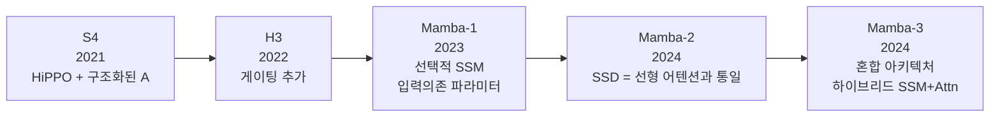

# 상태 공간 모델 일반 (State Space Models)

상태 공간 모델(SSM: State Space Model)은 제어 이론의 연속 시간 선형 시스템에서 출발한 시퀀스 모델링 패러다임이다. 신호 $x(t)$를 숨겨진 상태(hidden state) $h(t)$를 통해 출력 $y(t)$로 변환하는 구조로, **병렬 훈련(합성곱 모드)과 효율적 추론(재귀 모드)을 동시에** 지원한다. S4에서 시작해 Mamba-2에 이르기까지 빠르게 발전했다.

## 기본 방정식

$$h'(t) = Ah(t) + Bx(t)$$
$$y(t) = Ch(t) + Dx(t)$$

$A$: 상태 전이 행렬, $B$: 입력 투영, $C$: 출력 투영, $D$: 스킵 연결.

이산화(Zero-Order Hold)하면 RNN과 동일한 재귀 형태가 된다:
$$h_k = \bar{A}h_{k-1} + \bar{B}x_k, \quad y_k = Ch_k$$

## 계보: S4 → H3 → Mamba-1 → Mamba-2 → Mamba-3

## S4: HiPPO와 구조화된 상태 공간

Gu et al. (2021). 핵심 문제: 무작위 행렬 $A$는 그래디언트 소실/폭발로 긴 의존성을 학습하지 못한다.

**HiPPO(High-Order Polynomial Projection Operator)**: 과거 신호를 직교 다항식 기저로 최적 투영하는 특수 행렬 $A$를 이론적으로 유도한다. 이로써 수천~수만 스텝 이전 정보를 효율적으로 기억한다.

**구조화 행렬**: $A$를 대각(diagonal)+저랭크(low-rank) 구조로 강제해 $O(n \log n)$ 합성곱을 가능하게 한다.

## H3: 게이팅 추가

Fu et al. (2022). Transformer의 어텐션이 가진 "선택적 정보 통합" 능력을 SSM에 추가하기 위해 두 개의 SSM과 곱셈 게이팅을 결합한다. SSM만으로는 어렵던 귀납적 학습(induction heads) 태스크를 해결했다.

## Mamba-1: 선택적 SSM

Gu & Dao (2023). S4의 핵심 한계: $A, B, C, \Delta$가 입력에 **독립적**이라 내용 기반 추론이 불가능하다.

**선택적 SSM**: $B, C, \Delta$를 입력 $x$의 함수로 만든다.

$$B = \text{Linear}(x), \quad C = \text{Linear}(x), \quad \Delta = \text{softplus}(\text{Linear}(x))$$

이로써 어떤 정보를 상태에 넣을지/무시할지를 **콘텐츠에 기반해 동적으로** 결정한다.

**하드웨어 최적화**: 병렬화와 IO 효율을 위한 Selective Scan 알고리즘으로 GPU에서 실용적 속도를 달성했다.

## Mamba-2: SSD (State Space Duality)

Dao & Gu (2024). 선형 어텐션과 SSM이 수학적으로 동치임을 증명했다. 이를 SSD(Structured State Space Duality)라 부른다.

$$\text{SSM 상태} = \phi(K)^T V \quad \text{(선형 어텐션 상태와 동일)}$$

이 통일을 활용해 텐서 병렬화와 청크 병렬화로 **Mamba-1 대비 2-8배 빠른** 훈련을 달성했다.

## 훈련/추론 이중 모드

| 모드 | 계산 방식 | 복잡도 | 사용 시점 |
|------|---------|-------|---------|
| 합성곱(학습) | FFT 기반 전역 합성곱 | $O(n \log n)$ | 배치 학습 |
| 재귀(추론) | 이전 상태 한 스텝 업데이트 | $O(1)$ 스텝당 | 자동회귀 생성 |

## SSM vs Transformer vs RNN

| 항목 | Transformer | SSM (Mamba) | RNN (LSTM) |
|------|------------|------------|-----------|
| 학습 병렬성 | $O(n^2)$ | $O(n \log n)$ | $O(n)$ (순차) |
| 추론 메모리 | $O(n)$ KV캐시 | $O(d^2)$ 고정 상태 | $O(d)$ |
| 긴 의존성 | 완벽 (어텐션) | HiPPO/선택적 | 어려움 |
| 콘텐츠 기반 | 어텐션으로 자연 | 선택적 SSM | 게이트로 부분적 |

## 관련 문서
- [[liquid-neural-networks]] -- 리퀴드 신경망 (Liquid Neural Networks)
- [[mamba-3|Mamba-3]]
- [[gated-deltanet|Gated DeltaNet]]
- [[linear-attention|선형 어텐션]]
- [[rwkv|RWKV]]
- [[xlstm|xLSTM]]
- [[titans-miras|Titans / MIRAS]]
