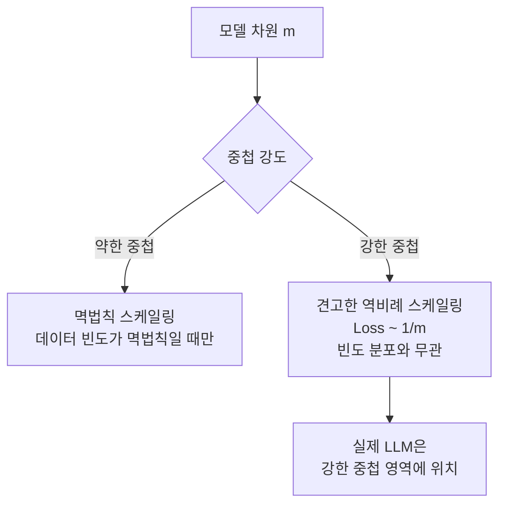
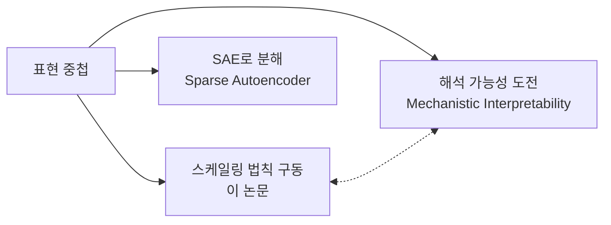

# Superposition Yields Robust Neural Scaling

표현 중첩([[embedding-layers|representation]] superposition)이 신경 스케일링 법칙을 구동한다는 이론적 발견. 모델 차원(m)에 대해 Loss가 1/m에 비례하여 감소하며, 이 관계가 OPT, GPT-2, Pythia, Qwen 등 실제 LLM에서 검증되었다. NeurIPS 2025 Best Paper Runner-up.

## 왜 지금 중요한가

신경 스케일링 법칙("모델을 키우면 성능이 향상된다")은 경험적으로 관찰되어 왔지만, **왜** 그런지에 대한 이론적 설명은 부족했다. 이 연구는 Anthropic의 toy model 프레임워크를 확장하여, 표현 중첩의 강도가 스케일링 법칙의 견고성(robustness)을 결정한다는 메커니즘을 제시했다. 이는 스케일링 법칙을 예측하고 최적화하는 데 실질적 도구를 제공한다.

## 핵심 발견

### 표현 중첩(Superposition)이란

LLM이 사용 가능한 차원 수보다 **더 많은 특징(feature)을 표현**하는 현상. 벡터들이 기하학적으로 겹치면서(overlap), 제한된 차원 공간에 더 많은 정보를 압축한다.

### 약한 중첩 vs 강한 중첩

| 중첩 강도 | 스케일링 조건 | 수학적 관계 |
|---|---|---|
| 약한 중첩 | 데이터 특징 빈도가 멱법칙(power-law) 분포일 때만 멱법칙 스케일링 | 분포 의존적 |
| **강한 중첩** | **어떤 빈도 분포에서든** 역비례 스케일링이 일반적으로 성립 | **Loss proportional to 1/m** |

핵심 통찰: 실제 오픈소스 LLM(OPT, GPT-2, Pythia, Qwen)은 모두 **강한 중첩 영역**에서 작동하며, 손실이 모델 차원에 역비례한다.

## 방법론

### 이론적 프레임워크

Anthropic의 toy model(표현 중첩 연구용 단순화된 신경망)을 기반으로, weight decay를 통해 중첩 정도를 제어하고 손실 스케일링을 체계적으로 분석했다.

### 기하학적 해석

표현 벡터 간의 기하학적 겹침(geometric overlap)이 스케일링 관계를 설명한다. 차원이 증가하면 벡터 간 겹침이 줄어들어 각 특징을 더 정확히 표현할 수 있고, 이것이 손실 감소로 이어진다.

### 실증 검증

다음 모델 패밀리에서 이론적 예측과 실제 스케일링이 일치함을 확인했다:

- **OPT** (Meta)
- **GPT-2** (OpenAI)
- **Pythia** (EleutherAI)
- **Qwen** (Alibaba)

Chinchilla 스케일링 법칙과도 정합적이었다.

## 이론적 함의

### 스케일링 법칙의 "왜"에 대한 답

기존 Chinchilla 법칙은 "데이터와 파라미터의 최적 비율"을 경험적으로 제시했지만, 왜 그런 관계가 성립하는지 설명하지 못했다. 이 연구는 **표현 중첩의 기하학**이라는 구체적 메커니즘을 제시한다.

### 해석 가능성(Interpretability) 연결

표현 중첩은 [[circuit-tracing]]과 [[mechanistic-interpretability-2026]] 연구의 핵심 개념이기도 하다. 이 논문은 중첩이 단순히 해석을 어렵게 만드는 장애물이 아니라, **스케일링의 구동 메커니즘**이라는 새로운 관점을 제공한다.

## 실무적 의미

- **모델 크기 결정**: Loss ~ 1/m 관계를 활용하여 목표 성능에 필요한 최소 차원을 추정할 수 있다
- **효율적 스케일링**: 중첩 강도를 weight decay로 제어할 수 있으므로, 학습 전에 스케일링 행동을 예측 가능
- **아키텍처 설계**: 중첩을 촉진하는 구조(더 많은 특징을 적은 차원에 압축)가 스케일링에 유리

## 수상 정보

- **논문**: "Superposition Yields Robust Neural Scaling"
- **저자**: Yizhou Liu, Ziming Liu, Jeff Gore
- **수상**: NeurIPS 2025 Best Paper Runner-up
- **제출**: 2025년 5월 15일, 최종 수정 2025년 11월 29일
- **arXiv**: 2505.10465

## 대표 자료

- [Superposition Yields Robust Neural Scaling (arXiv 2505.10465)](https://arxiv.org/abs/2505.10465)
- [OpenReview (NeurIPS 2025)](https://openreview.net/forum?id=knPz7gtjPW)
- [NeurIPS 2025 Oral Session](https://neurips.cc/virtual/2025/loc/san-diego/oral/116347)
- [SuperpositionScaling (GitHub)](https://github.com/liuyz0/SuperpositionScaling)

## 관련 문서

- [[gated-attention]] -- NeurIPS 2025 Best Paper, 어텐션 게이팅
- [[circuit-tracing]] -- 회로 추적, 중첩된 표현의 해석
- [[long-context-scaling]] -- 장문맥 스케일링
- [[multi-head-latent-attention]] -- MLA, 차원 효율화
