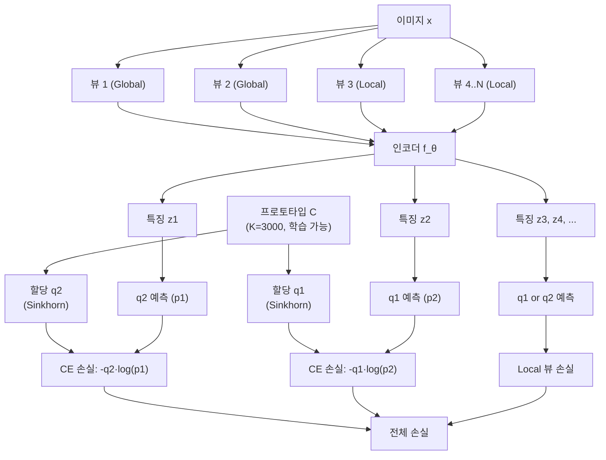

# SwAV - 클러스터링 기반 비전 표현 (Swapping Assignments between multiple Views)

## 동기와 배경

2020년 Facebook AI Research에서 발표한 SwAV는 대조 학습의 핵심 한계인 **쌍별(pairwise) 비교 의존성**을 극복한 방법론이다. SimCLR, MoCo가 샘플 쌍을 직접 비교하는 반면, SwAV는 **온라인 클러스터링(prototype)**을 통해 간접적으로 뷰 일관성을 학습한다.

핵심 아이디어: "같은 이미지의 두 뷰는 동일한 클러스터 프로토타입으로 할당되어야 한다." 뷰 A의 특징으로 뷰 B의 클러스터 할당을 예측하고 (그 반대도), 이를 "swap"이라고 부른다.

추가 공헌: **멀티크롭(Multi-Crop)** 전략으로 배치 크기를 늘리지 않고 더 많은 뷰를 활용할 수 있게 했다.

## 핵심 메커니즘

### 프로토타입 기반 할당

$K$개의 학습 가능한 프로토타입 벡터 $C = [c_1, c_2, \ldots, c_K]$를 유지한다 (보통 $K = 3000$).

이미지 $x_n$의 뷰 $t$에 대한 인코딩 $z_{nt}$가 주어지면:

1. 소프트 할당 계산: $q_{nt} = \text{softmax}(z_{nt}^\top C / \epsilon)$
2. 이를 균등 분포로 정규화(Sinkhorn-Knopp)

### 스왑 예측 (Swap Prediction)

뷰 $s$의 특징으로 뷰 $t$의 할당을 예측:

$$\mathcal{L}(z_{nt}, z_{ns}) = -\sum_k q_{nt}^{(k)} \log p_{ns}^{(k)} - \sum_k q_{ns}^{(k)} \log p_{nt}^{(k)}$$

$$p_{nt}^{(k)} = \frac{\exp(z_{nt}^\top c_k / \epsilon)}{\sum_{k'} \exp(z_{nt}^\top c_{k'} / \epsilon)}$$

- $q_{nt}$: **타겟 할당** (Sinkhorn으로 균등화, stop-gradient)
- $p_{nt}$: **예측 확률** (소프트맥스, 학습)

### Sinkhorn-Knopp 균등화

단순 소프트맥스로 할당하면 대부분의 샘플이 소수의 프로토타입에만 할당되는 붕괴가 발생한다. Sinkhorn-Knopp 알고리즘으로 **각 프로토타입이 균등한 수의 샘플을 받도록 강제**한다.

$$Q^* = \arg\min_{Q \in \mathcal{T}} \text{CE}(Q, \text{softmax}(ZC^\top / \epsilon))$$

$\mathcal{T}$는 행/열 합이 모두 균등한 이중 확률 행렬(doubly stochastic matrix) 집합.

실제 구현은 3-5번의 반복으로 빠르게 수렴한다.

### 멀티크롭 (Multi-Crop)

SimCLR은 2개 뷰(global), MoCo도 2개 뷰를 사용한다. SwAV는 **다수의 작은 크롭(local views)**을 추가해 연산 비용 없이 뷰 수를 늘렸다:

- Global views (2개): 이미지의 50-100% 크롭, 224×224
- Local views (4-8개): 이미지의 5-50% 크롭, 96×96

손실 계산 시: Global 뷰의 할당 $q_g$를 타겟으로 사용, 모든 로컬/글로벌 뷰가 이를 예측하도록 학습. 단, 로컬 뷰끼리의 비교는 수행하지 않는다.

작은 크롭은 인코더를 통과하는 픽셀 수가 적어 계산 비용이 낮지만, 다양한 지역 뷰를 제공한다.

## 훈련 안정성

### 프로토타입 정규화

프로토타입 벡터 $c_k$를 단위 구면(L2 정규화)에 고정한다. 특징 벡터 $z$도 L2 정규화해, 내적 = 코사인 유사도가 된다.

### Queue 활용 (옵션)

작은 배치에서 Sinkhorn 품질 향상을 위해 이전 배치의 특징을 큐에 보관하는 변형 버전도 사용 가능하다.

## 성능

ImageNet 선형 프로빙 (ResNet-50, 200 에폭):

| 방법 | 배치 크기 | Top-1 |
|------|---------|-------|
| SimCLR v1 | 4096 | 69.3% |
| MoCo v2 | 256 | 71.1% |
| SwAV (2 views) | 4096 | 71.8% |
| SwAV (Multi-crop) | 4096 | 75.3% |

멀티크롭의 효과가 두드러진다. 같은 배치 크기에서 75.3%는 당시 자기지도 SOTA.

## 후속 영향

- **MSN (Masked Siamese Networks)**: SwAV의 프로토타입 개념을 마스킹과 결합
- **DINO**: SwAV의 클러스터 개념에서 영감을 받아 교사-학생 자기 증류로 발전
- **DINOv2**: 멀티크롭 전략을 대규모 데이터셋 학습에 활용
- **멀티크롭 기법**: 이후 자기지도 학습 프레임워크의 표준 증강 전략으로 채택됨

## 한계

- **클러스터 수 $K$ 하이퍼파라미터**: 최적 $K$는 데이터셋 크기/다양성에 의존하며 민감할 수 있음
- **Sinkhorn 반복 연산**: 배치마다 Sinkhorn-Knopp 수행으로 추가 계산 비용
- **큰 배치 선호**: 균등 할당의 품질이 배치 크기에 영향받음

## 관련 문서

- [[self-supervised-learning]]
- [[contrastive-learning]]
- [[simclr-augmentation]]
- [[byol-bootstrap]]
- [[dino-self-distillation]]
- [[moco-momentum-contrast]]
- [[representation-learning-theory]]
