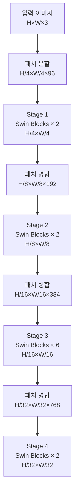
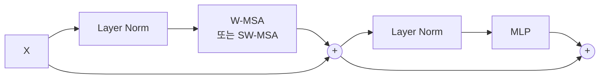

# Swin Transformer

Swin Transformer(Shifted Window Transformer)는 Microsoft Research가 2021년 발표한 범용 비전 백본(vision backbone)이다. ViT(Vision Transformer)가 전역 어텐션으로 고해상도 이미지에 $O(n^2)$ 비용을 치르는 한계를 극복하기 위해 **이동 윈도우(shifted window)** 기반 로컬 어텐션과 **계층적 특징 맵**을 도입했다. ImageNet 분류뿐 아니라 객체 탐지·인스턴스 세그멘테이션·시맨틱 세그멘테이션에서 표준 백본으로 자리잡았다.

## 핵심 아이디어: Shifted Window Partitioning

### W-MSA (Window Multi-head Self-Attention)
이미지를 $M \times M$ (기본값 7×7) 픽셀 윈도우로 분할하고 **윈도우 내부**에서만 어텐션을 수행한다. 해상도 $H \times W$ 이미지에서 복잡도가 $O(n^2)$에서 $O(n \cdot M^2)$로 선형화된다.

### SW-MSA (Shifted Window MSA)
교대(alternating) 레이어에서 윈도우 격자를 $(\lfloor M/2 \rfloor, \lfloor M/2 \rfloor)$만큼 이동시켜 인접 윈도우 간 연결을 만든다. 이동으로 새로 생긴 경계 윈도우는 **Cyclic Shift + Masking**으로 효율적으로 처리한다.

## 4단계 계층 구조

각 단계에서 해상도는 절반, 채널은 두 배로 증가한다. CNN의 FPN(Feature Pyramid Network)처럼 다중 스케일 특징을 자연스럽게 생성한다.

## Swin Block 구조

짝수 레이어는 W-MSA, 홀수 레이어는 SW-MSA를 교대로 사용한다.

## ViT 대비 장점

| 항목 | ViT | Swin |
|------|-----|------|
| 어텐션 범위 | 전역(global) | 로컬 + 이동 |
| 복잡도 | $O(n^2)$ | $O(n \cdot M^2)$ |
| 계층적 특징 | 단일 해상도 | 4단계 피라미드 |
| 고해상도 적용 | 어려움 | 자연스러움 |
| 검출/세그멘테이션 백본 | 비효율 | 표준 |

## Swin V2 확장

2022년 발표된 Swin V2는 최대 3B 파라미터까지 안정적으로 스케일링하기 위해 세 가지 개선을 도입했다:
1. **Post-LN → Residual Post-LN**: 깊은 레이어에서 학습 안정화
2. **Scaled Cosine Attention**: 점곱 크기 폭발 방지
3. **연속적 상대 위치 바이어스(Log-Spaced CPB)**: 다양한 해상도/윈도우 크기 전이

## 관련 문서
- [[vision-transformer|Vision Transformer]]
- [[convnext|ConvNeXt]]
- [[dinov2|DINOv2]]
- [[masked-autoencoder-mae|MAE]]
- [[transformer-attention-mechanisms|Transformer 어텐션 메커니즘]]
