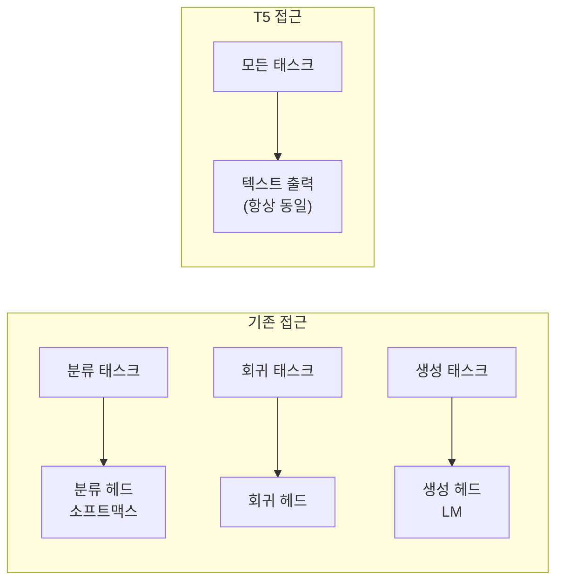
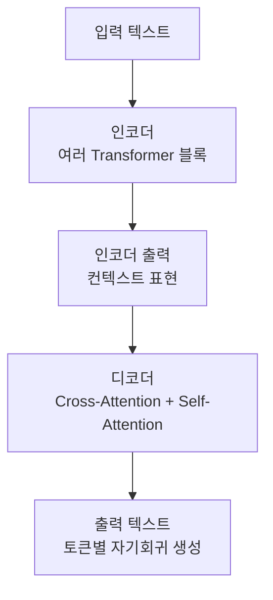
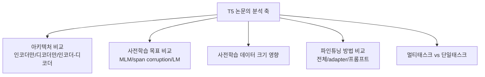

# T5 (Text-to-Text Transfer Transformer)

## 개요

T5는 Google Research에서 2019년 발표한 모델로(Raffel et al., 2020), **모든 NLP 태스크를 텍스트-텍스트 변환(text-to-text)으로 통일**한다는 아이디어를 핵심으로 한다. 분류, 번역, 요약, QA, 문법 교정 등 서로 다른 태스크를 동일한 인코더-디코더 아키텍처([[seq2seq]])와 동일한 손실 함수로 처리한다. 이 단일화 프레임워크는 이후 멀티태스크 학습과 [[transformer-architecture]] 기반 전이 학습 연구의 기준점이 되었다.

## Text-to-Text 프레임워크

T5의 핵심 아이디어는 모든 태스크를 "텍스트 입력 → 텍스트 출력"으로 재정의하는 것이다:

### 태스크 포맷 예시

| 태스크 | 입력 | 출력 |
|--------|------|------|
| 감성 분석 | `sentiment: This movie was great!` | `positive` |
| 번역 | `translate English to French: Hello` | `Bonjour` |
| 요약 | `summarize: Long document text...` | `Short summary` |
| QA | `question: Who was president? context: ...` | `Obama` |
| 문법 교정 | `cola sentence: He go to store` | `not acceptable` |

태스크 유형을 **텍스트 접두사(task prefix)**로 명시하면 동일한 모델이 다양한 태스크를 수행할 수 있다.

## 아키텍처 상세

T5는 원래 Transformer([[transformer-architecture]])의 인코더-디코더 구조를 거의 그대로 따른다.

### 주요 수정 사항

원 Transformer 대비 T5의 구조적 차이:

- **Layer Normalization 위치**: Pre-norm (레이어 이전 정규화, 학습 안정성 향상)
- **위치 인코딩**: Relative Position Bias (절대적 위치 임베딩 대신 상대적 위치 편향)
- **피드포워드**: ReLU 대신 일부 변형에서 GELU 사용
- **공유 임베딩**: 인코더와 디코더 임베딩 가중치 공유

### 모델 크기 스펙트럼

| 버전 | 파라미터 수 |
|------|-----------|
| T5-Small | 60M |
| T5-Base | 220M |
| T5-Large | 770M |
| T5-XL | 3B |
| T5-XXL | 11B |

## C4 데이터셋과 사전학습

T5는 **C4 (Colossal Clean Crawled Corpus)** 데이터셋으로 사전학습된다. 공통 크롤(Common Crawl) 데이터에서 품질이 낮은 텍스트를 필터링해 만들었다.

### Span Corruption 사전학습 목표

BERT의 마스킹과 달리, T5는 연속된 토큰 스팬(span)을 제거하고 단일 센티넬 토큰으로 대체한 뒤 제거된 스팬을 예측한다:

- 입력: `The [X] over the [Y] dog.`
- 출력: `[X] cat sat [Y] lazy`

이 방식은 단일 토큰 마스킹보다 더 풍부한 생성 능력을 유도한다.

## 멀티태스크 학습 분석

T5 논문은 다양한 전이 학습 방법론을 체계적으로 비교한 최초의 대규모 연구이기도 하다:

주요 발견:
- 인코더-디코더 구조가 여러 태스크에서 가장 균형 잡힌 성능
- 사전학습 데이터 크기는 성능과 로그 선형 관계
- Span corruption이 다른 사전학습 목표보다 우수

## 후속 영향

T5의 text-to-text 프레임워크는 후속 연구에 광범위한 영향을 미쳤다:

- **Flan-T5**: 지시 파인튜닝(instruction tuning)으로 zero-shot 성능 대폭 향상
- **mT5**: 101개 언어 다국어 버전
- **Efficient T5**: 파라미터 효율적인 파인튜닝 연구의 기준 모델
- **UL2**: 여러 사전학습 목표를 통합한 후속 구조

[[seq2seq]] 아키텍처의 완성도 높은 구현체로서, GPT 계열의 디코더 전용 모델과 대비되는 인코더-디코더 계열 연구의 중심이 되었다.

## 관련 문서

- [[transformer-architecture]] - T5의 기반인 원 Transformer 구조
- [[seq2seq]] - 인코더-디코더 시퀀스 변환 패러다임
- [[flan-t5]] - 지시 파인튜닝으로 개선된 T5 후속
- [[bert]] - 인코더 전용 사전학습 모델과의 비교
- [[in-context-learning]] - 파인튜닝 없는 적응과의 대비
