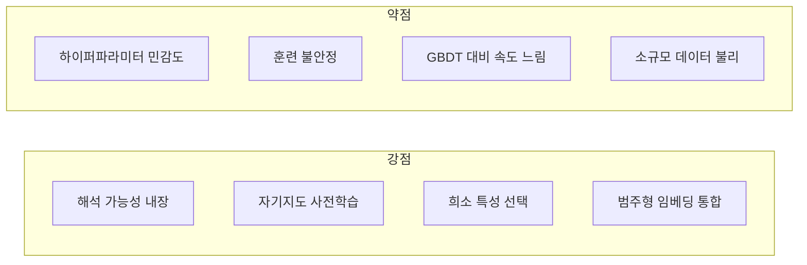

# TabNet 아키텍처

TabNet(Arik & Pfister, 2019/2021)은 Google Cloud AI Research가 제안한 테이블 데이터 특화 딥러닝 아키텍처다. 핵심 아이디어는 **순차적 어텐션(Sequential Attention)** 을 통해 매 결정 단계마다 입력 특성의 부분집합을 동적으로 선택하는 것이다. 결정 트리처럼 해석 가능하면서도 심층 신경망의 표현력을 결합한다.

## 설계 동기

테이블 데이터에서 딥러닝이 GBDT([[tabular-ml]] 참고)에 뒤처지는 주요 이유는:
1. **모든 특성을 동등하게 처리** - 관련 없는 특성이 학습을 방해
2. **해석 불가능** - 어떤 특성이 예측에 기여했는지 불명확
3. **특성 선택과 학습의 분리** - 전처리 단계에서 별도로 처리

TabNet은 이를 네트워크 구조 안에서 해결한다.

## 핵심 구성 요소

### 순차적 어텐션 메커니즘

```mermaid
flowchart TD
    Input[배치 정규화된 입력 특성 BN(f)] --> A1

    subgraph 스텝 1
        A1[어텐션 변환기\nAttentive Transformer] --> M1[마스크 M1\n소프트맥스 + 스파스텍스]
        M1 --> Mul1[마스킹 입력\nM1 ⊙ BN(f)]
        Mul1 --> FC1[피처 변환기\nFeature Transformer]
        FC1 --> H1[처리된 특성 h1]
    end

    subgraph 스텝 2
        H1 --> A2[어텐션 변환기\n이전 스텝 출력 반영]
        A2 --> M2[마스크 M2]
        M2 --> Mul2[마스킹 입력]
        Mul2 --> FC2[피처 변환기]
        FC2 --> H2[처리된 특성 h2]
    end

    H1 & H2 --> AGG[집계\n최종 예측]
```

### Attentive Transformer (어텐션 변환기)

각 스텝 $t$에서 마스크 $M[t]$를 생성한다:

$$M[t] = \text{sparsemax}(P[t-1] \cdot h_W(a[t-1]))$$

- $P[t-1]$: 이전 스텝까지의 특성 사용량 페널티 (많이 쓰인 특성 억제)
- $h_W$: 학습 가능한 변환 행렬
- $\text{sparsemax}$: 소프트맥스보다 희소한 출력을 생성 (여러 특성을 0으로)

페널티 업데이트: $P[t] = P[t-1] \cdot (\eta - M[t])$, $\eta$는 완화 계수

### Feature Transformer (피처 변환기)

마스킹된 특성을 처리하는 FC + BN + GLU(Gated Linear Unit) 스택이다:

$$\text{GLU}(x) = x_1 \odot \sigma(x_2)$$

GLU는 게이트를 통해 정보 흐름을 제어하며, 공유 레이어(모든 스텝 공유)와 스텝별 레이어의 두 부분으로 구성된다.

## 해석 가능성

TabNet의 핵심 장점은 특성 중요도를 네트워크 자체에서 추출할 수 있다는 점이다.

**전역 중요도**: 모든 샘플과 스텝에 걸쳐 마스크를 집계

$$\eta_j = \sum_i \sum_t M_{ij}[t] \cdot \text{ReLU}(h_i[t])$$

**지역 중요도**: 특정 샘플의 각 스텝별 마스크를 시각화

[[shap-feature-importance]] 처럼 사후 분석이 아닌, 모델 내부 구조에서 해석성이 자연스럽게 나오는 점이 특징이다.

## 자기지도 학습 지원

TabNet은 컬럼 마스킹 기반 사전학습(pretraining)을 지원한다 - 일부 특성을 마스킹하고 이를 복원하도록 학습한다. 레이블이 없는 데이터가 많을 때 유용하며, 이후 미세조정(fine-tuning)으로 성능을 높인다.

## [[transformer-architecture]] 와의 관계

TabNet의 어텐션은 [[transformer-architecture]] 의 셀프어텐션과 다르다:
- Transformer: 시퀀스 내 위치 간 어텐션 (토큰 → 토큰)
- TabNet: 특성 선택 마스크 (샘플 내 특성 차원에 대한 어텐션)

그럼에도 "어텐션으로 무엇을 볼지 결정"하는 핵심 직관은 공유한다. [[ft-transformer-tabular]] 처럼 Transformer를 직접 테이블에 적용하는 방향과 TabNet의 커스텀 어텐션 방향은 상보적인 접근법이다.

## 성능 프로필



[[tabular-ml]] 벤치마크에서 TabNet은 대규모 데이터와 원시 특성이 많을 때 경쟁력이 있으나, 소규모 데이터에서는 일반적으로 GBDT에 뒤처진다.

## 관련 문서

- [[tabular-ml]] - 테이블 데이터 딥러닝 전반
- [[transformer-architecture]] - 어텐션 메커니즘 기초
- [[ft-transformer-tabular]] - Transformer를 테이블에 직접 적용한 접근
- [[shap-feature-importance]] - 사후 특성 중요도 해석 (TabNet과 보완)
- [[saint-attention-tabular]] - 행/열 양방향 어텐션의 SAINT
