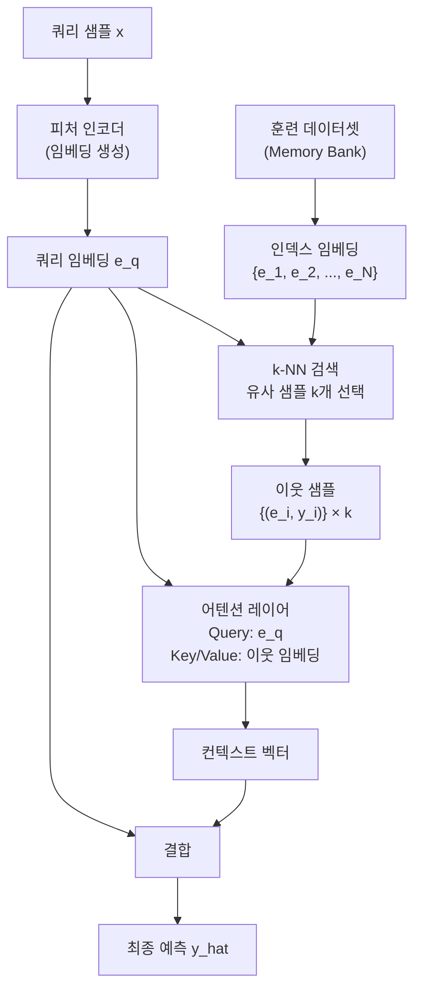

# TabR - 검색 증강 테이블 학습

TabR(Tabular Retrieval-augmented)은 정형 데이터(tabular data) 학습에 검색 증강(retrieval augmentation) 패러다임을 적용한 신경망 아키텍처다. 예측 시점에 훈련 세트에서 유사한 샘플들을 검색해 추가 컨텍스트로 활용하는 방식으로, 트리 기반 모델(XGBoost, LightGBM)과 순수 신경망 사이의 성능 격차를 줄이는 것을 목표로 한다.

## 핵심 아이디어

전통적인 k-NN(k-Nearest Neighbors)은 예측 시 가장 유사한 훈련 샘플의 레이블을 직접 활용한다. TabR은 이를 신경망과 결합해, k-NN으로 찾은 이웃 샘플들을 어텐션 메커니즘으로 처리해 예측에 통합한다. 정형 데이터에서의 RAG(Retrieval-Augmented Generation) 패턴이라 볼 수 있다.

## 아키텍처 구성 요소

### 1. 피처 인코더

범주형 변수는 임베딩으로, 수치형 변수는 정규화 후 선형 변환으로 처리한다. 이 인코더는 쿼리 샘플과 훈련 샘플 모두에 공유된다.

### 2. 메모리 뱅크 (Memory Bank)

전체 훈련 세트의 임베딩을 메모리 뱅크로 유지한다. 추론 시 쿼리 임베딩과 메모리 뱅크 임베딩 간 코사인 유사도 또는 내적으로 k개 이웃을 선택한다.

### 3. 컨텍스트 어텐션

선택된 k개 이웃 임베딩과 해당 레이블 정보를 어텐션 메커니즘으로 집계한다. 쿼리가 어떤 이웃에 더 집중할지를 학습한다.

### 4. 예측 레이어

쿼리 임베딩과 컨텍스트 벡터를 결합해 최종 예측을 생성한다.

## 트리 기반 모델 vs 신경망 vs TabR

정형 데이터는 "딥러닝이 트리 기반 모델을 넘지 못하는 마지막 영역"으로 오랫동안 여겨졌다. 벤치마크 비교:

| 모델 | 평균 순위 (Grinsztajn et al. 벤치마크) | 특징 |
|------|---------------------------------------|------|
| XGBoost | 1~2위 | 빠르고 강력, 피처 엔지니어링 필요 |
| LightGBM | 1~2위 | XGBoost와 유사 |
| TabPFN | 3~5위 | 사전학습 트랜스포머, 작은 데이터에 강함 |
| **TabR** | **2~4위** | 신경망 기반, 대규모 데이터에서 트리와 경쟁 |
| MLP (단순) | 5~8위 | 정형 데이터에서 약함 |
| ResNet (테이블용) | 4~7위 | 개선된 MLP |

TabR은 특히 훈련 세트 크기가 클 때(10만+ 샘플) 성능이 좋아지는 경향이 있다. 메모리 뱅크가 커질수록 더 정확한 이웃을 찾을 수 있기 때문이다.

## 정형 데이터에서의 RAG 패턴

이 접근법은 NLP에서의 RAG와 철학적으로 동일하다:

| NLP RAG | TabR |
|---------|------|
| 질의 쿼리 | 예측할 샘플 |
| 문서 검색 | k-NN 이웃 검색 |
| 검색된 문서 텍스트 | 이웃 샘플의 피처 + 레이블 |
| 생성 모델 | 어텐션 + 예측 레이어 |
| 비파라메트릭 메모리 | 훈련 데이터셋 (메모리 뱅크) |

특히 레이블 누출(label leakage)을 막기 위해 테스트 시 이웃 레이블을 컨텍스트로만 사용하고, 훈련 시에는 자신을 제외한 이웃만 참조한다.

## 한계

- **추론 지연**: 매 예측마다 k-NN 검색이 필요해 배치 추론이 느리다. 대용량 메모리 뱅크에서는 ANN(Approximate Nearest Neighbor) 인덱스가 필요하다
- **메모리 사용**: 훈련 데이터 전체를 임베딩으로 유지해야 해 RAM 사용량이 크다
- **온라인 학습 어려움**: 새 데이터 추가 시 메모리 뱅크와 임베딩을 갱신해야 한다

## 관련 문서
- [[alexnet-imagenet]] -- AlexNet - 딥러닝 ImageNet 혁명

- [[realmlp-tabular]] - 검색 없이 MLP 아키텍처 개선으로 정형 데이터 성능 향상
- [[rag-original-paper]] - 검색 증강 패러다임의 원형
- [[tabular-feature-interaction]] - 정형 데이터의 피처 상호작용 모델링
