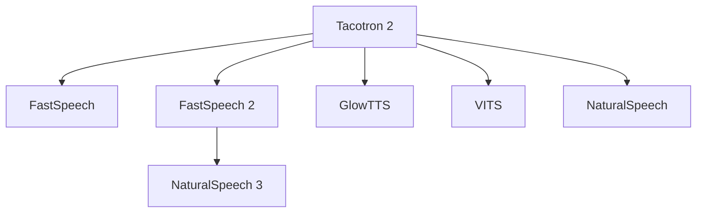

# Tacotron 2 - 신경망 기반 텍스트-음성 합성

## 배경

Tacotron 2(Shen et al., Google, 2018)는 Google이 개발한 엔드투엔드(end-to-end) 신경망 TTS(Text-to-Speech) 시스템이다. 첫 번째 Tacotron이 Griffin-Lim 알고리즘 기반 보코더를 사용한 반면, Tacotron 2는 WaveNet 보코더를 결합하여 **사람에 가까운 자연스러움**을 달성했다.

발표 당시 MOS(Mean Opinion Score) 4.53을 기록하며 인간 음성 4.58에 근접한 품질을 보여줬다. 이후 대부분의 신경망 TTS 연구의 출발점이 됐다.

## 아키텍처 구조

Tacotron 2는 크게 두 단계로 구성된다:

1. **시퀀스-투-시퀀스 모델**: 텍스트 -> 멜 스펙트로그램(mel-spectrogram)
2. **WaveNet 보코더**: 멜 스펙트로그램 -> 음성 파형

### 인코더

인코더는 입력 텍스트 문자 시퀀스를 숨겨진 표현으로 변환한다:

1. **문자 임베딩**: 각 문자를 512차원 벡터로 임베딩
2. **컨볼루션 레이어 3개**: 각 512개 필터, 커널 크기 5. 배치 정규화 + ReLU 활성화
3. **양방향 LSTM**: 512개 유닛(각 방향 256). 전후 문맥을 모두 고려한 인코더 출력 생성

### 어텐션 메커니즘 - Location-Sensitive Attention

Tacotron 2의 핵심은 **위치 민감 어텐션(Location-Sensitive Attention)**이다. 일반 어텐션과 달리 이전 어텐션 가중치를 입력으로 사용하여, 왼쪽에서 오른쪽으로 순차적으로 읽어나가는 패턴을 학습한다:

$$e_{i,j} = \text{score}(s_{i-1}, h_j, \alpha_{i-1})$$

- $s_{i-1}$: 이전 디코더 상태
- $h_j$: j번째 인코더 출력
- $\alpha_{i-1}$: 이전 어텐션 가중치 (위치 정보로 활용)

위치 정보는 32개 필터 컨볼루션으로 처리되어 어텐션 에너지에 더해진다. 이를 통해 어텐션이 특정 위치에 고착되거나 건너뛰는 문제를 방지한다.

### 디코더

디코더는 자기회귀(autoregressive) 방식으로 멜 스펙트로그램 프레임을 한 번에 생성한다:

1. **Pre-net**: 이전 멜 프레임을 256차원 두 레이어를 거쳐 변환. 학습 중 드롭아웃 50% 적용 (추론 시에도 유지 - 불확실성 도입 의도)
2. **디코더 LSTM 2개**: 각 1024 유닛
3. **선형 프로젝션**: 80개 멜 채널 출력
4. **Stop 토큰 예측**: 이진 분류기로 발화 종료 예측

### 포스트넷 (Post-net)

포스트넷은 5개 컨볼루션 레이어로 구성된 잔차 네트워크다. 멜 스펙트로그램 품질을 개선하는 역할을 한다:

$$\text{mel\_refined} = \text{mel\_pred} + \text{PostNet}(\text{mel\_pred})$$

### WaveNet 보코더

조건부 WaveNet이 멜 스펙트로그램을 입력받아 24kHz 음성 파형을 생성한다:
- 멜 스펙트로그램을 업샘플링 후 WaveNet 로컬 조건으로 사용
- 인과적 팽창 컨볼루션(causal dilated convolution) 스택
- mu-law 양자화된 16비트 오디오 출력

WaveNet은 추론 속도가 느린 것이 단점이다 (실시간의 수십분의 1 속도). 이후 연구들이 이를 해결하기 위해 병렬 생성 방식으로 대체한다.

## 학습

### 학습 설정

- **데이터**: 단일 화자 영어 데이터 약 24.6시간 (내부 녹음 데이터)
- **손실 함수**: L1 손실 (멜 예측 + 포스트넷 출력) + 이진 교차 엔트로피 (stop 토큰)
- **옵티마이저**: Adam (lr=1e-3, 감쇠 스케줄)
- **Teacher forcing**: 학습 중 실제 이전 프레임을 디코더에 공급 (추론 시는 예측 프레임 사용)

### 훈련 트릭

- Pre-net 드롭아웃은 추론 시에도 켜둔다 - 모델이 어텐션에 더 의존하도록 유도
- 멜 스펙트로그램 범위: 125Hz ~ 7600Hz, 80개 채널
- 프레임 이동: 12.5ms, 프레임 크기: 50ms

## 성능 및 평가

### MOS 비교 (5점 척도)

| 시스템 | MOS |
|--------|-----|
| 실제 인간 음성 | 4.58 |
| **Tacotron 2** | **4.53** |
| 첫 번째 Tacotron | 4.00 |
| WaveNet (기존) | 4.21 |
| SPSS (통계 기반) | 3.82 |

단일 화자 기준으로 인간 음성에 근접한 MOS를 달성한 첫 번째 신경망 TTS 시스템이다.

### 한계

- **자기회귀 디코딩**: 프레임을 순차적으로 생성하므로 긴 문장에서 추론이 느림
- **어텐션 불안정**: 잘못된 어텐션 정렬(건너뜀, 반복)로 인한 음질 저하 가능
- **단일 화자**: 여러 화자로 확장하려면 화자 임베딩 추가 필요
- **WaveNet 속도**: 보코더가 병목. 실시간 생성 불가

## 계보와 영향

Tacotron 2는 이후 TTS 연구의 기초가 됐다:

- **FastSpeech / FastSpeech 2**: 비자기회귀 방식으로 속도 문제 해결
- **GlowTTS**: 정규화 흐름 기반 TTS
- **VITS**: 변분 추론 기반 엔드투엔드, 보코더 통합
- **NaturalSpeech 시리즈**: 인간 수준 품질 목표

## 실무 활용

- **TTS 기반 서비스**: Google Assistant, Amazon Alexa, 내비게이션 음성 안내의 기반 기술
- **오픈소스**: ESPnet-TTS, Coqui TTS에 Tacotron 2 구현 포함
- **다국어 확장**: 언어별 G2P(Grapheme-to-Phoneme) + Tacotron 2 결합
- **데이터 증강**: TTS로 생성한 합성 음성으로 ASR 학습 데이터 보완

## 관련 문서

- [[fastspeech-2-tts]]
- [[valle-zero-shot-tts]]
- [[voicebox-nonautoregressive-tts]]
- [[naturalspeech3-tts]]
- [[audiolm-framework]]
- [[conformer-speech-recognition]]
- [[transformer-architecture]]
- [[cross-attention]]
