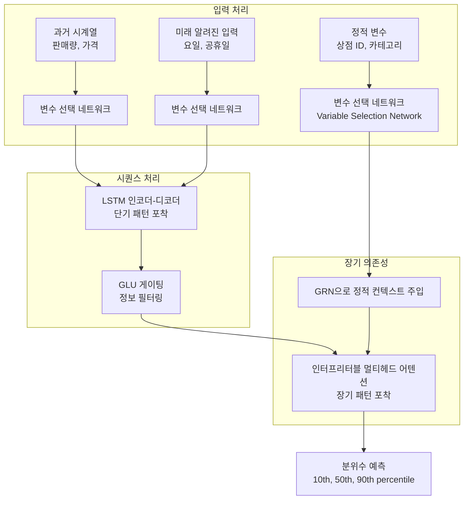
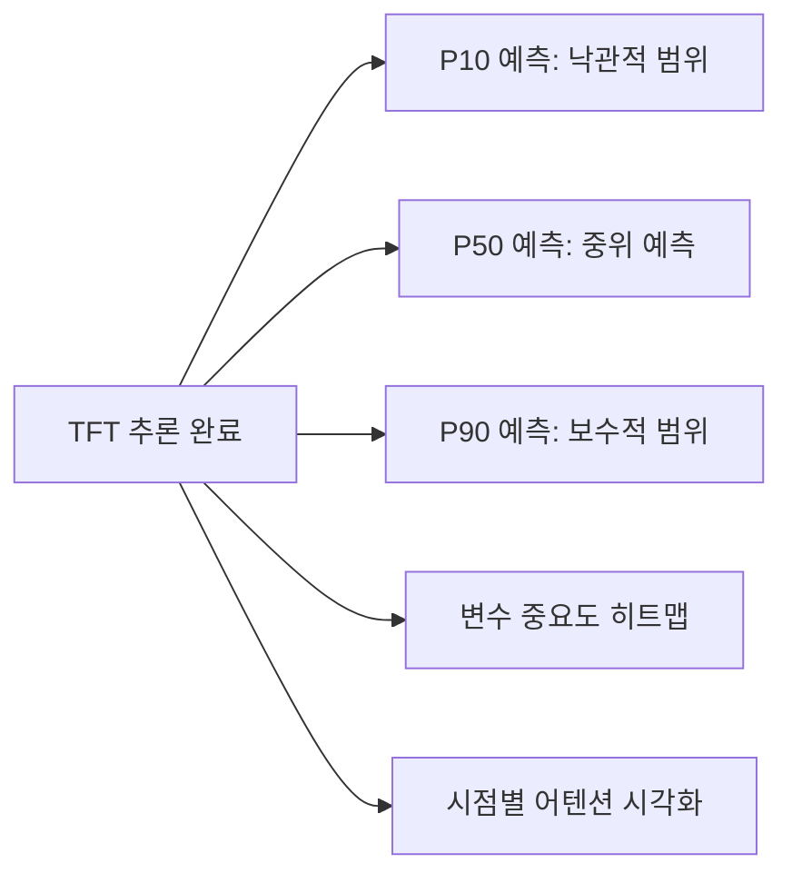

# Temporal Fusion Transformer (TFT)

Temporal Fusion Transformer(TFT)는 구글 연구팀이 2019년 발표한 **다수평선 시계열 예측(multi-horizon time-series forecasting)** 아키텍처다. [[transformer-architecture]]의 어텐션 메커니즘을 시계열 도메인에 맞게 재설계하면서, 동시에 **해석 가능성(interpretability)**을 핵심 설계 원칙으로 내세운 것이 특징이다. 단순히 정확도만 추구하는 블랙박스 모델과 달리, TFT는 어떤 변수가, 어떤 시점에, 얼마나 중요한지를 정량적으로 설명할 수 있다.

[[time-series-forecasting-dl]] 분야에서 트리 기반 앙상블(XGBoost, LightGBM)과 딥러닝 모델 간의 격차를 처음으로 유의미하게 좁힌 모델 중 하나로 평가받는다.

## 핵심 설계 원칙

TFT는 다음 세 가지 설계 목표를 동시에 달성하려 했다.

1. **다양한 입력 유형 처리**: 과거 관측값, 미래 알려진 입력(예: 달력 정보), 정적 메타데이터(예: 상점 ID)를 각기 다른 방식으로 처리
2. **장단기 의존성 포착**: LSTM으로 단기 패턴을, 셀프-어텐션으로 장기 패턴을 각각 포착
3. **해석 가능한 출력**: 변수 선택 가중치, 시점별 어텐션, 분위수 예측을 통한 불확실성 정량화

## 아키텍처 구조



### 핵심 구성 요소

**변수 선택 네트워크(Variable Selection Network, VSN)**: 각 시점에서 예측에 유용한 입력 변수를 소프트 선택(soft selection)한다. 어떤 변수가 중요한지 사후에 분석 가능하다.

**게이팅 잔차 네트워크(Gated Residual Network, GRN)**: ELU 활성화 + 게이팅 + 잔차 연결을 결합한 블록. 불필요한 정보를 억제하면서도 중요한 신호는 보존한다.

$$\text{GRN}(x) = \text{LayerNorm}(x + \text{Gate}(\text{ELU}(W_1 x + W_2 c + b)))$$

**해석 가능한 멀티헤드 어텐션**: 각 헤드가 독립적인 값(value) 행렬을 갖지 않고 공유하여, 어텐션 가중치의 의미를 보존한다. 이를 통해 과거 어떤 시점이 현재 예측에 영향을 미쳤는지 직접 읽어낼 수 있다.

## 해석 가능성 출력

TFT가 생성하는 해석 정보는 세 가지다.

| 해석 정보 | 설명 | 활용 |
|----------|------|------|
| 변수 중요도 | 어떤 입력 변수가 예측에 기여하는가 | 피처 선택, 도메인 이해 |
| 시점 어텐션 가중치 | 과거 어떤 시점이 중요한가 | 계절성, 이상점 탐지 |
| 분위수 예측 | P10/P50/P90 예측 범위 | 불확실성 정량화, 재고 관리 |



## 성능과 벤치마크

원논문에서 TFT는 전기 수요, 소매 판매, 의약품 판매 등 4개 실제 데이터셋에서 기존 LSTNet, Deep AR, N-BEATS 등 기준 모델을 상회하는 성능을 기록했다.

| 데이터셋 | TFT P50 sMAPE | LSTNet P50 sMAPE |
|---------|------------|--------------|
| Volatility | 5.0% | 7.2% |
| Electricity | 10.5% | 12.6% |
| Traffic | 15.1% | 17.3% |

## PatchTST, iTransformer와의 비교

[[time-series-forecasting-dl]] 관점에서 TFT와 이후 모델들은 서로 다른 설계 철학을 갖는다.

| 특성 | TFT | [[patchtst]] | [[itransformer]] |
|------|-----|---------|------------|
| 어텐션 방향 | 시간축 | 패치(시간 세그먼트) | 변수축(채널) |
| 해석 가능성 | 명시적 설계 | 낮음 | 낮음 |
| 이종 입력 | 지원 | 미지원 | 미지원 |
| 출시 연도 | 2019 | 2023 | 2023 |

TFT는 이종 입력과 해석 가능성이 중요한 비즈니스 예측(수요 예측, 재무 예측)에 강하고, PatchTST와 iTransformer는 동질 다변량 시계열의 순수 예측 정확도에 최적화되어 있다.

## 실무 활용

```python
from pytorch_forecasting import TemporalFusionTransformer, TimeSeriesDataSet

# 데이터셋 정의
dataset = TimeSeriesDataSet(
    data,
    time_idx="time_idx",
    target="value",
    group_ids=["group_id"],
    static_categoricals=["store_id"],
    time_varying_known_reals=["day_of_week"],
    time_varying_unknown_reals=["sales"],
)

# TFT 모델 초기화
tft = TemporalFusionTransformer.from_dataset(
    dataset,
    hidden_size=32,
    attention_head_size=4,
    dropout=0.1,
)
```

PyTorch Forecasting 라이브러리가 TFT의 공식 구현체를 제공한다.

## 관련 문서

- [[time-series-forecasting-dl]] - TFT가 속하는 딥러닝 시계열 예측 전체 맥락
- [[transformer-architecture]] - TFT의 기반이 되는 Transformer 아키텍처
- [[patchtst]] - 패치 기반 시계열 예측 모델
- [[itransformer]] - 변수를 토큰으로 처리하는 전치 Transformer
