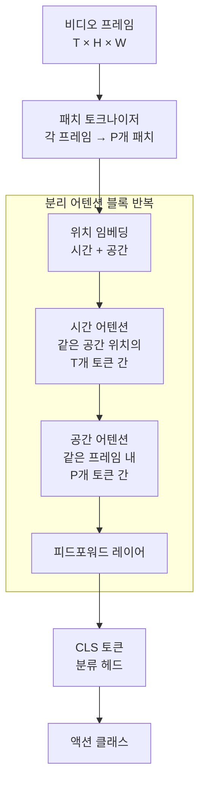

# TimeSformer - 분리된 시공간 어텐션

## 개요

TimeSformer(Time-Space Transformer)는 Facebook AI Research(2021)에서 발표한 비디오 인식 트랜스포머 아키텍처다. 핵심 기여는 **시간 어텐션(temporal attention)과 공간 어텐션(spatial attention)을 별도 레이어로 분리(divided attention)**하는 방식으로, [[vision-transformer]]를 비디오에 직접 적용할 때 발생하는 연산 폭발 문제를 해결한다.

## 문제 배경: 시공간 어텐션의 연산 비용

[[transformer-architecture]]의 셀프 어텐션은 입력 토큰 수 $N$에 대해 $O(N^2)$ 복잡도를 가진다. 비디오를 $T$ 프레임, 각 프레임을 $H \times W$ 패치로 분할하면 총 토큰 수는 $N = T \times H \times W$가 된다. $T=8, H=W=14$이면 $N = 1568$, 풀 시공간 어텐션은 약 $1568^2 \approx 2.5M$ 어텐션 가중치를 계산해야 한다. TimeSformer는 이를 분리하여 현실적인 계산 비용으로 줄인다.

분리 어텐션 블록은 각 트랜스포머 레이어를 시간 어텐션 → 공간 어텐션 순으로 구성한다.

## 분리 어텐션의 수학적 구조

각 레이어 $\ell$에서의 연산은 다음 두 단계로 나뉜다:

**1단계 - 시간 어텐션**: 공간 위치 $(h, w)$를 고정하고, 모든 프레임 $t \in [1, T]$의 동일 위치 토큰끼리 어텐션을 수행한다.

$$z^{(h,w)}_\ell = \text{Attn}_\text{time}\left(\{x^{(t,h,w)}_{\ell-1}\}_{t=1}^T\right)$$

**2단계 - 공간 어텐션**: 프레임 $t$를 고정하고, 해당 프레임 내 모든 패치 $(h, w)$끼리 어텐션을 수행한다.

$$y^{(t)}_\ell = \text{Attn}_\text{space}\left(\{z^{(t,h,w)}_\ell\}_{h,w}\right)$$

이 분리 방식으로 복잡도가 $O(T^2 \cdot P + T \cdot P^2)$으로 감소한다. $P = H \times W$로 표기할 때, 풀 시공간 어텐션의 $O((T \cdot P)^2)$에 비해 월등히 효율적이다.

## 다양한 어텐션 변형 비교

TimeSformer 논문에서는 5가지 어텐션 설계를 실험적으로 비교한다:

| 방식 | 설명 | Kinetics-400 Top-1 | 연산 비용 |
|------|------|-------------------|----------|
| Space Only | 공간 어텐션만 | 72.0% | 낮음 |
| Joint Space-Time | 완전 시공간 어텐션 | 78.0% | 매우 높음 |
| Divided Space-Time | 시간 + 공간 분리 (논문 제안) | 78.0% | 중간 |
| Sparse Local Global | 지역/전역 혼합 | 77.3% | 중간 |
| Axial | 행/열 분리 | 76.8% | 낮음 |

결론: 분리 어텐션은 풀 시공간 어텐션과 **동등한 성능**을 훨씬 낮은 연산 비용으로 달성한다.

## ViT와의 관계 및 확장

TimeSformer는 [[vision-transformer]]의 사전학습 가중치(ImageNet 21K)를 직접 초기화에 활용한다. 공간 어텐션 레이어는 ViT와 동일한 구조이므로 가중치 재사용이 자연스럽다. 시간 어텐션 레이어는 신규 추가이므로 제로 초기화 후 파인튜닝한다.

[[transformer-architecture]] 관점에서 TimeSformer는 기존 구조를 유지하면서 어텐션 패턴만 도메인 특화로 수정한 "최소 침습(minimal invasive)" 설계다.

## 실무 적용 관점

- **영상 분류 파이프라인**: 클립(clip) 단위로 샘플링 후 TimeSformer 추론 → 클립별 예측을 평균화하는 방식이 표준
- **긴 비디오**: 분리 어텐션 덕분에 $T$를 늘려도 메모리가 선형적으로만 증가(공간 어텐션 기준)
- **[[videomae-masked-video]] 와의 결합**: TimeSformer 아키텍처에 MAE 사전학습을 결합하면 성능이 더욱 향상됨
- **이후 발전**: Video Swin Transformer(2022)는 이 방향을 윈도우 어텐션으로 확장, InternVideo2([[internvideo2-video-foundation]])는 대규모 멀티모달로 발전

## 한계

- 분리 어텐션은 시간과 공간의 상호작용을 충분히 포착하지 못할 수 있음 - 복잡한 시공간 패턴에서 풀 어텐션 대비 열세
- 고해상도 비디오($H, W$가 클 때)에서 공간 어텐션 비용이 여전히 높음
- 짧은 동작(단일 프레임으로 구분 가능한 경우)에서는 시간 어텐션의 효용이 제한적

## 관련 문서

- [[vision-transformer]] - 사전학습 가중치를 재사용하는 기반 아키텍처
- [[transformer-architecture]] - 셀프 어텐션의 기본 원리
- [[videomae-masked-video]] - 비디오 자기지도학습 접근법
- [[video-clip-contrastive]] - 텍스트-비디오 대조학습
