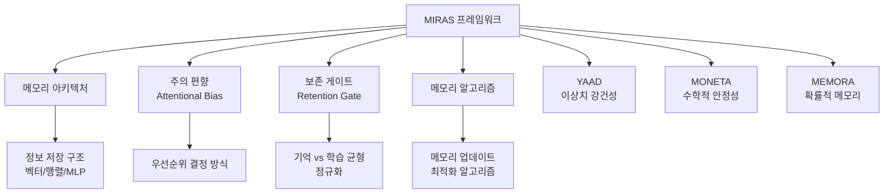
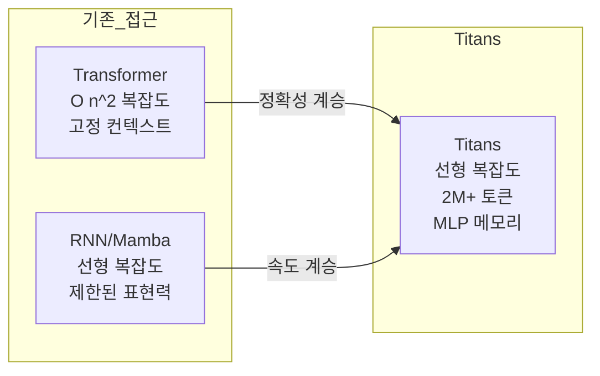

# Titans + MIRAS (Google 장기 메모리 아키텍처)

Google Research가 2025년 12월 발표한 차세대 시퀀스 모델 아키텍처. 신경망 자체를 학습 가능한 장기 메모리로 활용하여 "놀라움(surprise)" 신호 기반의 선택적 정보 보존을 구현하고, 2백만 토큰 이상의 극한 컨텍스트를 RNN 수준 효율로 처리한다.

## 개요

기존 [[multi-head-latent-attention|트랜스포머]]는 시퀀스 길이에 따라 계산 비용이 제곱으로 증가하고, [[mamba-3|Mamba]] 계열 RNN은 고정 크기 상태로 표현력이 제한된다. Titans는 이 둘의 장점 -- 트랜스포머의 정확성과 RNN의 속도 -- 을 결합한 아키텍처이며, MIRAS는 주요 시퀀스 모델을 통합적으로 설명하는 프레임워크로서 새로운 변형 모델 설계를 체계적으로 가능하게 한다.

## MIRAS 프레임워크

MIRAS(Memory as Associative Recall in Sequences)는 모든 주요 시퀀스 모델을 **효율적 연관 메모리 모듈**로 통합 해석하는 프레임워크다. 네 가지 설계 축으로 모델을 체계적으로 정의한다.

### MIRAS 변형 모델

- **YAAD**: Huber loss로 문서의 오타 같은 일회성 오류에 과도 반응하지 않는 이상치 강건 설계
- **MONETA**: 일반화된 노름(generalized norm)으로 주의와 망각 메커니즘 모두에 안정적 장기 메모리 구현
- **MEMORA**: 메모리를 확률 맵으로 강제하여 업데이트 시 변화를 통제하고 균형잡힌 정보 통합 보장

## 기존 아키텍처 대비 성능

| 측면 | Transformer | Mamba/RNN | Titans |
|------|-------------|-----------|--------|
| 계산 복잡도 | O(n^2) | O(n) | O(n) |
| 컨텍스트 처리 | 고정 윈도우 | 고정 크기 상태 | 2M+ 토큰 |
| 메모리 구조 | 어텐션 KV 캐시 | 벡터/행렬 | 심층 MLP 신경망 |
| 표현력 | 높음 | 제한적 | 높음 |
| 추론 속도 | 느림 | 빠름 | 빠름 |

## 벤치마크 결과

### BABILong (극한 장문맥 회상)

Titans는 극도로 긴 문서에 걸친 추론 작업에서 **GPT-4를 포함한 모든 기존 모델을 능가**했다. 매개변수가 훨씬 적음에도 GPT-4보다 우수한 검색 정확도를 유지하면서 2백만 토큰을 넘어 확장에 성공했다.

### 언어 모델링

- Mamba-2, [[gated-deltanet|Gated DeltaNet]], Transformer++ 등 최첨단 모델을 능가
- 동일 크기 모델 대비 낮은 혼란도(perplexity) 달성
- 360M/760M 파라미터 규모에서 시퀀스 길이 증가에 따른 우수한 확장성 입증

### 범용성

텍스트를 넘어 DNA(게놈 모델링), 시계열 예측 등 다양한 도메인에서 검증되어 아키텍처의 범용 일반화 능력이 확인되었다.

## 메모리 깊이의 효과

같은 크기의 메모리 모듈에서 더 깊은(더 많은 층의) 메모리 구조가 일관되게 더 낮은 퍼플렉서티를 달성한다. 이는 메모리 용량(파라미터 수)뿐 아니라 메모리 표현력(깊이)이 장기 컨텍스트 처리에 핵심임을 보여준다.

## 기술적 의의

MIRAS가 기존 평균제곱오차(MSE) 패러다임을 초월하여 **비유클리드 목적함수와 정규화**를 탐색할 수 있는 생성적 프레임워크를 제공함으로써, 온라인 최적화, 연관 메모리, 아키텍처 설계 간의 깊은 연결을 체계적으로 드러냈다. 이는 [[long-context-scaling|장문맥 확장]] 연구의 새로운 방향을 제시한다.

## 실무 관점

- 2M+ 토큰 컨텍스트는 코드베이스 전체, 법률 문서, 의료 기록 같은 초장문 입력을 단일 컨텍스트로 처리할 수 있음을 의미한다
- 선형 복잡도로 장기 컨텍스트를 처리하므로 추론 비용이 크게 절감된다
- "놀라움 기반 선택적 메모리"는 인간의 인지 과정과 유사해, 모델 행동을 해석/디버깅하기 쉬운 이점이 있다
- MIRAS의 설계 공간 체계화는 후속 연구에서 새로운 메모리 아키텍처를 빠르게 탐색하고 비교하는 데 활용될 수 있다
- Qwen3-Next가 [[gated-deltanet|Gated DeltaNet]](75% 선형 + 25% 풀 어텐션) 하이브리드를 채택한 것과 맥락이 같으며, Titans는 이 방향의 다음 단계로 읽힌다
- [[meta-tribe-v2]] 같은 신경과학 모델이 뇌의 정보 처리 원리를 실증하고, 이것이 다시 Titans 같은 AI 아키텍처 설계에 영감을 주는 양방향 시너지가 형성되고 있다

## 관련 페이지

- [[long-context-scaling|장문맥 스케일링]]
- [[mamba-3|Mamba 아키텍처]]
- [[gated-deltanet|Gated DeltaNet & Hybrid Linear Attention]]
- [[multi-head-latent-attention|Multi-Head Latent Attention]]
- [[ai-reasoning-models|AI 추론 모델]]
- [[meta-tribe-v2|Meta TRIBE v2]] - 뇌 활동 예측 모델 (신경과학-AI 양방향 시너지)

## 참고 자료

- [Google Research Blog: Titans & MIRAS](https://research.google/blog/titans-miras-helping-ai-have-long-term-memory/)
- [Search Engine Journal: Google's Titans and MIRAS](https://www.searchenginejournal.com/googles-titans-and-miras-significant-advancement-in-long-context-ai/568688/)
- [The Decoder: MIRAS and Titans](https://the-decoder.com/google-outlines-miras-and-titans-a-possible-path-toward-continuously-learning-ai/)
