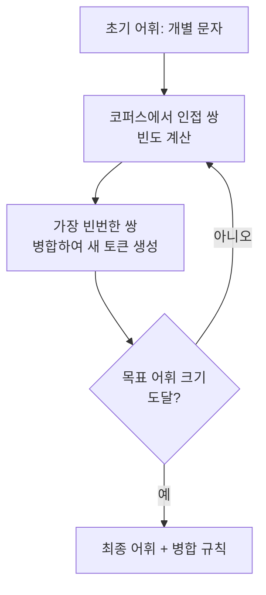

# 토크나이제이션 (BPE / SentencePiece)

## 개요

토크나이제이션은 원시 텍스트를 모델이 처리할 수 있는 이산 단위(토큰)로 분할하는 과정이다. 현대 LLM은 단어 단위도 문자 단위도 아닌 **서브워드(subword)** 토크나이제이션을 사용한다. BPE(Byte-Pair Encoding)가 가장 널리 쓰이며, SentencePiece는 BPE/Unigram 등을 언어 독립적으로 구현하는 프레임워크다. 토크나이저는 [[embedding-layers|임베딩 레이어]]의 입력 공간을 정의하며, 모델의 어휘 능력과 추론 비용에 직접 영향을 준다.

## 왜 서브워드인가

| 방식 | 어휘 크기 | 문제 |
|---|---|---|
| 단어 단위 | 매우 큼 (수십만+) | OOV(미등록어) 발생, 형태소 풍부한 언어 처리 불가 |
| 문자 단위 | 매우 작음 (~수백) | 시퀀스 극도로 길어짐, 의미 단위 파악 어려움 |
| **서브워드** | 중간 (32K-128K) | 빈도 높은 단어는 하나로, 희귀 단어는 조각으로 |

서브워드 분할은 빈출 단어("the", "is")는 단일 토큰으로 유지하고, 희귀 단어("tokenization")는 의미 있는 조각("token" + "ization")으로 분해하여 어휘 크기와 시퀀스 길이의 균형을 잡는다.

## BPE (Byte-Pair Encoding)

Sennrich et al. (2016)이 기계 번역에 도입한 알고리즘으로, 현재 GPT, Llama, Qwen 등 대부분의 LLM이 사용한다.

### 학습 과정

1. 모든 단어를 문자 단위로 분리 (초기 어휘 = 문자 집합)
2. 코퍼스에서 가장 자주 인접하는 문자/토큰 쌍을 찾음
3. 해당 쌍을 하나의 새 토큰으로 병합
4. 목표 어휘 크기에 도달할 때까지 2-3 반복

**핵심 특성:** 상향식(bottom-up) 구축이다. 작은 단위에서 출발하여 빈번한 패턴을 반복 병합한다. 탐욕적(greedy) 알고리즘이므로 가장 빈번한 쌍을 우선 병합한다.

### Byte-level BPE

GPT-2 이후 모델들은 문자가 아닌 **바이트** 수준에서 BPE를 적용한다. UTF-8 바이트(256개)를 기본 단위로 사용하면 어떤 언어의 텍스트도 OOV 없이 처리할 수 있다. 대부분의 현대 LLM이 이 방식을 사용한다.

## WordPiece

Google의 BERT에서 사용된 알고리즘으로, BPE와 유사하지만 병합 기준이 다르다. 단순 빈도 대신 **우도(likelihood)**를 최대화하는 쌍을 선택한다. 병합 시 해당 쌍이 어휘에 추가되었을 때 코퍼스의 우도 증가분이 가장 큰 쌍을 우선한다. 단어 내부의 서브워드는 "##" 접두사로 표시한다(예: "playing" -> "play" + "##ing").

## Unigram Language Model

Kudo (2018)가 제안한 알고리즘으로, BPE와 반대 방향인 **하향식(top-down)** 접근이다.

1. 큰 후보 어휘로 시작
2. 각 토큰을 제거했을 때 전체 코퍼스 우도 감소분을 계산
3. 가장 영향이 적은 토큰을 제거
4. 목표 어휘 크기에 도달할 때까지 반복

확률 모델에 기반하므로 동일 텍스트에 대해 여러 가능한 분할(segmentation) 중 확률적으로 최적인 분할을 선택할 수 있다.

## SentencePiece

Google이 개발한 토크나이제이션 프레임워크로, BPE와 Unigram을 **언어 독립적**으로 구현한다.

**핵심 설계 원칙:**
- **공백 문제 해결**: 표준 BPE는 공백으로 단어를 분리한 뒤 서브워드를 적용하지만, 이는 중국어/일본어처럼 공백이 없는 언어에서 작동하지 않는다. SentencePiece는 원시 텍스트를 바이트/문자 스트림으로 직접 처리한다
- **공백 기호**: 공백을 특수 문자 "_" (U+2581)로 치환하여 어휘에 포함시킨다. "Hello world" -> "_Hello_world"
- **가역성**: 토큰화와 역토큰화가 완전히 가역적(lossless reversible)이다

**사용 모델:** T5, Llama, Gemma 등이 SentencePiece를 사용한다.

## 토크나이저가 LLM에 미치는 영향

- **추론 비용**: 토큰 수가 곧 연산량이다. 효율적 토크나이저는 같은 텍스트를 더 적은 토큰으로 표현
- **다국어 능력**: 어휘가 특정 언어에 편중되면 다른 언어의 텍스트가 과도하게 긴 토큰 시퀀스가 됨
- **코드 처리**: 들여쓰기, 특수 기호 처리가 코드 생성 품질에 직접 영향
- **KV 캐시**: 토큰 수가 줄면 [[kv-cache|KV 캐시]] 크기도 비례하여 감소

## 관련 문서
- [[vocabulary-size-scaling]] -- 어휘 크기 스케일링 (Vocabulary Size Scaling)

- [[embedding-layers]] -- 토큰 ID를 벡터로 변환하는 다음 단계
- [[word2vec-pretrained-embeddings]] -- 사전학습 임베딩과 토크나이제이션의 관계
- [[kv-cache]] -- 토큰 수가 KV 캐시 크기를 결정

## 참고 자료

- [Tokenization algorithms (Hugging Face Docs)](https://huggingface.co/docs/transformers/tokenizer_summary)
- [SentencePiece: Unsupervised text tokenizer (GitHub)](https://github.com/google/sentencepiece)
- [Byte-Pair Encoding: Subword-based tokenization algorithm (Towards Data Science)](https://towardsdatascience.com/byte-pair-encoding-subword-based-tokenization-algorithm-77828a70bee0/)
