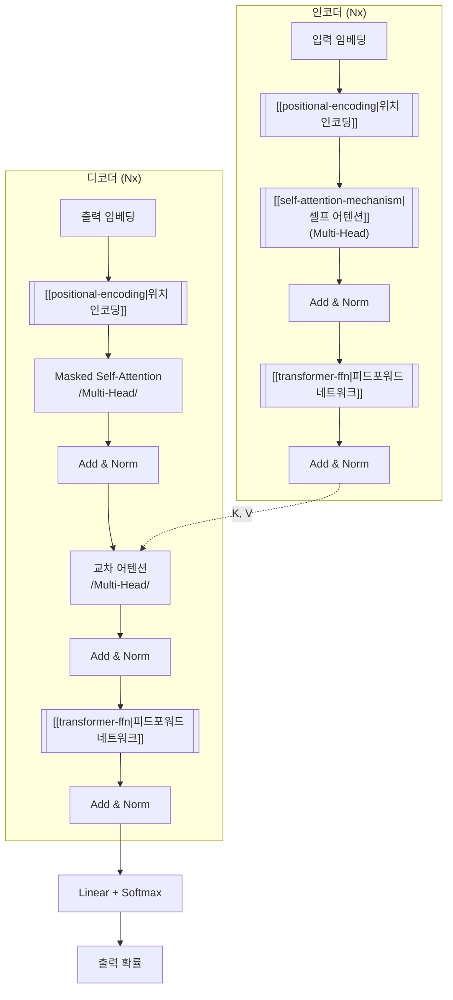
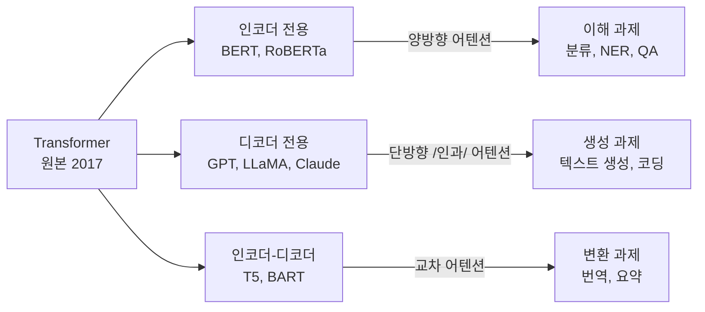

## 개요

Transformer는 Vaswani et al.(2017)이 "Attention Is All You Need"에서 제안한 시퀀스-투-시퀀스 아키텍처로, 순환(recurrence)과 합성곱 없이 [[self-attention-mechanism]]만으로 입력 시퀀스의 모든 위치 간 관계를 병렬 계산한다. WMT 2014 영-독 번역에서 28.4 BLEU, 영-불 번역에서 41.8 BLEU를 달성하며 당시 최고 성능을 기록했다. 이후 BERT, GPT, T5, LLaMA 등 현대 대규모 언어모델(LLM)의 근간이 되었으며, 비전(ViT), 음성, 과학 분야로까지 확장되어 현재 딥러닝의 사실상 표준 아키텍처다.

## 전체 구조



원본 Transformer는 인코더 6층 + 디코더 6층으로 구성되며, 각 층은 동일한 구조를 반복한다. 모든 서브 계층에 잔차 연결(residual connection)과 레이어 정규화(LayerNorm)가 적용된다.

## 핵심 구성 요소

### 1. 셀프 어텐션 (Self-Attention)

입력 시퀀스의 각 위치가 다른 모든 위치와의 관련성을 계산한다. Query, Key, Value 세 벡터로 변환한 뒤 Scaled Dot-Product Attention을 수행한다:

```
Attention(Q, K, V) = softmax(Q * K^T / sqrt(d_k)) * V
```

d_k로 스케일링하는 이유는 내적 값이 차원 수에 비례하여 커지면 소프트맥스 기울기가 소실되기 때문이다. 상세 내용은 [[self-attention-mechanism]] 참조.

### 2. 멀티헤드 어텐션 (Multi-Head Attention)

단일 어텐션 대신 h개의 독립적 어텐션 헤드를 병렬 수행하여 다양한 관계 패턴을 동시에 포착한다. 원본 모델은 h=8, d_model=512, d_k=d_v=64를 사용했다. 상세 내용은 [[multi-head-attention]] 참조.

### 3. 위치 인코딩 (Positional Encoding)

어텐션은 순서 정보를 내재하지 않으므로, 시퀀스 내 위치 정보를 별도로 주입해야 한다. 원본은 사인/코사인 함수 기반의 고정 인코딩을 사용했다. 현대 모델은 RoPE, ALiBi 등을 채택한다. 상세 내용은 [[positional-encoding]] 참조.

### 4. 피드포워드 네트워크 (FFN)

각 어텐션 계층 뒤에 위치별 독립적으로 적용되는 2층 완전연결 네트워크다. 원본은 ReLU 활성화와 d_ff=2048을 사용했으며, 현대 모델은 SwiGLU/GeGLU를 채택한다. 상세 내용은 [[transformer-ffn]] 참조.

### 5. 잔차 연결 + 레이어 정규화

모든 서브 계층의 출력에 입력을 더하는 잔차 연결이 기울기 흐름을 보장한다. 원본 Transformer는 서브 계층 뒤에 LayerNorm을 배치하는 Post-LN 구조이며, 현대 모델 대다수는 학습 안정성을 위해 [[pre-ln-vs-post-ln|Pre-LN]]을 채택한다.

## 원본 하이퍼파라미터

| 항목 | 값 |
|------|-----|
| d_model (모델 차원) | 512 |
| d_ff (FFN 내부 차원) | 2048 |
| h (어텐션 헤드 수) | 8 |
| d_k = d_v (헤드당 차원) | 64 |
| 인코더 층수 | 6 |
| 디코더 층수 | 6 |
| 드롭아웃 | 0.1 |
| 레이블 스무딩 | 0.1 |

## Transformer의 세 가지 변형

현대 LLM은 원본의 인코더-디코더 구조에서 세 가지 방향으로 분화했다:



상세 비교는 [[encoder-decoder-architectures]] 참조.

## 현대 Transformer의 진화

원본 대비 현대 LLM(LLaMA, Mistral, Qwen 등)에서 변경된 주요 설계 결정:

| 항목 | 원본 (2017) | 현대 (2024-2026) |
|------|------------|-----------------|
| 정규화 위치 | [[pre-ln-vs-post-ln|Post-LN]] | Pre-LN (또는 Pre-RMSNorm) |
| 정규화 방식 | LayerNorm | RMSNorm |
| 활성화 함수 | ReLU | SwiGLU / GeGLU |
| 위치 인코딩 | 사인/코사인 | [[positional-encoding|RoPE]] |
| 어텐션 변형 | MHA | GQA, [[multi-head-latent-attention|MLA]] |
| 어텐션 게이팅 | 없음 | [[gated-attention]] |
| 어텐션 최적화 | 없음 | FlashAttention |
| 시퀀스 혼합 대안 | 없음 | [[mamba-3|SSM]] 하이브리드 |

## 계산 복잡도

셀프 어텐션의 시간/공간 복잡도는 O(n^2 * d)로, 시퀀스 길이 n에 대해 이차적이다. 이 한계를 극복하기 위한 연구가 활발하다:

- **FlashAttention**: IO-aware 커널로 실질적 속도 향상 (복잡도는 동일)
- **Sparse Attention**: Longformer, BigBird 등 O(n) 근사
- **선형 어텐션**: [[gated-deltanet]], [[mamba-3]] 등 O(n) 대안
- **MLA**: [[multi-head-latent-attention]]으로 KV 캐시 압축

## 대표 자료

- [Vaswani et al., "Attention Is All You Need" (arXiv:1706.03762)](https://arxiv.org/abs/1706.03762)
- [Phuong & Hutter, "Formal Algorithms for Transformers" (arXiv:2207.09238)](https://arxiv.org/abs/2207.09238)
- [The Illustrated Transformer (Jay Alammar)](https://jalammar.github.io/illustrated-transformer/)

## 관련 문서
- [[gpt-architecture-lineage]] -- GPT 아키텍처 계보 (GPT Architecture Lineage)
- [[t5-text-to-text]] -- T5 (Text-to-Text Transfer Transformer)
- [[machine-translation-modern]] -- 현대 기계번역 (Modern Machine Translation)
- [[llama-2-3]] -- Llama (Meta 오픈소스 LLM 패밀리)
- [[hybrid-mamba-transformer]] -- 하이브리드 Mamba-Transformer - 선택적 SSM과 어텐션의 결합

- [[self-attention-mechanism]] -- Q/K/V와 Scaled Dot-Product Attention 상세
- [[multi-head-attention]] -- 다중 헤드 병렬 어텐션
- [[positional-encoding]] -- 사인/코사인, RoPE, ALiBi
- [[transformer-ffn]] -- SwiGLU/GeGLU, FFN as Key-Value Memories
- [[pre-ln-vs-post-ln]] -- 레이어 정규화 위치에 따른 학습 안정성
- [[encoder-decoder-architectures]] -- BERT/GPT/T5 구조적 차이
- [[multi-head-latent-attention]] -- DeepSeek의 KV 캐시 압축 어텐션
- [[gated-attention]] -- 시그모이드 게이트 기반 어텐션 개선
- [[mamba-3]] -- 순환 구조 기반 대안 아키텍처
- [[gated-deltanet]] -- 게이트 기반 선형 어텐션
- [[titans-miras]] -- 장기 기억 통합 아키텍처
- [[rnn-lstm-gru]] -- Transformer 이전의 시퀀스 모델링 패러다임
- [[cnn]] -- Transformer 이전의 특징 추출 패러다임
- [[diffusion-models]] -- DiT에서 Transformer 기반 디노이징
