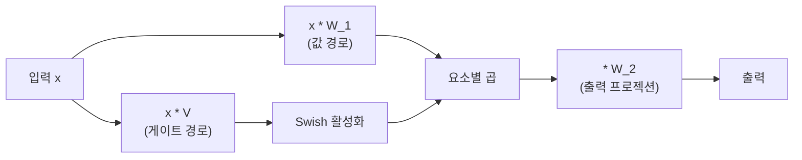
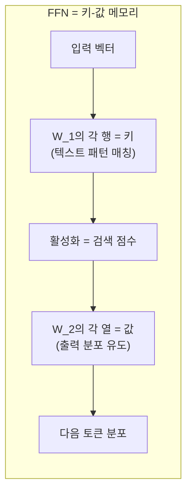

## 개요

Transformer 피드포워드 네트워크(FFN, Feed-Forward Network)는 [[transformer-architecture]]의 각 층에서 [[multi-head-attention|멀티헤드 어텐션]] 뒤에 위치하는 위치별(position-wise) 독립 완전연결 네트워크다. 원본 Transformer는 ReLU 활성화의 2층 FFN을 사용했지만, 현대 LLM은 SwiGLU 또는 GeGLU 활성화로 교체하여 일관된 성능 향상을 달성한다. Geva et al.(2021)의 연구는 FFN이 사실상 키-값 메모리(key-value memory)로 기능한다는 해석을 제시하여, FFN의 역할에 대한 이해를 심화시켰다.

## 원본 FFN 구조

```
FFN(x) = max(0, x * W_1 + b_1) * W_2 + b_2
```

- W_1: d_model -> d_ff (확장)
- W_2: d_ff -> d_model (축소)
- 원본: d_model=512, d_ff=2048 (4배 확장)

2층 구조로, 첫 번째 층이 차원을 확장하고 비선형 활성화를 적용한 뒤, 두 번째 층이 원래 차원으로 축소한다. "위치별 독립"이란 시퀀스의 각 토큰에 동일한 가중치로 독립 적용된다는 의미다.

### FFN의 파라미터 비중

FFN은 Transformer 파라미터의 약 2/3를 차지한다. 어텐션이 "어디를 볼 것인가"를 결정한다면, FFN은 "무엇을 기억하고 변환할 것인가"를 담당한다.

## GLU 변형과 SwiGLU

### GLU (Gated Linear Unit)

Dauphin et al.(2017)이 제안한 게이트 메커니즘이다. 입력을 두 갈래로 프로젝션하여 하나는 게이트, 하나는 값으로 사용한다:

```
GLU(x) = (x * W_1) * sigmoid(x * V)
```

### SwiGLU

Shazeer(2020)가 제안한 GLU 변형으로, 시그모이드 대신 Swish(SiLU) 활성화를 사용한다:

```
SwiGLU(x) = (x * W_1) * Swish(x * V)
Swish(x) = x * sigmoid(beta * x)
```



### GeGLU

GELU 활성화를 사용하는 변형:

```
GeGLU(x) = (x * W_1) * GELU(x * V)
```

### 차원 조정

GLU 변형은 프로젝션이 2개(W_1, V)이므로 파라미터를 맞추려면 d_ff를 2/3로 축소한다. LLaMA는 d_ff를 (2/3 * 4 * d_model)로 설정하고 가장 가까운 256의 배수로 반올림한다.

## ReLU vs SwiGLU 비교

| 항목 | ReLU FFN (원본) | SwiGLU FFN (현대) |
|------|----------------|------------------|
| 활성화 | ReLU | Swish + 요소별 곱 |
| 프로젝션 수 | 2개 (W_1, W_2) | 3개 (W_1, V, W_2) |
| d_ff (동일 파라미터) | 4 * d_model | 8/3 * d_model |
| 성능 | 기준 | perplexity 일관적 개선 |
| 채택 | GPT-2, BERT | LLaMA, Mistral, Qwen, Gemma |

Shazeer의 실험에서 SwiGLU는 동일 파라미터 예산 대비 가장 낮은 perplexity를 달성했으며, 이후 대규모 실험에서도 이 결과가 재현되어 사실상 표준이 되었다.

## FFN as Key-Value Memories

Geva et al.(2021, EMNLP)의 "Transformer Feed-Forward Layers Are Key-Value Memories"는 FFN을 새로운 관점에서 해석했다:

### 핵심 주장



- **W_1의 각 행(키)**: 특정 텍스트 패턴(n-gram, 의미 패턴)과 대응
- **활성화 값**: 입력이 해당 패턴에 얼마나 일치하는지의 점수
- **W_2의 각 열(값)**: 매칭된 패턴에 후속할 토큰의 분포를 유도

하위 층은 얕은 패턴(구문, n-gram)을, 상위 층은 깊은 패턴(의미, 주제)을 캡처하는 경향이 관찰된다. 이 해석은 지식 편집(knowledge editing), 사실 추적(fact tracing), 모델 해석 가능성 연구의 이론적 기반이 되었다.

## 현대 LLM의 FFN 설계 패턴

| 모델 | 활성화 | d_ff / d_model | 비고 |
|------|--------|---------------|------|
| GPT-2 | GELU | 4x | 고전적 설계 |
| LLaMA 1/2/3 | SwiGLU | ~2.67x (8/3) | 256 배수 정렬 |
| Mistral | SwiGLU | ~3.5x | 모델별 조정 |
| Qwen 2.5 | SwiGLU | ~2.67x | LLaMA와 유사 |
| Gemma 2/3 | GeGLU | ~4x | GELU 게이트 변형 |

## 대표 자료

- [Vaswani et al., "Attention Is All You Need" (arXiv:1706.03762)](https://arxiv.org/abs/1706.03762)
- [Shazeer, "GLU Variants Improve Transformer" (arXiv:2002.05202)](https://arxiv.org/abs/2002.05202)
- [Geva et al., "Transformer Feed-Forward Layers Are Key-Value Memories" (EMNLP 2021)](https://arxiv.org/abs/2012.14913)

## 관련 문서

- [[transformer-architecture]] -- FFN이 핵심 구성 요소인 전체 구조
- [[self-attention-mechanism]] -- FFN 이전에 수행되는 어텐션 연산
- [[multi-head-attention]] -- 어텐션과 FFN의 역할 분담
- [[pre-ln-vs-post-ln]] -- FFN 전후의 레이어 정규화 위치
- [[gated-attention]] -- 어텐션에도 게이팅을 적용하는 최신 연구
- [[gated-deltanet]] -- 게이트 메커니즘의 선형 어텐션 적용
