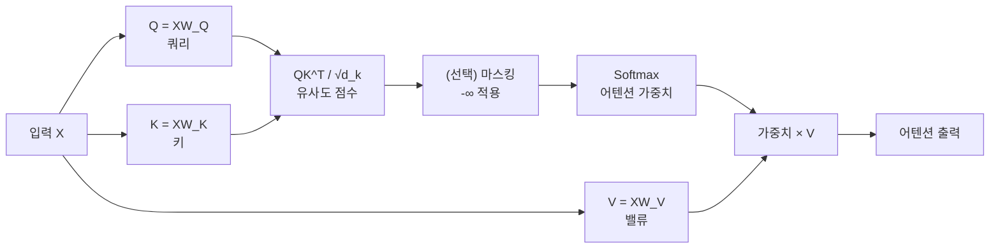
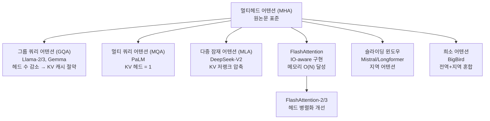
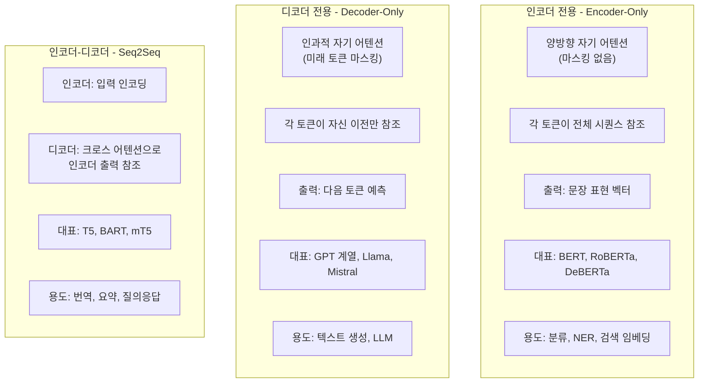
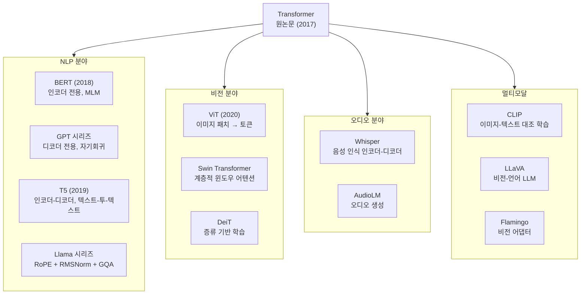

# Transformer 아키텍처

## 개념 정의

Transformer는 Vaswani et al. (2017) "Attention Is All You Need" 논문에서 제안된 신경망 아키텍처로, RNN/LSTM을 대체하는 **전적으로 어텐션(attention) 메커니즘에 기반한 시퀀스 모델**이다. 병렬 처리 친화적 구조와 장거리 의존성(long-range dependency) 처리 능력 덕분에 NLP뿐 아니라 비전, 오디오, 멀티모달 영역으로 확장되어 현대 AI의 사실상 표준 아키텍처가 되었다.

```mermaid
flowchart TD
    INPUT[입력 시퀀스\n토큰 ID] --> EMBED[토큰 임베딩\nE ∈ R^(n×d_model)]
    EMBED --> PE[위치 인코딩 추가\nPE ∈ R^(n×d_model)]
    PE --> ENC_STACK

    subgraph ENC_STACK[인코더 스택 - N층]
        E_MHSA[멀티헤드 자기 어텐션] --> E_ADD1[잔차 연결 + LayerNorm]
        E_ADD1 --> E_FFN[피드포워드 네트워크]
        E_FFN --> E_ADD2[잔차 연결 + LayerNorm]
    end

    ENC_STACK --> ENC_OUT[인코더 출력\n컨텍스트 표현]

    TARGET[타겟 시퀀스] --> EMBED2[임베딩 + PE]
    EMBED2 --> DEC_STACK

    subgraph DEC_STACK[디코더 스택 - N층]
        D_MMHSA[마스킹된 멀티헤드\n자기 어텐션] --> D_ADD1[잔차 + LayerNorm]
        D_ADD1 --> D_XATTN[크로스 어텐션\n인코더 출력 참조]
        D_XATTN --> D_ADD2[잔차 + LayerNorm]
        D_ADD2 --> D_FFN[피드포워드 네트워크]
        D_FFN --> D_ADD3[잔차 + LayerNorm]
    end

    ENC_OUT --> D_XATTN
    DEC_STACK --> LINEAR[선형 레이어]
    LINEAR --> SOFTMAX[Softmax\n다음 토큰 확률]
```

---

## 핵심 구성 요소

### 1. 토큰 임베딩과 위치 인코딩

Transformer는 순서 정보가 없으므로 위치를 명시적으로 인코딩한다.

**원논문 사인/코사인 위치 인코딩**:

$$PE_{(pos, 2i)} = \sin\left(\frac{pos}{10000^{2i/d_{model}}}\right)$$
$$PE_{(pos, 2i+1)} = \cos\left(\frac{pos}{10000^{2i/d_{model}}}\right)$$

```python
import torch
import torch.nn as nn
import math

class SinusoidalPositionalEncoding(nn.Module):
    """원논문의 사인/코사인 위치 인코딩."""
    def __init__(self, d_model: int, max_seq_len: int = 5000, dropout: float = 0.1):
        super().__init__()
        self.dropout = nn.Dropout(p=dropout)
        pe = torch.zeros(max_seq_len, d_model)
        position = torch.arange(max_seq_len).unsqueeze(1).float()
        div_term = torch.exp(
            torch.arange(0, d_model, 2).float() * (-math.log(10000.0) / d_model)
        )
        pe[:, 0::2] = torch.sin(position * div_term)
        pe[:, 1::2] = torch.cos(position * div_term)
        self.register_buffer("pe", pe.unsqueeze(0))  # (1, max_seq_len, d_model)

    def forward(self, x: torch.Tensor) -> torch.Tensor:
        # x: (batch, seq_len, d_model)
        return self.dropout(x + self.pe[:, :x.size(1)])
```

**진화**: 원논문 고정 PE → 학습 가능 PE(BERT, GPT) → RoPE(Llama) → ALiBi(MPT) → NTK-aware RoPE(긴 컨텍스트 확장)

### 2. 스케일드 닷 프로덕트 어텐션



$$\text{Attention}(Q, K, V) = \text{softmax}\left(\frac{QK^\top}{\sqrt{d_k}}\right)V$$

- $Q \in \mathbb{R}^{n \times d_k}$: 쿼리
- $K \in \mathbb{R}^{m \times d_k}$: 키
- $V \in \mathbb{R}^{m \times d_v}$: 밸류
- $\sqrt{d_k}$: 내적 값이 너무 커져 소프트맥스 기울기가 소실되는 것을 방지하는 스케일 팩터

```python
import torch.nn.functional as F

def scaled_dot_product_attention(
    q: torch.Tensor,
    k: torch.Tensor,
    v: torch.Tensor,
    mask: torch.Tensor | None = None,
) -> torch.Tensor:
    """스케일드 닷 프로덕트 어텐션."""
    d_k = q.size(-1)
    scores = torch.matmul(q, k.transpose(-2, -1)) / math.sqrt(d_k)  # (batch, heads, n, m)
    if mask is not None:
        scores = scores.masked_fill(mask == 0, float("-inf"))
    attn_weights = F.softmax(scores, dim=-1)
    return torch.matmul(attn_weights, v)
```

### 3. 멀티헤드 어텐션 (MHA)

여러 "헤드"가 서로 다른 표현 부분 공간(representation subspace)에서 어텐션을 병렬로 수행한다:

$$\text{MHA}(Q, K, V) = \text{Concat}(\text{head}_1, ..., \text{head}_h)W^O$$

$$\text{head}_i = \text{Attention}(QW_i^Q, KW_i^K, VW_i^V)$$

```python
class MultiHeadAttention(nn.Module):
    def __init__(self, d_model: int, num_heads: int):
        super().__init__()
        assert d_model % num_heads == 0
        self.d_model = d_model
        self.num_heads = num_heads
        self.d_k = d_model // num_heads

        self.W_q = nn.Linear(d_model, d_model, bias=False)
        self.W_k = nn.Linear(d_model, d_model, bias=False)
        self.W_v = nn.Linear(d_model, d_model, bias=False)
        self.W_o = nn.Linear(d_model, d_model, bias=False)

    def forward(
        self,
        q: torch.Tensor,
        k: torch.Tensor,
        v: torch.Tensor,
        mask: torch.Tensor | None = None,
    ) -> torch.Tensor:
        batch = q.size(0)
        # 헤드별 분리: (batch, seq, d_model) -> (batch, heads, seq, d_k)
        def split_heads(x: torch.Tensor) -> torch.Tensor:
            return x.view(batch, -1, self.num_heads, self.d_k).transpose(1, 2)

        q, k, v = split_heads(self.W_q(q)), split_heads(self.W_k(k)), split_heads(self.W_v(v))
        attn_out = scaled_dot_product_attention(q, k, v, mask)  # (batch, heads, seq, d_k)
        # 헤드 합치기: (batch, seq, d_model)
        attn_out = attn_out.transpose(1, 2).contiguous().view(batch, -1, self.d_model)
        return self.W_o(attn_out)
```

### 4. 피드포워드 네트워크 (FFN)

각 위치에 독립적으로 적용되는 2층 완전연결 네트워크:

$$\text{FFN}(x) = \text{max}(0, xW_1 + b_1)W_2 + b_2$$

- 은닉층 크기는 보통 $d_{model} \times 4$ (예: 512 → 2048)
- ReLU 대신 GELU(GPT-2), SwiGLU(LLaMA) 등이 더 나은 성능을 보임

**SwiGLU** (LLaMA 계열에서 사용):

$$\text{FFN}_{SwiGLU}(x) = (\text{Swish}(xW_1) \odot xW_2)W_3$$

### 5. 레이어 정규화 (LayerNorm)와 잔차 연결

```python
class TransformerLayer(nn.Module):
    def __init__(self, d_model: int, num_heads: int, d_ff: int, dropout: float = 0.1):
        super().__init__()
        self.mha = MultiHeadAttention(d_model, num_heads)
        self.ffn = nn.Sequential(
            nn.Linear(d_model, d_ff),
            nn.GELU(),
            nn.Linear(d_ff, d_model),
        )
        self.norm1 = nn.LayerNorm(d_model)
        self.norm2 = nn.LayerNorm(d_model)
        self.dropout = nn.Dropout(dropout)

    def forward(self, x: torch.Tensor, mask: torch.Tensor | None = None) -> torch.Tensor:
        # Pre-LN (원논문: Post-LN, 현재 표준: Pre-LN으로 안정성 개선)
        attn_out = self.mha(self.norm1(x), self.norm1(x), self.norm1(x), mask)
        x = x + self.dropout(attn_out)                # 잔차 연결
        ffn_out = self.ffn(self.norm2(x))
        x = x + self.dropout(ffn_out)                 # 잔차 연결
        return x
```

**Pre-LN vs Post-LN**:
- Post-LN (원논문): 안정적 학습에 warmup 필수
- Pre-LN (현재 표준): warmup 없이도 안정, 깊은 모델에서 선호

---

## 어텐션 변형 카탈로그



### 주요 어텐션 변형 비교

| 방식 | KV 헤드 수 | KV 캐시 크기 | 정확도 | 주요 모델 |
|------|-----------|------------|-------|----------|
| MHA | = Q 헤드 수 | 기준 (1x) | 최고 | BERT, GPT-2 |
| MQA | 1 | 1/h | 약간 저하 | PaLM |
| GQA | Q/g (그룹) | 1/g | MHA 근접 | Llama-2/3, Mistral |
| MLA | 잠재 압축 | ~매우 작음 | 경쟁력 | DeepSeek-V2 |

---

## 위치 인코딩 진화

| 방법 | 특징 | 사용 모델 |
|------|------|----------|
| 절대 사인/코사인 PE | 고정, 외삽 제한 | 원논문 |
| 학습 가능 절대 PE | 유연, 최대 길이 고정 | BERT, GPT-2 |
| ALiBi | 선형 거리 편향, 외삽 우수 | MPT, BLOOM |
| RoPE | 상대 위치 회전, 외삽 가능 | Llama, Mistral, GPT-NeoX |
| NTK-aware RoPE | RoPE 컨텍스트 확장 | Llama-2 Long, Code Llama |
| YaRN | 동적 스케일링 + NTK | Mistral Long |

**RoPE (Rotary Position Embedding)** 핵심:

쿼리와 키 벡터에 위치에 의존하는 회전 행렬을 곱하여 상대 위치 정보를 어텐션 내적에 자연스럽게 포함:

$$\langle \mathbf{q}_m R_m, \mathbf{k}_n R_n \rangle = \langle \mathbf{q}_m, R_{n-m} \mathbf{k}_n \rangle$$

---

## 인코더 전용 vs 디코더 전용 vs 인코더-디코더



---

## 정규화 기법

| 기법 | 수식 | 위치 | 특징 |
|------|------|------|------|
| LayerNorm | $\frac{x-\mu}{\sigma} \cdot \gamma + \beta$ | 각 서브레이어 후/전 | 표준 |
| RMSNorm | $\frac{x}{\sqrt{\text{RMS}(x)}} \cdot \gamma$ | LLama 등 최신 LLM | 계산 효율, 안정적 |
| Pre-LN | 서브레이어 입력 정규화 | 현재 표준 | 깊은 모델 안정 |
| Post-LN | 서브레이어 출력 정규화 | 원논문 | warmup 필요 |

**RMSNorm** (LLaMA, Mistral):

$$\text{RMSNorm}(x) = \frac{x}{\sqrt{\frac{1}{d}\sum_i x_i^2 + \epsilon}} \odot \gamma$$

---

## 복잡도 분석

| 연산 | 시간 복잡도 | 공간 복잡도 |
|------|-----------|-----------|
| 어텐션 (전체) | $O(n^2 d)$ | $O(n^2)$ |
| FFN | $O(n d^2)$ | $O(nd)$ |
| 전체 레이어 | $O(n^2 d + n d^2)$ | $O(n^2 + nd)$ |

어텐션은 시퀀스 길이 $n$에 대해 **이차(quadratic) 복잡도**를 가지므로 긴 컨텍스트에서 병목이 된다. FlashAttention, 선형 어텐션, SSM 등이 이 문제를 해결하려는 시도다.

---

## 핵심 변형 카탈로그



---

## 확장 법칙 (Scaling Laws)과 Transformer

Kaplan et al. (2020), Chinchilla (2022) 연구에서 Transformer 성능은 다음에 스케일한다:

$$\mathcal{L}(N, D) \approx \frac{A}{N^\alpha} + \frac{B}{D^\beta} + L_\infty$$

- $N$: 모델 파라미터 수
- $D$: 학습 토큰 수
- Chinchilla 법칙: 최적 효율은 $N : D \approx 1 : 20$ (토큰)

현재 표준인 디코더 전용 LLM의 대략적 규모:

| 모델 | 파라미터 | 레이어 | 헤드 | d_model | 컨텍스트 |
|------|---------|--------|------|---------|---------|
| GPT-2 Medium | 345M | 24 | 16 | 1024 | 1024 |
| LLaMA-2 7B | 7B | 32 | 32 | 4096 | 4096 |
| LLaMA-3 70B | 70B | 80 | 64 | 8192 | 128K |
| GPT-4 (추정) | ~1.8T | - | - | - | 128K |

---

## 관련 문서

- [[attention-is-all-you-need]] - 원논문 요약
- [[vision-transformer]] - ViT: 이미지를 위한 Transformer
- [[multimodal-llm]] - 멀티모달 LLM 아키텍처
- [[long-context]] - 긴 컨텍스트 처리 전략
- [[fine-tuning]] - Transformer 파인튜닝 기법
- [[transformer-architecture]] - Transformer 아키텍처 심화
