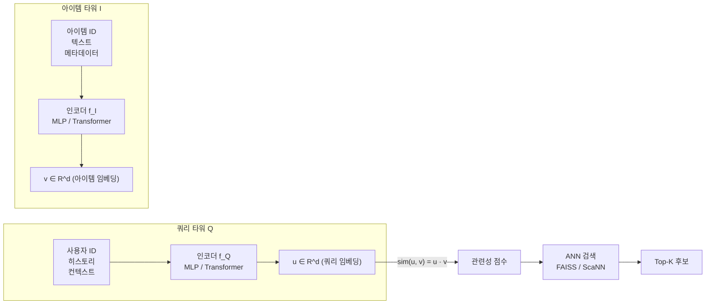
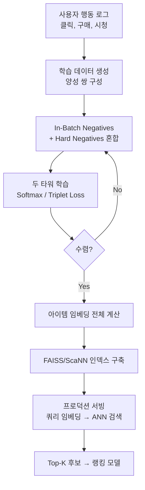

# 두 타워 모델 (Two-Tower Model)

두 타워 모델(Two-Tower Model)은 쿼리(query)와 아이템(item)을 **독립된 두 신경망 인코더로 각각 임베딩**하여, 내적(dot product) 또는 코사인 유사도로 관련성을 계산하는 아키텍처다. 대규모 추천 시스템에서 수억 개 후보를 실시간으로 검색하는 **후보 검색(candidate retrieval)** 단계의 표준 해법으로 자리잡았다.

구글, YouTube, Pinterest, Twitter 등 대규모 플랫폼에서 채택하며, "Dual Encoder", "Bi-Encoder"라는 이름으로도 불린다.

## 왜 중요한가

전통적인 협업 필터링(Collaborative Filtering)은 사용자 수 × 아이템 수 행렬이 필요하고, 교차 인코더(Cross-Encoder)는 쿼리-아이템 쌍마다 모델을 재실행해야 한다. 두 타워 모델은:

1. **아이템 임베딩을 사전 계산(pre-compute)**해 오프라인으로 인덱싱
2. 서빙 시 쿼리 임베딩 한 번 계산 후 ANN(Approximate Nearest Neighbor) 검색으로 수백 ms 내 수억 개 후보를 스캔

이 구조가 실시간 대규모 검색을 가능하게 만드는 핵심이다.

---

## 아키텍처 구조



두 인코더는 독립적으로 작동하며 공유 파라미터가 없다. 학습 시에만 동시에 역전파가 이루어진다.

---

## 수식 정의

쿼리 인코더 $f_Q$와 아이템 인코더 $f_I$에 대해:

$$\text{score}(q, i) = \langle f_Q(q), f_I(i) \rangle$$

학습 목표는 관련 쌍의 점수를 비관련 쌍보다 높이는 것이다. 소프트맥스 손실(softmax loss) 형태:

$$\mathcal{L} = -\log \frac{\exp(\langle u, v^+ \rangle / \tau)}{\exp(\langle u, v^+ \rangle / \tau) + \sum_{j=1}^{N} \exp(\langle u, v_j^- \rangle / \tau)}$$

- $v^+$: 양성(positive) 아이템 임베딩
- $v_j^-$: 음성(negative) 아이템 임베딩
- $\tau$: 온도 파라미터(temperature)

---

## In-Batch Negatives

두 타워 모델 학습에서 가장 중요한 기법 중 하나가 **인-배치 네거티브(In-Batch Negatives)**다. 미니배치 내 다른 쌍의 양성 아이템을 자동으로 음성 샘플로 활용한다.

```mermaid
flowchart TD
    subgraph 미니배치 예시 N=4
        P1["(u1, v1+)"] 
        P2["(u2, v2+)"]
        P3["(u3, v3+)"]
        P4["(u4, v4+)"]
    end

    P1 -- "양성" --> S11["sim(u1, v1+) ↑"]
    P1 -- "음성으로 재활용" --> S12["sim(u1, v2+) ↓"]
    P1 -- "음성으로 재활용" --> S13["sim(u1, v3+) ↓"]
    P1 -- "음성으로 재활용" --> S14["sim(u1, v4+) ↓"]
```

배치 크기 $N$이면 각 쿼리에 대해 $N-1$개의 음성이 자동 생성된다. 별도의 음성 샘플링 없이 대규모 음성 학습이 가능하나, **인기 아이템 편향(popularity bias)** 문제가 생긴다 - 자주 등장하는 인기 아이템이 음성으로 더 많이 등장해 모델이 인기 아이템을 회피하도록 편향된다.

### 빈도 보정 (Frequency Correction)

```python
import torch
import torch.nn.functional as F

def in_batch_softmax_loss(
    query_embs: torch.Tensor,    # (B, d)
    item_embs: torch.Tensor,     # (B, d)
    item_freq: torch.Tensor,     # (B,) 아이템 샘플링 확률
    temperature: float = 0.07,
) -> torch.Tensor:
    """빈도 보정 In-Batch Softmax Loss (YouTube DNN 방식)."""
    # 유사도 행렬
    logits = torch.matmul(query_embs, item_embs.T) / temperature  # (B, B)
    
    # 인기 보정: log(p_j) 차감
    correction = torch.log(item_freq).unsqueeze(0)  # (1, B)
    logits = logits - correction
    
    # 대각 원소가 양성 쌍
    labels = torch.arange(logits.size(0), device=logits.device)
    return F.cross_entropy(logits, labels)
```

---

## 음성 샘플링 전략 비교

| 전략 | 설명 | 장단점 |
|------|------|--------|
| **In-Batch Negatives** | 배치 내 다른 양성 재활용 | 구현 단순, 인기 편향 |
| **랜덤 네거티브** | 전체 코퍼스에서 랜덤 샘플 | 쉽지만 대부분 "쉬운" 샘플 |
| **Hard Negatives** | 쿼리와 유사하지만 비관련 아이템 | 학습 효율 높음, 구성 어려움 |
| **Popularity-Based** | 인기 아이템 위주 샘플 | 실서비스 분포 모방 |
| **Mixed** | 랜덤 + Hard 조합 | 균형 잡힌 학습, 표준 권장 |

---

## 추천 시스템 파이프라인에서의 위치

대규모 추천 시스템은 보통 3단계로 구성된다:

```mermaid
flowchart LR
    A[전체 아이템 풀\n1억+ 개] -->|두 타워 모델| B[후보 검색\nTop-500]
    B -->|경량 모델\nGBDT 등| C[1차 랭킹\nTop-100]
    C -->|복잡한 모델\nCross-Encoder| D[2차 랭킹\nTop-10]
    D --> E[비즈니스 규칙\n다양성/신선도| F[최종 노출]]
```

두 타워 모델은 **후보 검색(Retrieval/Recall)** 단계만 담당한다. 이후 단계에서는 교차 피처(cross-features)를 사용하는 더 복잡한 모델이 정밀 랭킹을 수행한다.

---

## 인코더 설계 선택

### 쿼리 타워 입력 특성

| 특성 유형 | 예시 | 처리 방식 |
|-----------|------|-----------|
| 사용자 ID | user_id_123 | 임베딩 룩업 |
| 시청/클릭 히스토리 | [item1, item2, ...] | 평균 풀링 또는 어텐션 |
| 인구통계 | 나이, 성별, 위치 | 임베딩 + Dense |
| 컨텍스트 | 시간대, 디바이스 | 임베딩 + Dense |

### 아이템 타워 입력 특성

| 특성 유형 | 예시 | 처리 방식 |
|-----------|------|-----------|
| 아이템 ID | item_id_456 | 임베딩 룩업 |
| 텍스트 설명 | 제목, 카테고리 | BERT/SBERT 인코딩 |
| 이미지 | 썸네일 | ResNet/ViT 인코딩 |
| 통계 | 조회수, 평점 | Dense Layer |

### 텍스트 기반 두 타워 (BERT Bi-Encoder)

질의응답, 의미적 검색에서는 두 타워 모두 BERT 계열 인코더를 사용한다. [CLS] 토큰 벡터를 임베딩으로 사용하며, SBERT(Sentence-BERT)가 대표적이다.

```python
from transformers import AutoTokenizer, AutoModel
import torch

class BiEncoderRetriever:
    """BERT 기반 두 타워 검색기."""
    
    def __init__(self, model_name: str = "sentence-transformers/all-MiniLM-L6-v2"):
        self.tokenizer = AutoTokenizer.from_pretrained(model_name)
        self.model = AutoModel.from_pretrained(model_name)
    
    def encode(self, texts: list[str], batch_size: int = 32) -> torch.Tensor:
        all_embeddings = []
        for i in range(0, len(texts), batch_size):
            batch = texts[i:i+batch_size]
            encoded = self.tokenizer(
                batch, padding=True, truncation=True,
                max_length=128, return_tensors="pt"
            )
            with torch.no_grad():
                output = self.model(**encoded)
            # Mean pooling (CLS보다 안정적)
            mask = encoded["attention_mask"].unsqueeze(-1).float()
            emb = (output.last_hidden_state * mask).sum(1) / mask.sum(1)
            all_embeddings.append(torch.nn.functional.normalize(emb, dim=-1))
        return torch.cat(all_embeddings)

retriever = BiEncoderRetriever()
query_embs = retriever.encode(["추천 시스템 최신 기법은?"])
item_embs  = retriever.encode(["Two-Tower 모델 구현 방법", "BERT 파인튜닝 가이드"])
scores = torch.matmul(query_embs, item_embs.T)
```

---

## ANN(Approximate Nearest Neighbor) 검색 연동

학습 완료 후 아이템 임베딩을 ANN 인덱스에 저장하고, 서빙 시 쿼리 임베딩으로 실시간 검색한다.

```python
import faiss
import numpy as np

# 아이템 임베딩 인덱싱
d = 128  # 임베딩 차원
n_items = 10_000_000

index = faiss.IndexFlatIP(d)         # Inner Product (정규화 후 cosine 동일)
# 대규모: faiss.IndexIVFPQ(quantizer, d, nlist=4096, m=8, bits=8)

item_embs = np.random.randn(n_items, d).astype("float32")
faiss.normalize_L2(item_embs)        # 정규화
index.add(item_embs)

# 쿼리 검색
query_emb = np.random.randn(1, d).astype("float32")
faiss.normalize_L2(query_emb)

distances, indices = index.search(query_emb, k=500)  # Top-500 후보 반환
```

---

## 학습 절차 전체 흐름



---

## 한계와 극복 방안

### 교차 피처 부재

두 타워는 쿼리와 아이템의 교차 피처(예: "이 사용자가 이 아이템을 본 횟수")를 사전 계산된 임베딩 내적으로만 표현한다. 이 한계를 극복하는 방법:

- **3개 타워 모델**: 사용자-아이템 상호작용 타워 추가
- **특성 교차 레이어**: FM(Factorization Machine) 스타일 교차항 추가
- **MoE 헤드**: 각 사용자 세그먼트에 맞는 전문가 모듈 배치

### 콜드 스타트 (Cold Start)

신규 사용자/아이템에 대한 임베딩이 없는 문제:
- **콘텐츠 기반 특성**: ID 임베딩 없이도 텍스트, 이미지 등 콘텐츠로 임베딩 생성
- **인구통계 기반 폴백**: 신규 사용자는 인구통계 유사 사용자 임베딩으로 초기화

---

## 관련 문서

- [[two-tower-retrieval]] - 두 타워 모델 상세 검색 구현
- [[ai-content-recommendation]] - 콘텐츠 추천 시스템 적용 사례
- [[recommendation-systems-dl]] - 딥러닝 추천 시스템 전반
- [[ai-personalization-engines]] - 개인화 엔진에서 두 타워 활용
- [[contrastive-learning]] - 두 타워 학습의 기반이 되는 대조 학습 이론
