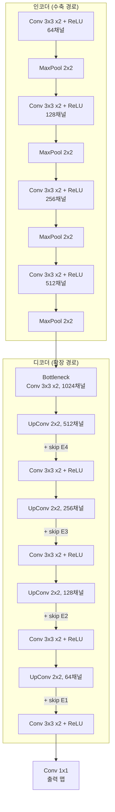

# U-Net

## 개요

U-Net은 Ronneberger, Fischer, Brox(2015)가 의료 이미지 분할을 위해 설계한 인코더-디코더 [[cnn|합성곱 신경망]]이다. 수축 경로(contracting path)로 문맥 정보를 포착하고, 대칭적인 확장 경로(expansive path)로 공간 해상도를 복원하되, 두 경로를 skip connection으로 직접 연결하여 세밀한 공간 정보를 보존하는 것이 핵심이다. 원래 소량의 바이오메디컬 데이터에서도 정밀한 분할을 수행하기 위해 만들어졌으나, Ho et al.(2020)의 DDPM 이후 [[diffusion-models|확산 모델]]의 표준 노이즈 예측 네트워크로 채택되어, DALL-E 2, Stable Diffusion 1.x/2.x, Midjourney 등 [[ai-image-generation|AI 이미지 생성]] 시스템의 근간이 되었다. 최근에는 [[diffusion-transformer|DiT(Diffusion Transformer)]]가 대규모 모델에서 U-Net을 대체하는 추세다.

## 아키텍처 구조

U-Net이라는 이름은 네트워크의 형태가 알파벳 U를 닮은 데서 유래한다.

### 인코더 (수축 경로)

인코더는 일반적인 [[cnn|CNN]] 분류 네트워크와 유사한 구조다:

1. 각 단계에서 3x3 합성곱 2회 + ReLU 활성화
2. 2x2 max pooling으로 공간 해상도를 절반으로 축소
3. 채널 수를 2배로 증가 (64 -> 128 -> 256 -> 512)

공간 해상도가 줄어들수록 수용 영역(receptive field)이 넓어져, 넓은 문맥의 의미적 정보(semantic information)를 포착한다.

### 병목 (Bottleneck)

네트워크의 가장 깊은 지점으로, 공간 해상도가 가장 작고 채널 수가 가장 많다(1024). 입력 이미지의 가장 추상적이고 압축된 표현을 담는다.

### 디코더 (확장 경로)

1. 2x2 업컨볼루션(transposed convolution)으로 해상도를 2배로 확장
2. 인코더의 대응 단계에서 skip connection으로 전달된 특징 맵을 연결(concatenation)
3. 3x3 합성곱 2회 + ReLU로 결합된 특징을 정제

### Skip Connection의 역할

skip connection은 U-Net의 가장 중요한 설계 요소다. 인코더의 고해상도 특징 맵을 디코더에 직접 전달하여 두 가지 문제를 해결한다:

- **공간 정보 복원**: 풀링으로 손실된 세밀한 위치 정보를 디코더에 제공
- **기울기 전파**: 깊은 네트워크에서 기울기가 인코더까지 효과적으로 흐르도록 경로를 제공 ([[residual-connection|잔차 연결]]과 유사한 효과)

U-Net의 skip connection은 특징 맵을 **연결(concatenation)**하는 방식이다. 이는 ResNet의 [[residual-connection|잔차 연결]]이 **덧셈(addition)**을 사용하는 것과 구별된다. 연결 방식은 인코더와 디코더의 특징을 독립적으로 보존한 채 디코더가 선택적으로 활용할 수 있게 한다.

## 확산 모델에서의 U-Net

### 왜 U-Net인가

[[diffusion-models|확산 모델]]의 핵심 태스크는 "노이즈가 추가된 이미지에서 노이즈를 예측하는 것"이다. 이 태스크는 입력과 출력의 공간 크기가 동일해야 하며, 전역적 문맥(어떤 종류의 이미지인지)과 지역적 디테일(픽셀 수준 노이즈 패턴)을 모두 파악해야 한다. U-Net의 구조는 이 요구사항에 정확히 부합한다:

- 인코더가 전역 문맥을 포착
- 디코더가 원래 해상도의 노이즈 맵을 출력
- skip connection이 세밀한 공간 정보를 보존

### 확산 모델용 U-Net의 수정사항

Ho et al.(2020)의 DDPM과 Rombach et al.(2022)의 Latent Diffusion Model에서 U-Net은 원본 대비 여러 수정을 거쳤다:

**타임스텝 조건화**: 확산 과정의 현재 시간 단계(timestep) t를 사인파 임베딩(sinusoidal embedding)으로 인코딩하여, 각 ResBlock에 주입한다. 네트워크가 "현재 노이즈 수준"을 인식하도록 하는 메커니즘이다.

**어텐션 블록 추가**: 합성곱 블록 사이에 [[self-attention-mechanism|셀프 어텐션]] 레이어를 삽입하여 장거리 의존성을 포착한다. 특히 저해상도 단계(16x16, 8x8)에서 어텐션을 적용하면 전역적 일관성이 크게 향상된다.

**텍스트 조건화 (Cross-Attention)**: 텍스트-이미지 생성에서는 CLIP이나 T5 텍스트 인코더의 출력을 cross-attention으로 U-Net에 주입한다. 이를 통해 "빨간 자동차가 산을 달린다" 같은 텍스트 프롬프트를 이미지 생성 과정에 반영한다.

**잠재 공간 적용 (Latent Diffusion)**: Stable Diffusion에서는 픽셀 공간이 아닌 VAE의 잠재 공간(latent space)에서 확산을 수행한다. U-Net이 처리하는 입력 크기가 512x512에서 64x64x4로 줄어들어 연산 비용이 크게 감소한다.

### Stable Diffusion 1.x/2.x의 U-Net 구성

| 구성 요소 | 세부 사항 |
|----------|----------|
| 입력 | 잠재 표현 (64x64x4) + 타임스텝 + 텍스트 임베딩 |
| 인코더 | 4단계, ResBlock + Self-Attention + Cross-Attention |
| 병목 | ResBlock + Self-Attention + Cross-Attention |
| 디코더 | 4단계 (대칭), skip connection으로 인코더와 연결 |
| 출력 | 예측 노이즈 (64x64x4) |
| 파라미터 수 | 약 860M (SD 1.5 기준) |

## DiT로의 전환

Stable Diffusion 3(2024)부터 U-Net은 [[diffusion-transformer|DiT(Diffusion Transformer)]]로 대체되기 시작했다. 주요 동기:

- **스케일링 한계**: U-Net은 채널 수와 깊이를 늘리는 방식으로 확장하지만, [[transformer-architecture|Transformer]]처럼 매끄러운 스케일링 법칙을 보이지 않는다
- **멀티모달 통합**: Transformer의 네이티브 시퀀스 처리 능력이 텍스트-이미지 상호작용에 더 자연스럽다
- **하드웨어 최적화**: GPU/TPU의 행렬 연산 가속기가 Transformer 연산에 최적화되어 있다

그러나 U-Net은 소규모 모델, 실시간 추론, 에지 디바이스 배포 등에서 여전히 효율적이며, ControlNet, IP-Adapter 같은 풍부한 커뮤니티 생태계가 강점이다.

## 참고 자료

- Ronneberger, O. et al. (2015). [U-Net: Convolutional Networks for Biomedical Image Segmentation](https://arxiv.org/abs/1505.04597). MICCAI 2015
- [U-Net - Wikipedia](https://en.wikipedia.org/wiki/U-Net)
- [U-Net Architecture for Noise Prediction](https://apxml.com/courses/intro-diffusion-models/chapter-4-model-architecture-training/unet-architecture-noise-prediction). APXML
