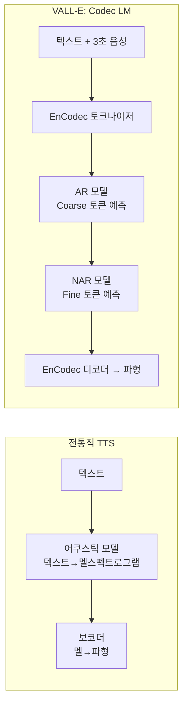

# VALL-E 제로샷 TTS

## 개요

VALL-E는 Microsoft Research가 2023년 발표한 제로샷(zero-shot) 텍스트-음성 변환(TTS) 모델이다. 3초의 화자 음성 샘플만으로 해당 화자의 목소리를 흉내 내어 임의의 텍스트를 읽어주는 것이 핵심 능력이다. "언어 모델로서의 TTS"라는 새로운 패러다임을 제시하여 TTS 분야에 큰 영향을 미쳤다.

## 핵심 패러다임: Codec Language Model

전통적인 TTS는 텍스트 -> 음향 특성(mel-spectrogram) -> 파형의 파이프라인을 따른다. VALL-E는 이를 근본적으로 바꾼다.

[[encodec-audio-tokenizer]]로 음성을 이산 코덱 토큰으로 변환한 뒤, [[causal-language-modeling]] 방식으로 토큰을 생성한다. 보코더 대신 코덱 디코더가 파형을 복원한다.

## 이산 코덱 토큰 구조

VALL-E는 [[encodec-audio-tokenizer]]의 RVQ 출력을 토큰으로 사용한다. EnCodec의 24kHz 모델 기준:

- **8개 RVQ 레이어** 사용
- 각 레이어는 75Hz 프레임률로 토큰 생성
- 1초 오디오 = 75 프레임 x 8 코드북 = 600개 토큰

| RVQ 레이어 | 역할 |
|-----------|------|
| 1번 (Coarse) | 음성의 기본 내용, 리듬, 화자 특성 |
| 2-8번 (Fine) | 음질 세부사항, 배음, 음색 정밀도 |

## AR + NAR 이중 모델 구조

VALL-E는 두 개의 Transformer 모델을 결합한다.

### 자기회귀(AR) 모델
- 1번 RVQ 코드북(coarse 토큰)을 자기회귀 방식으로 생성
- 텍스트 + 화자 음성의 coarse 토큰을 컨텍스트로 사용
- [[causal-language-modeling]] 기반: 이전 토큰을 보고 다음 토큰 예측

### 비자기회귀(NAR) 모델
- 2-8번 RVQ 코드북(fine 토큰)을 병렬로 예측
- Coarse 토큰과 이전 RVQ 레이어를 조건으로 사용
- 생성 속도가 AR보다 훨씬 빠름 (병렬 디코딩)

## 제로샷 학습의 비밀: 스케일

VALL-E의 제로샷 능력은 대규모 데이터 학습에서 나온다. LibriLight 데이터셋의 60,000시간 영어 음성으로 사전학습했는데, 이는 기존 TTS 훈련 데이터 대비 수백 배 규모다. 이 대규모 학습 덕분에 본 적 없는 화자의 목소리도 in-context learning으로 모방할 수 있다.

## [[voxcpm2]]와의 비교

[[voxcpm2]]가 다국어 음성에 초점을 맞춘 반면, VALL-E는 영어 단일 언어에서 화자 충실도(speaker fidelity)를 극대화하는 방향으로 설계되었다. 이후 VALL-E X가 다국어 버전으로 확장되었다.

## 주요 성과

- **화자 유사도**: 3초 프롬프트로 모르는 화자를 흉내 내는 능력에서 기존 제로샷 TTS 대비 큰 향상
- **감정/환경 보존**: 프롬프트 오디오의 감정 톤이나 배경 노이즈까지 유지
- **자연스러움**: MOS(Mean Opinion Score)에서 기존 모델 압도

## 한계와 윤리 문제

- 화자 동의 없이 목소리를 복제할 수 있어 딥페이크 악용 위험
- 영어에만 특화된 초기 버전 (VALL-E X에서 다국어 확장)
- 화자 인증 없이 배포 불가 - Microsoft는 데모를 제한적으로만 공개
- 훈련 데이터의 화자가 아닌 경우 품질 저하 가능

## 실무 관점

VALL-E는 TTS를 "언어 모델 문제"로 재정의함으로써 이후 [[bark-generative-tts]], VOICEBOX, Voicecraft 등의 연구 방향을 결정지었다. 코덱 토큰을 언어 모델로 생성하는 접근법은 현재 생성형 음성 AI의 표준 패러다임으로 자리잡고 있다.

## 관련 문서

- [[encodec-audio-tokenizer]] - VALL-E의 오디오 토크나이저
- [[rvq-residual-vector-quantization]] - 코덱 토큰의 기반 기술
- [[audiolm-framework]] - VALL-E와 동시기에 등장한 유사 패러다임
- [[causal-language-modeling]] - AR 모델의 훈련 방식
- [[bark-generative-tts]] - VALL-E 패러다임을 다국어+감정으로 확장한 오픈소스 모델
- [[voxcpm2]] - 관련 다국어 음성 언어 모델
