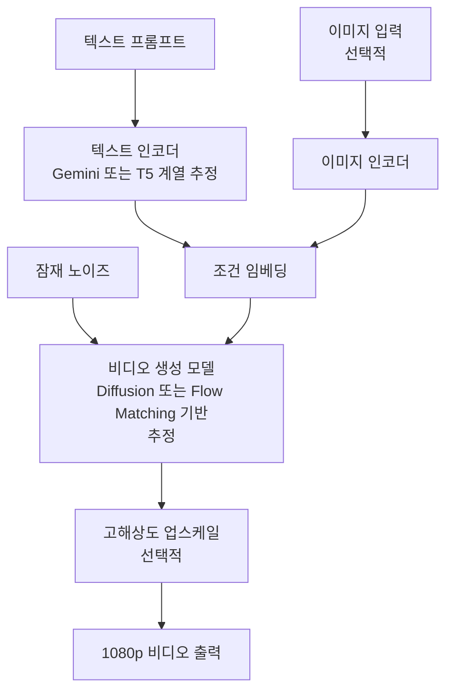

# Veo - Google DeepMind 비디오 생성 모델

> **공개 정보 한정 안내**: Veo의 내부 아키텍처는 Google DeepMind에 의해 공개되지 않았다. 이 페이지는 Google의 공식 블로그 발표, I/O 2024 키노트, Vertex AI 제품 문서에 근거한다. 아키텍처 추정이 포함된 부분은 [교차검증 필요]로 표시한다.

## 개요

Veo는 Google DeepMind가 2024년 5월 Google I/O에서 공개한 고품질 비디오 생성 모델이다. 최대 1080p 해상도, 60초 이상 길이의 비디오를 텍스트·이미지 조건으로 생성할 수 있다고 발표됐다. [[sora-architecture|Sora]]와 함께 2024년 대형 비디오 생성 모델 경쟁의 핵심 플레이어다.

Google은 Veo를 YouTube Shorts 창작 도구(Dream Screen), Vertex AI 엔터프라이즈 API, 영화감독·크리에이터 협업 프로그램(팀 버튼 등 감독 참여)에 순차적으로 연계한다고 발표했다.

## 공개된 특성

### 지원 입력 유형

| 입력 유형 | 설명 |
|-----------|------|
| 텍스트 → 비디오 | 자연어 프롬프트로 비디오 생성 |
| 이미지 → 비디오 | 정지 이미지를 시작점으로 애니메이션화 |
| 비디오 + 텍스트 | 기존 비디오를 편집하거나 연장 |

### 제어 가능한 요소 (공식 발표 기준)

Google의 발표에 따르면 Veo는 다음 요소를 텍스트로 지정 가능하다:

- **카메라 움직임**: 팬, 틸트, 줌, 트래킹, 드론 샷 등 영화적 표현
- **조명**: 황금 시간대, 야간, 스튜디오 조명 등
- **화면 비율**: 16:9, 9:16, 1:1
- **시각 스타일**: 수중 촬영, 항공 촬영, 타임랩스 등

이 제어 수준은 Veo가 일반 소비자용이 아닌 **프로 영상 창작자** 대상임을 시사한다.

### 시간적 일관성

발표 데모에서 Veo는 장시간 시퀀스에서 객체 동일성과 배경 일관성을 유지하는 능력을 보였다. [[sora-architecture|Sora]]와 마찬가지로 물리적 현실성(물의 흐름, 사람 움직임)에서 높은 수준을 보여줬다.

## 추정 아키텍처 (공개 정보 기반 분석)

[교차검증 필요] Google DeepMind의 선행 연구를 바탕으로 연구 커뮤니티가 추정하는 구조:

Google DeepMind의 선행 연구인 Imagen Video, Lumiere 등이 Veo의 기반 기술로 영향을 미쳤을 것으로 추정된다. Lumiere는 시공간 U-Net(Space-Time U-Net) 구조를 제안했으며, 이 방향성이 Veo에 반영됐을 가능성이 있다. [교차검증 필요]

## 제품 통합 현황

### YouTube Dream Screen

YouTube Shorts 창작자가 텍스트 입력으로 배경 비디오 또는 독립 비디오 클립을 생성할 수 있는 기능. 2024년 하반기부터 단계적 출시.

### Vertex AI

Google Cloud의 엔터프라이즈 AI 플랫폼인 Vertex AI를 통해 기업 고객에게 API 형태로 제공. 콘텐츠 제작사·광고 대행사 등 B2B 타겟.

### VideoFX (Labs)

Google Labs의 실험적 비디오 생성 인터페이스. 창작자 파트너 프로그램을 통해 영화감독 팀 버튼, 도날드 글로버 등과 협업 및 피드백 수집.

## Veo 2 (2024년 12월 발표)

Google은 2024년 12월 Veo 2를 발표했다. 공개된 개선점:

- Sora Turbo 대비 품질 개선 (ELO 기반 비교 평가에서 우세 주장)
- 인간 움직임·신체 역학 표현 개선
- 더 정확한 카메라 움직임 제어
- VideoFX 및 YouTube Dream Screen에 우선 통합

## 안전성·워터마킹

Google은 SynthID 기술을 활용해 Veo로 생성된 비디오에 디지털 워터마크를 삽입한다고 발표했다. SynthID는 인간이 시각적으로 감지할 수 없는 방식으로 AI 생성 콘텐츠임을 표시한다.

## 경쟁 모델 비교

| 속성 | Veo 2 | [[sora-architecture\|Sora]] | [[cogvideox-architecture\|CogVideoX]] |
|------|-------|------|----------|
| 조직 | Google DeepMind | OpenAI | 智谱AI/Tsinghua |
| 공개 여부 | 비공개 | 비공개 | 오픈소스 |
| 최대 해상도 | 1080p | 1080p | 720p |
| 아키텍처 공개 | 없음 | 기술보고서 일부 | 논문 공개 |
| 접근 방법 | Vertex AI / YouTube | ChatGPT Plus | HuggingFace |

## 한계와 비판

- 아키텍처가 완전 비공개여서 학술 재현 및 검증 불가
- 접근이 제한적이어서 독립적 평가 어려움
- Google 자체 ELO 비교가 유일한 성능 근거로, 독립 평가 부재

## 관련 문서

- [[sora-architecture]] - OpenAI의 경쟁 비디오 모델
- [[cogvideox-architecture]] - 공개된 비디오 생성 아키텍처
- [[animatediff-motion-modules]] - 확산 기반 비디오 생성
- [[video-generation-architecture]] - 비디오 생성 아키텍처 전반
- [[dit-diffusion-transformer]] - 비디오 생성 모델의 공통 백본 후보
- [[flow-matching]] - 현대 생성 모델 훈련 기법
