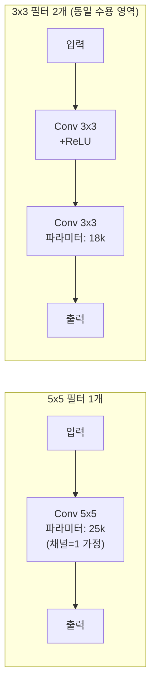
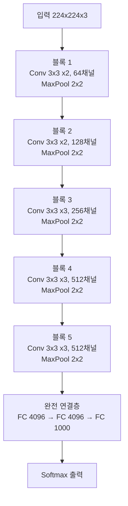

# VGGNet - 깊이로 승부한 네트워크

VGGNet(Simonyan & Zisserman, 2014)은 옥스퍼드 Visual Geometry Group이 개발한 합성곱 신경망으로, **3x3 합성곱 필터만을 일관되게 사용하면서 레이어 수를 늘리는 것이 성능 향상의 핵심**임을 실험적으로 입증한 아키텍처다. ILSVRC 2014에서 2위를 차지했으나, 단순하고 규칙적인 구조 덕분에 이후 수년간 전이 학습의 표준 백본으로 사용됐다.

## 핵심 아이디어: 작은 필터, 깊은 네트워크

### 왜 3x3인가

VGG 이전의 AlexNet은 11x11, 5x5 같은 큰 필터를 사용했다. VGG의 통찰은 **작은 필터를 여러 겹 쌓는 것이 큰 필터 하나와 동일한 수용 영역(receptive field)을 가지면서 더 적은 파라미터와 더 많은 비선형성을 제공한다**는 것이다:

- 3x3 합성곱 2개 겹침 → 5x5와 동일한 수용 영역, 파라미터 수 $2 \times 9 = 18 < 25$
- 3x3 합성곱 3개 겹침 → 7x7과 동일한 수용 영역, 파라미터 수 $3 \times 9 = 27 < 49$
- 각 합성곱 후 ReLU가 추가되어 비선형성이 더 풍부해짐

## VGG 구조

### VGG-16 아키텍처 (대표 모델)

| 구성요소 | VGG-11 | VGG-13 | VGG-16 | VGG-19 |
|---------|--------|--------|--------|--------|
| 합성곱 레이어 | 8 | 10 | 13 | 16 |
| 완전 연결층 | 3 | 3 | 3 | 3 |
| 총 파라미터 | ~133M | ~133M | ~138M | ~143M |
| Top-5 오류율 | 11.2% | 10.4% | 8.8% | 9.0% |

### 특징적인 설계 원칙

1. **균일한 필터 크기**: 3x3 (단, 첫 번째 버전에서 1x1도 일부 사용)
2. **MaxPooling으로 해상도 감소**: 각 블록 끝 2x2 MaxPool, stride=2
3. **채널 배증 규칙**: MaxPool 후 채널 수를 2배로 (64 → 128 → 256 → 512)
4. **동일한 패딩**: 합성곱 후 해상도 유지 (same padding)

## 깊이 실험 결과

VGG 논문의 핵심 기여는 깊이를 체계적으로 변화시키며 성능 변화를 측정한 것이다:

| 네트워크 깊이 | 파라미터 | Top-1 오류 | 비고 |
|-------------|---------|-----------|------|
| 11층 (A) | 133M | 29.6% | LRN 추가해도 효과 없음 |
| 13층 (B) | 133M | 28.7% | 깊이 증가 효과 확인 |
| 16층 (D) | 138M | 27.0% | **최다 인용 모델** |
| 19층 (E) | 143M | 27.3% | 16층 대비 미미한 개선 |

19층 이상에서 성능이 정체되거나 저하되는 현상은 기울기 소실 문제로 인한 것으로, 이후 [[resnet-skip-connections]]가 해결한 과제다.

## VGGNet의 한계

### 파라미터 수 과다

완전 연결층 3개(FC 4096, 4096, 1000)가 전체 파라미터의 **약 74%**를 차지한다. VGG-16의 138M 파라미터 중 약 102M이 FC 레이어에 집중된다. 이후 GoogLeNet([[inception-modules]])은 전역 평균 풀링(Global Average Pooling)으로 FC를 제거해 파라미터를 획기적으로 줄였다.

### 메모리 및 연산량

입력 224x224 이미지 기준 약 15.5 GFLOPs. 실시간 추론에 부담이 크다.

### 스킵 연결 부재

기울기 소실로 인해 19층 이상에서 성능이 포화된다. [[resnet-skip-connections]]의 잔차 블록이 이 문제를 구조적으로 해결했다.

## 전이 학습에서의 역할

VGGNet은 한계에도 불구하고 전이 학습 백본으로 수년간 표준 지위를 유지했다. 이유:

1. **단순하고 규칙적인 구조**: 특성 추출기로 사용하기 쉬움
2. **풍부한 시각적 특성**: 대규모 ImageNet으로 학습된 표현이 다양한 태스크에 전이됨
3. **PyTorch/Keras 등 기본 제공**: 즉시 사용 가능

관행적으로 VGG16의 `block4_pool`까지의 합성곱 레이어를 특성 추출기로 사용하고, 그 위에 태스크별 헤드를 붙이는 방식이 많이 사용됐다.

## 역사적 의의

VGGNet은 "아키텍처의 복잡한 설계보다 단순한 원칙의 반복이 더 강력할 수 있다"는 교훈을 남겼다. 이 철학은 [[resnet-skip-connections]]의 잔차 블록, [[inception-modules]]의 모듈화로 이어지는 CNN 발전의 중간 단계다.

## 관련 문서

- [[cnn]] - 합성곱 신경망의 기본 구조와 필터 학습 원리
- [[resnet-skip-connections]] - VGG의 기울기 소실 한계를 해결한 잔차 네트워크
- [[inception-modules]] - 병렬 다중 스케일 필터로 효율을 높인 GoogLeNet
- [[gradient-descent-backpropagation]] - 역전파와 기울기 소실 문제
