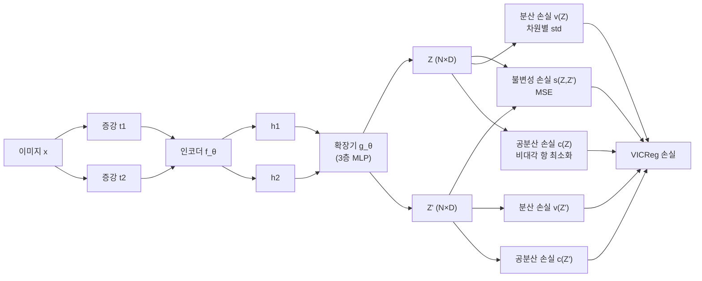

# VICReg 분산-불변-공분산 정규화 (Variance-Invariance-Covariance Regularization)

## 동기와 배경

2022년 Facebook AI Research에서 발표한 VICReg은 자기지도 학습의 모드 붕괴(mode collapse) 문제를 **명시적인 정규화 항**으로 해결한다. 음수 샘플도 없고, EMA 타겟 네트워크도 없으며, Sinkhorn 같은 복잡한 최적화도 없다. 오직 세 가지 손실 항의 선형 결합만 사용한다.

VICReg의 중요한 기여는 기술적 성능보다 **BYOL이 왜 모드 붕괴 없이 동작하는가**를 이해하는 분석 도구로서의 가치에 있다. VICReg은 자기지도 학습의 이론적 이해를 크게 증진시켰다.

## 핵심 메커니즘

### 세 가지 손실 항

VICReg의 손실은 세 항의 가중합이다:

$$\mathcal{L}_{\text{VICReg}} = \lambda \cdot s(Z, Z') + \mu \cdot v(Z) + \mu \cdot v(Z') + \nu \cdot c(Z) + \nu \cdot c(Z')$$

- $Z, Z'$: 두 뷰의 인코딩 + 확장기(expander, MLP) 출력 배치. 크기 $N \times D$
- $\lambda = 25, \mu = 25, \nu = 1$: 기본 가중치

### 1. 불변성 손실 (Invariance)

두 뷰의 표현이 가까워야 한다:

$$s(Z, Z') = \frac{1}{N} \sum_{i=1}^N \|z_i - z'_i\|_2^2$$

단순 MSE. 이 항만으로는 모든 표현이 0으로 수렴하는 붕괴가 일어난다.

### 2. 분산 손실 (Variance)

각 차원의 표현이 배치 내에서 충분한 분산을 가져야 한다:

$$v(Z) = \frac{1}{D} \sum_{j=1}^D \max\!\left(0,\, \gamma - \text{Std}(z^j)\right)$$

$$\text{Std}(z^j) = \sqrt{\text{Var}(z^j) + \epsilon}$$

- $\gamma = 1$: 목표 표준편차
- 각 차원 $j$의 표준편차가 $\gamma$ 미만이면 페널티 부여

이 항이 **표현 붕괴(모든 샘플이 같은 벡터로 수렴)**를 방지한다. 배치 내에서 각 차원이 다양한 값을 갖도록 강제한다.

### 3. 공분산 손실 (Covariance)

서로 다른 차원 간의 상관관계를 최소화한다:

$$c(Z) = \frac{1}{D} \sum_{i \neq j} [C(Z)]_{ij}^2$$

$$C(Z) = \frac{1}{N-1} \sum_{i=1}^N (z_i - \bar{z})(z_i - \bar{z})^\top$$

공분산 행렬의 **비대각 항(off-diagonal)**을 0으로 만들어, 각 차원이 서로 독립적인 정보를 인코딩하도록 강제한다. 이는 **표현의 중복성(redundancy)을 제거**한다.

Barlow Twins와 유사한 아이디어지만, Barlow Twins는 교차 상관(cross-correlation)을 항등 행렬로 만드는 반면 VICReg은 각 뷰의 공분산 행렬을 별도로 정규화한다.

## 직관적 이해

| 손실 항 | 방지하는 붕괴 |
|--------|------------|
| 불변성 | 두 뷰가 다른 표현으로 수렴 |
| 분산 | 모든 샘플이 동일한 표현으로 수렴 (상수 붕괴) |
| 공분산 | 몇 가지 차원만 사용하는 차원 붕괴 |

세 항이 각각 다른 종류의 붕괴를 방지하며, 조합하면 유의미한 다양한 표현이 학습된다.

## BYOL 이해에의 기여

VICReg 논문은 BYOL이 왜 모드 붕괴 없이 학습되는지에 대한 분석을 제공한다:

- BYOL의 Batch Normalization이 암묵적으로 분산과 공분산 정규화를 수행한다
- EMA 타겟 네트워크는 변화하는 목표를 제공해 불변성 손실이 즉각적으로 붕괴로 이어지지 않도록 완충한다

VICReg은 이 암묵적 메커니즘을 **명시적 손실 항**으로 분해해 투명하게 만들었다.

## 성능

ImageNet 선형 프로빙 (ResNet-50, 100 에폭):

| 방법 | Top-1 |
|------|-------|
| SimCLR | 69.3% |
| MoCo v2 | 71.1% |
| Barlow Twins | 71.8% |
| BYOL | 74.3% |
| VICReg | 73.2% |

200 에폭: VICReg 74.4%. BYOL과 유사한 수준에 도달한다.

## 확장: VICRegL

2022년 후속 연구 VICRegL은 전역 표현과 지역 특징을 동시에 학습하는 방법으로 확장됐다:

- 패치 수준의 지역 손실 추가
- 다운스트림 밀집 예측(세분화, 탐지)에서 성능 향상

## 후속 영향

- **이론적 이해 향상**: 자기지도 학습의 붕괴 메커니즘을 분류하는 분석 프레임워크 제공
- **명시적 정규화 패턴**: 이후 방법들이 유사한 명시적 분산/공분산 정규화를 참조
- **Barlow Twins와 비교 연구**: 두 방법이 정보 이론적으로 동일한 원리의 다른 구현임을 보임

## 한계

- **배치 크기 의존성**: 분산/공분산은 배치 통계에 의존해 작은 배치에서 불안정
- **분산 항의 상수 목표**: $\gamma = 1$이 최적인지 태스크마다 재조정 필요
- **BYOL/DINO 대비 성능**: 명시적 정규화로 이해하기 쉬운 대신, 최첨단 성능에서 약간 뒤처짐

## 관련 문서

- [[self-supervised-learning]]
- [[contrastive-learning]]
- [[byol-bootstrap]]
- [[simclr-augmentation]]
- [[swav-clustering-features]]
- [[dino-self-distillation]]
- [[moco-momentum-contrast]]
- [[representation-learning-theory]]
