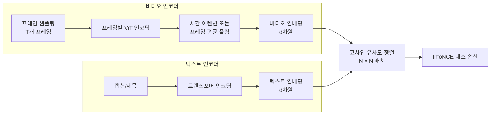

# VideoCLIP - 비디오-텍스트 대조학습

## 개요

VideoCLIP은 [[clip]]의 대조학습(contrastive learning) 패러다임을 비디오-텍스트 쌍으로 확장한 일련의 접근법을 가리킨다. Facebook AI Research(2021년)에서 발표한 동명 논문이 시초이며, 이후 InternVideo, VideoPrism 등 다양한 후속 모델이 등장했다. 핵심은 **비디오 클립과 해당 텍스트 설명을 공동 임베딩 공간에 정렬**하는 것으로, 텍스트만으로 비디오를 검색하거나 분류하는 제로샷(zero-shot) 능력을 부여한다.

## [[clip]]에서 비디오로의 확장

이미지-텍스트 [[clip]]의 동작 원리:
- 이미지 인코더 + 텍스트 인코더를 대조 손실(InfoNCE)로 공동 훈련
- 배치 내 매칭 쌍의 유사도를 높이고, 비매칭 쌍은 낮춤

비디오로 확장 시 두 가지 핵심 과제가 생긴다:
1. **시간 축 처리**: 단일 프레임이 아닌 다수 프레임 시퀀스를 인코딩
2. **비디오-텍스트 정렬의 느슨함**: 텍스트는 비디오의 특정 순간이 아닌 전체 클립을 설명



## VideoCLIP의 핵심 설계: 겹치는 비디오-텍스트 쌍

원논문(Xu et al., 2021)의 핵심 기여는 **시간적으로 겹치는(overlapped) 비디오-텍스트 쌍**을 구성하는 방식이다.

- 단순 매칭: 한 비디오 세그먼트 = 한 텍스트 (경직된 정렬)
- VideoCLIP: 비디오 클립과 텍스트 클립이 시간적으로 부분 겹침 허용 → 더 유연한 시간 정렬 학습

이를 통해 정확한 타임스탬프 없이도 비디오-텍스트 대응을 학습한다.

## 학습 데이터 규모

VideoCLIP류 모델은 대규모 약지도(weakly-supervised) 데이터로 학습한다:

| 데이터셋 | 규모 | 출처 |
|----------|------|------|
| HowTo100M | 1억 2천만 클립 | YouTube 교육 영상 자동 캡션 |
| YT-Temporal-180M | 1.8억 쌍 | YouTube 자동 자막 |
| WebVid-10M | 1천만 쌍 | 웹 크롤링 비디오-설명 쌍 |

약지도 데이터는 노이즈가 많지만 규모로 보완한다. [[videomae-masked-video]]처럼 레이블이 필요 없는 자기지도와 달리, 텍스트 페어링이 필요하다.

## 제로샷 비디오 이해 능력

학습 후 모델은 텍스트 프롬프트만으로 다양한 비디오 태스크를 수행한다:

```mermaid
flowchart TD
    VE2[비디오 임베딩] --> ZS{제로샷 태스크}
    ZS --> Ret[텍스트-비디오 검색\n"요리하는 영상 찾기"]
    ZS --> Cls[비디오 분류\n클래스명 = 텍스트 프롬프트]
    ZS --> QA[비디오 질문응답\n"이 사람은 무엇을 하고 있나?"]
    ZS --> Cap[비디오 캡셔닝\n시각-언어 디코더와 결합]
```

**제로샷 분류**: 클래스 이름을 텍스트로 인코딩 후, 비디오 임베딩과의 유사도로 최근접 클래스 선택. CLIP의 이미지 분류와 동일한 원리다.

## [[videomae-masked-video]]와의 비교 및 결합

| 관점 | VideoCLIP | VideoMAE |
|------|-----------|----------|
| 학습 신호 | 텍스트-비디오 대조 | 픽셀 재구성 |
| 레이블 | 텍스트 페어 필요 | 불필요 |
| 강점 | 텍스트 정렬, 제로샷 | 순수 시각 패턴, 세밀한 표현 |
| 약점 | 텍스트 없는 세밀한 동작 구분 | 언어 기반 태스크 |

두 방식을 결합한 모델(예: InternVideo2[[internvideo2-video-foundation]])이 각각보다 우수한 성능을 보인다.

## 주요 후속 모델

- **CLIP4Clip(2022)**: CLIP 이미지 인코더를 비디오 검색에 직접 적용, 프레임 평균 임베딩
- **VideoPrism(2024, Google)**: 웹 비디오 + 전문가 주석 혼합으로 강력한 비디오 표현
- **InternVideo2([[internvideo2-video-foundation]], 2024)**: VideoMAE + CLIP 결합 대규모 파운데이션

## 평가 벤치마크

- **MSR-VTT**: 비디오-텍스트 검색 (텍스트→비디오, 비디오→텍스트 R@1)
- **ActivityNet Captions**: 비디오 캡셔닝 및 검색
- **DiDeMo**: 순간(moment) 검색 - 텍스트로 비디오 내 특정 구간 찾기
- **Kinetics 제로샷**: 사전 학습 없이 액션 분류

## 실무 적용

- **영상 검색 엔진**: 자연어로 비디오 검색 (YouTube, TikTok의 시맨틱 검색)
- **콘텐츠 모더레이션**: 텍스트 정책 설명으로 위반 영상 감지
- **스포츠 분석**: "슛 동작" 같은 자연어로 하이라이트 추출
- **교육 비디오 인덱싱**: 강의 내용을 자동으로 챕터화

## 관련 문서

- [[clip]] - 이미지-텍스트 대조학습의 원형
- [[videomae-masked-video]] - 픽셀 재구성 기반 비디오 표현 학습
- [[internvideo2-video-foundation]] - VideoCLIP + VideoMAE 결합 파운데이션 모델
- [[timesformer-divided-attention]] - 비디오 인코더로 자주 사용되는 아키텍처
