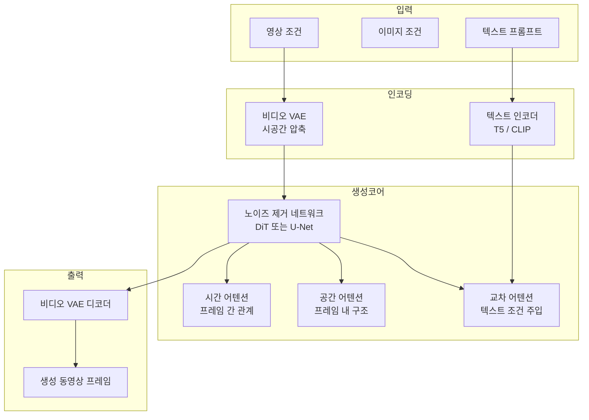
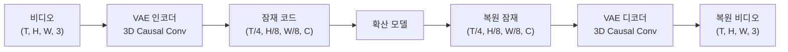

# 비디오 생성 아키텍처

비디오 생성(video generation)은 이미지 생성 모델의 공간적 능력에 시간 축을 추가하는 확장 문제다. 텍스트, 이미지, 또는 영상 클립을 조건으로 자연스럽고 물리적으로 그럴듯한 동영상을 합성하는 것이 목표다. 현재 주류는 [[diffusion-models]] 기반이며, 아키텍처로는 [[dit-diffusion-transformer]] 계열과 U-Net 계열 두 흐름이 공존한다.

## 핵심 아키텍처 흐름



## U-Net 계열

초기 비디오 생성 모델(Imagen Video, Make-A-Video, ModelScope)은 이미지 U-Net에 시간 차원을 추가하는 방식을 택했다.

### 시간 어텐션 삽입 방식

공간 어텐션 레이어 옆에 시간 어텐션(temporal attention) 레이어를 직렬 또는 병렬로 추가한다.

```
[Spatial Attn] → [Temporal Attn] → [FFN]
```

- **1D 시간 어텐션**: 같은 공간 위치의 모든 프레임 토큰 간 어텐션. 계산 효율 좋음
- **시공간 결합 어텐션**: 프레임×공간 전체 어텐션. 품질 높지만 O(T²H²W²) 비용

### 시간 합성곱 (Temporal Convolution)

3D 합성곱 `Conv3D(T, H, W)` 또는 팩토리얼 분해 `Conv1D(T) + Conv2D(H, W)`로 시간-공간 정보를 동시에 모델링.

| 방법 | 연산 복잡도 | 장거리 의존성 |
|------|------------|-------------|
| Conv3D | O(k³·T·H·W) | 제한적 |
| 시간 어텐션 | O(T²·H·W) | 우수 |
| 팩토리얼 | 중간 | 중간 |

## [[dit-diffusion-transformer]] 계열

최신 고성능 모델(Sora, CogVideoX, Wan, HunyuanVideo)은 U-Net 대신 Transformer 기반 DiT를 채택한다.

### 시공간 패칭 (Spatiotemporal Patchification)

비디오를 시공간 패치로 나누어 토큰 시퀀스로 변환한다.

$$
\text{비디오} (T, H, W, C) \xrightarrow{\text{패칭}} \text{토큰} \left(\frac{T}{t_p} \cdot \frac{H}{h_p} \cdot \frac{W}{w_p}, D\right)
$$

- $t_p, h_p, w_p$: 시간, 높이, 너비 방향 패치 크기
- 모든 시공간 위치를 균일하게 처리

### Full Attention vs. 팩토리얼 Attention

- **Full 3D Attention** (Sora 추정): 전체 시공간 토큰 간 어텐션. 최고 품질이지만 메모리 O(T²H²W²)
- **팩토리얼 Attention** (CogVideoX): 공간 어텐션 + 시간 어텐션 교대. 효율적

### 대표 모델 비교

| 모델 | 아키텍처 | 훈련 프레임워크 | 공개 여부 |
|------|----------|---------------|---------|
| Sora (OpenAI) | DiT 추정 | Flow Matching | 비공개 |
| CogVideoX (智谱) | DiT (팩토리얼 Attn) | 확산 | 오픈소스 |
| Wan 2.1 (알리바바) | DiT | Flow Matching | 오픈소스 |
| HunyuanVideo (텐센트) | DiT | Flow Matching | 오픈소스 |
| AnimateDiff | U-Net + 시간 모듈 | 확산 | 오픈소스 |

## 비디오 VAE (Latent Video Diffusion)

픽셀 공간에서 확산하면 메모리·연산 비용이 폭발적으로 증가한다. 비디오 VAE로 시공간을 압축한 잠재 공간에서 확산을 수행한다.



**인과적(Causal) 합성곱**: 미래 프레임이 과거에 영향을 주지 않도록 시간 방향으로 인과 마스킹. 스트리밍 생성에 필수.

## Flow Matching

최신 비디오 생성은 DDPM 대신 Flow Matching을 주로 사용한다.

- 데이터 분포 → 가우시안의 직선 경로(ODE) 학습
- 더 적은 스텝(수십 NFE)으로 품질 확산과 동일하거나 우수
- Consistency Distillation과 결합 시 4~8 스텝 실시간 생성 가능

## 조건 주입 방식

| 조건 | 주입 방법 |
|------|---------|
| 텍스트 | 교차 어텐션 (Cross-Attention) |
| 이미지 (I2V) | 첫 프레임 잠재 코드 연결 |
| 모션 | 광류 또는 카메라 파라미터 임베딩 |
| 오디오 | 오디오 인코더 + 교차 어텐션 |
| 카메라 | Plücker 임베딩, LoRA 어댑터 |

## 주요 과제

- **시간 일관성**: 물체 외관이 프레임마다 변하는 flickering 현상
- **물리 법칙 준수**: 중력, 충돌, 유체 역학을 데이터에서 암묵적으로 학습
- **장기 의존성**: 수백 프레임에 걸친 플롯 일관성
- **해상도-길이 트레이드오프**: 고해상도 + 장편 생성은 메모리 한계
- **모션 다양성**: 카메라와 물체 모션의 독립적 제어

## 관련 문서

- [[dit-diffusion-transformer]] - 비디오 생성의 주류 아키텍처 기반
- [[diffusion-models]] - 확산 과정과 노이즈 스케줄링 원리
- [[4d-gaussian-splatting]] - 비디오 데이터에서 동적 3D 표현 학습
- [[nerf-neural-radiance-fields|NeRF]] - 멀티뷰 비디오에서 볼류메트릭 동영상 표현
