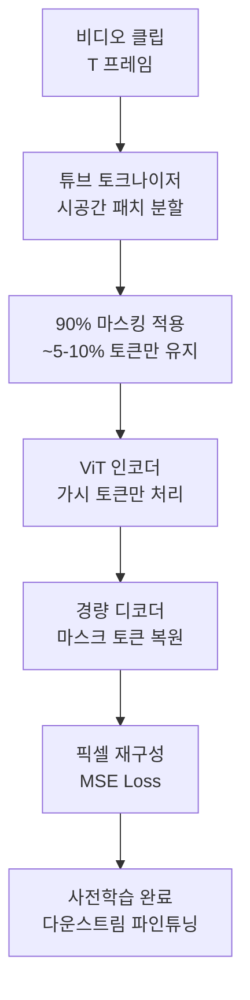

# VideoMAE - 마스크 비디오 자기지도학습

## 개요

VideoMAE(Video Masked Autoencoders)는 이미지 도메인의 [[masked-autoencoder-mae]]를 비디오로 확장한 자기지도학습(self-supervised learning) 프레임워크다. Facebook Research(Meta AI)에서 2022년에 발표했으며, 핵심 아이디어는 비디오 토큰의 **90% 이상을 무작위로 마스킹**한 뒤 원본을 재구성하도록 모델을 학습시키는 것이다. 이미지 MAE가 75% 마스킹을 쓰는 것과 달리, 비디오는 프레임 간 시간적 중복(temporal redundancy)이 크기 때문에 훨씬 높은 마스킹 비율이 필요하다.

## 왜 비디오에서 마스킹 비율이 더 높아야 하는가

이미지에서 인접 픽셀은 비슷한 정보를 담고 있지만 공간적 거리가 있다. 반면 비디오에서 연속 프레임은 거의 동일한 내용을 담고 있어, 낮은 마스킹 비율로는 모델이 인접 프레임에서 단순 복사하여 정답을 맞추는 "속임수(cheating)"를 쓸 수 있다. VideoMAE는 이를 막기 위해 90-95% 수준의 공격적 마스킹을 채택했다.

위 다이어그램은 VideoMAE의 학습 파이프라인을 보여준다. 인코더는 가시 토큰만 처리하기 때문에 실제 연산량이 크게 줄어든다.

## 핵심 구성 요소

### 1. 시공간 튜브 토크나이저 (Spatiotemporal Tube Tokenizer)

[[vision-transformer-vit]]의 패치 분할 방식을 시간 축으로 확장한다. 공간 패치 크기 $16 \times 16$에 시간 방향 $t$ 프레임을 묶어 하나의 "튜브 토큰"을 만든다. 이 방식은 [[transformer-architecture]] 기반 인코더가 시간과 공간을 동시에 처리할 수 있게 한다.

### 2. 마스킹 전략

무작위 마스킹(random masking)을 기본으로 사용하며, 프레임별로 독립적으로 마스킹하지 않고 전체 비디오 토큰 풀에서 균등하게 샘플링한다. 이렇게 하면 일부 프레임에 가시 토큰이 집중되는 편향을 방지한다.

### 3. 비대칭 인코더-디코더 구조

- **인코더**: 대형 ViT(ViT-B, ViT-L, ViT-H). 가시 토큰(~5-10%)만 입력받아 처리 - 연산 효율적
- **디코더**: 얕은 트랜스포머 블록(4-8층). 학습 시에만 사용하며, 파인튜닝 시 제거

## 학습 효율성

비디오 MAE는 이전 방식 대비 **학습 비용을 대폭 절감**한다. 기존 비디오 자기지도학습(SimCLR 비디오 버전, MoCo 비디오 버전 등)은 증강(augmentation)과 모멘텀 인코더를 필요로 했지만, VideoMAE는 단순한 재구성 목표만으로도 강력한 표현을 학습한다.

| 설정 | 마스킹 비율 | 에폭 | Kinetics-400 Top-1 |
|------|------------|------|-------------------|
| ViT-B | 90% | 800 | 80.0% |
| ViT-L | 90% | 1600 | 85.2% |
| ViT-H | 90% | 1600 | 86.6% |

## 다운스트림 태스크 성능

VideoMAE로 사전학습된 모델은 다음 태스크에서 우수한 결과를 보인다:

- **액션 인식(Action Recognition)**: Kinetics-400/600/700, Something-Something V2
- **시공간 액션 탐지**: AVA (Atomic Visual Actions)
- **비디오 검색**: Zero-shot 비디오-텍스트 검색

특히 Something-Something V2처럼 시간적 인과관계 이해가 중요한 벤치마크에서 두드러진 성능 향상을 보인다. 이는 90% 마스킹이 강제하는 시간적 컨텍스트 이해 능력 덕분으로 분석된다.

## 왜 중요한가 / 실무 적용

1. **레이블 없는 대규모 비디오 사전학습**: YouTube, TikTok 등 레이블 없는 비디오를 대규모로 활용 가능
2. **도메인 특화 파인튜닝 효율**: 의료 영상(내시경 동영상), 산업 품질 검사 영상 등에서 소량 데이터만으로도 파인튜닝 가능
3. **[[video-clip-contrastive]] 와의 상보성**: VideoMAE는 픽셀 재구성 기반, VideoCLIP은 텍스트-비디오 대조 학습 기반 - 두 접근법을 결합한 하이브리드 모델도 연구됨

## 한계

- 텍스트 감독(text supervision) 없이 시각적 패턴만 학습 - 개념적 이해는 [[video-clip-contrastive]] 방식 대비 제한적
- 90% 마스킹 재구성 목표가 항상 최적은 아님 - 일부 태스크에서는 낮은 마스킹 비율이 유리할 수 있음
- 긴 비디오(수 분 이상) 처리 시 메모리 비용이 폭증

## 관련 문서

- [[masked-autoencoder-mae]] - 이미지 도메인 MAE, VideoMAE의 원형
- [[vision-transformer-vit]] - 기반 인코더 아키텍처
- [[video-clip-contrastive]] - 비디오-텍스트 대조학습 기반 보완 접근법
- [[optical-flow-deep-learning]] - 비디오 움직임 표현의 전통적 기법
