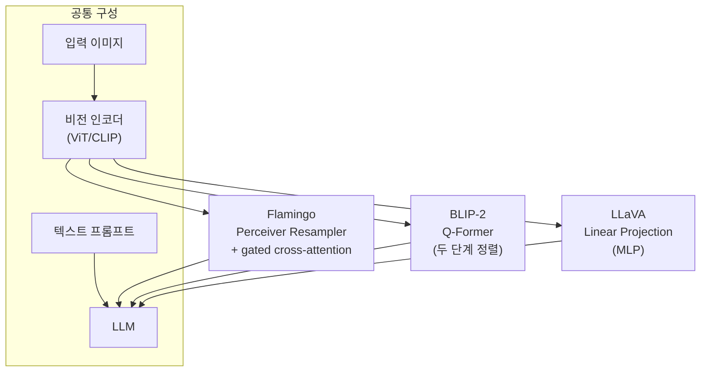

# 비전-언어 모델 아키텍처 (VLM Patterns)

VLM(Vision-Language Model)은 이미지와 텍스트를 함께 처리하는 멀티모달(multimodal) 모델이다. 비전 인코더(ViT 계열)가 추출한 시각 표현을 LLM에 어떻게 연결하느냐에 따라 세 가지 대표 패턴으로 나뉜다: **Flamingo(Perceiver Resampler + gated cross-attention)**, **BLIP-2(Q-Former)**, **LLaVA(linear projection)**.

## 세 가지 연결 패턴

## 패턴 1: Flamingo (Perceiver Resampler + Gated Cross-Attention)

DeepMind, 2022. 사전학습된 대형 LM과 비전 인코더를 **동결(freeze)**한 채 연결 레이어만 학습한다.

**Perceiver Resampler**: 가변 길이 시각 토큰을 고정 길이 64개로 압축한다. 학습 가능한 latent 쿼리가 시각 특징에서 정보를 추출한다.

**Gated Cross-Attention**: LLM 레이어 사이에 삽입된 크로스 어텐션 레이어. tanh 게이팅으로 학습 초기에는 시각 정보를 무시하다 점진적으로 통합한다.

$$\text{output} = x + \tanh(\alpha) \cdot \text{CrossAttn}(x, \text{visual\_tokens})$$

$\alpha$는 초기값 0인 학습 파라미터.

## 패턴 2: BLIP-2 (Q-Former Bridge)

Salesforce, 2023. 두 단계 정렬(alignment)으로 시각-언어 간극을 메운다.

**Q-Former(Querying Transformer)**: 32개의 학습 가능한 쿼리 토큰이 비전 인코더와 크로스 어텐션을 수행해 언어 모델이 이해하기 쉬운 표현을 추출한다.

**2단계 학습**:
1. 1단계: 동결된 비전 인코더 + Q-Former로 이미지-텍스트 정렬 (ITC, ITM, ITG 손실)
2. 2단계: 동결된 LLM + Q-Former 출력을 LLM 토큰 공간으로 선형 투영해 생성 학습

## 패턴 3: LLaVA (Linear Projection / MLP)

Haotian Liu et al., 2023. **간단한 선형 투영**으로 비전 인코더 출력을 LLM 임베딩 공간에 맵핑한다.

LLaVA 1.5에서는 단순 Linear → 2층 MLP로 업그레이드해 성능이 대폭 향상됐다.

**인스트럭션 튜닝**: GPT-4로 생성한 이미지-텍스트 대화 데이터셋으로 파인튜닝해 지시 따르기 능력을 부여한다.

## 세 패턴 비교

| 항목 | Flamingo | BLIP-2 | LLaVA |
|------|---------|--------|-------|
| 연결 방식 | gated cross-attn | Q-Former + 투영 | Linear/MLP |
| 시각 토큰 수 | 64 (Perceiver) | 32 (Q-Former) | 256+ (ViT 패치 수) |
| LLM 수정 | 최소 (cross-attn 삽입) | 없음 (동결) | 없음 (동결) |
| 학습 비용 | 중간 | 높음 (2단계) | 낮음 |
| 구조 복잡도 | 높음 | 중간 | 낮음 |
| 후속 모델 | IDEFICS, OpenFlamingo | InstructBLIP | LLaVA-NeXT, LLaVA-ONEVISION |

## 최신 추세

현재 VLM은 세 패턴을 혼합하거나 더 발전시킨 형태다:
- **LLaVA-NeXT**: 고해상도 이미지 분할(AnyRes)로 시각 세부사항 개선
- **InternVL**: Q-Former 방식에서 더 큰 비전 인코더 사용
- **Qwen-VL**: 위치 인식 어댑터 추가
- **Claude/GPT-4V**: 내부 아키텍처 미공개, Flamingo 계열 추정 [교차검증 필요]

## 관련 문서
- [[clip|CLIP]]
- [[vision-transformer|Vision Transformer]]
- [[cross-attention|크로스 어텐션]]
- [[dinov2|DINOv2]]
