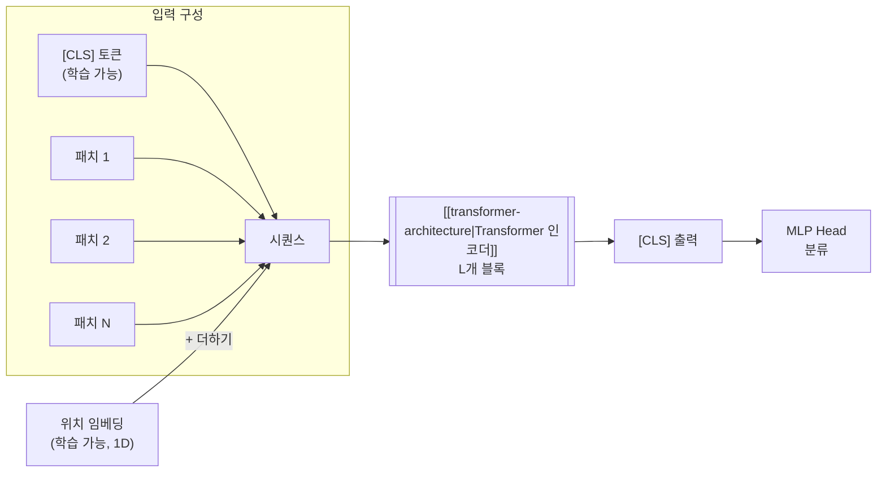

# Vision Transformer (ViT)

## 개요

Vision Transformer(ViT)는 Dosovitskiy et al.(Google Brain, 2020, ICLR 2021) "An Image is Worth 16x16 Words"에서 제안한 이미지 처리용 **순수 Transformer 아키텍처**다. 이미지를 고정 크기 패치로 분할해 token처럼 다루고 표준 [[transformer-architecture|Transformer]] 인코더로 처리한다. [[cnn|CNN]]의 합성곱 연산 없이 순수 [[self-attention-mechanism|셀프 어텐션]]만으로도 이미지를 처리할 수 있음을 입증했다. JFT-300M 규모의 대용량 데이터셋에서 사전학습 시 ImageNet에서 88.55% top-1 정확도를 달성하며 CNN 기반 모델(EfficientNet, BiT-L)과 동등하거나 우수한 성능을 보였다. ViT의 패치 토큰화 전략은 이후 [[diffusion-transformer|DiT]], DeiT, Swin Transformer 등 비전 분야 전반으로 확산되었다.

## 핵심 통찰

> "A pure transformer applied directly to sequences of image patches can perform very well on image classification tasks."
> — Dosovitskiy et al. 2020 abstract

기존 Vision은 CNN의 inductive bias(지역성, 이동 불변성, 계층적 특징)에 의존했다. ViT는 이를 거의 제거하고 attention만으로 픽셀 패턴을 학습한다. 대신 **데이터·계산량이 충분히 클 때만** CNN을 능가한다.

[[cnn|CNN]]은 이미지 인식의 사실상 표준이었다. 그러나 NLP에서 [[transformer-architecture|Transformer]]가 보여준 스케일링 효율성과 범용성은 "비전에서도 Transformer만으로 충분한가?"라는 질문을 자연스럽게 이끌었다. CNN의 귀납적 편향(inductive bias)인 지역성(locality)과 이동 불변성(translation equivariance)이 소규모 데이터에서는 유리하지만, 대규모 데이터에서는 Transformer가 이 편향 없이도 동등한 패턴을 데이터에서 직접 학습할 수 있다는 것이 ViT의 핵심 가설이었다.

## 아키텍처 구조


### 패치 임베딩 (Patch Embedding)

ViT의 첫 단계는 2D 이미지를 1D 토큰 시퀀스로 변환하는 것이다:

```
입력 이미지: H x W x C (예: 224 x 224 x 3)
패치 크기: P x P (예: 16 x 16)
패치 수: N = (H x W) / P^2 = (224 x 224) / (16 x 16) = 196개
각 패치: P^2 x C = 16 x 16 x 3 = 768 차원 벡터
선형 투영: 768 --> D차원 (모델 히든 차원)
```

이미지를 겹치지 않는 P x P 패치 격자로 분할하고, 각 패치를 평탄화(flatten)한 뒤 학습 가능한 선형 투영(linear projection)으로 D차원 임베딩 공간에 매핑한다. 이 과정은 NLP에서 단어를 토큰 임베딩으로 변환하는 것에 대응된다.

### 특수 토큰과 위치 임베딩



- **[CLS] 토큰**: 시퀀스 맨 앞에 학습 가능한 특수 토큰을 추가한다. Transformer 인코더를 거친 후 이 토큰의 출력 표현이 전체 이미지를 대표하며, 분류 헤드의 입력이 된다. BERT의 [CLS] 토큰과 동일한 역할이다
- **위치 임베딩**: 1D 학습 가능한 위치 임베딩을 패치 임베딩에 더한다. 2D 인식 위치 임베딩도 실험했으나, 1D 임베딩과 성능 차이가 미미했다 ([[positional-encoding]] 비교 참고)

### Transformer 인코더

ViT는 표준 Transformer 인코더를 거의 수정 없이 사용한다. 각 블록은:

1. Layer Normalization (Pre-LN 배치)
2. [[multi-head-attention|Multi-Head Self-Attention]] (MSA)
3. [[residual-connection|잔차 연결]]
4. Layer Normalization
5. MLP (2층, GELU 활성함수)
6. [[residual-connection|잔차 연결]]

이 구조는 NLP Transformer와 사실상 동일하며, 비전 특화 수정이 최소화된 것이 ViT의 설계 철학이다.

### 핵심 구성요소 요약

| 단계 | 설명 |
|------|------|
| **Patch embedding** | $H \times W \times C$ 이미지를 $N = HW/P^2$ 개의 $P \times P$ patch로 분할, 각 패치를 평탄화 후 선형 사상 |
| **[CLS] token** | BERT 스타일 학습 가능 토큰을 시퀀스 앞에 concat — 분류 시 이 토큰의 출력만 사용 |
| **Position embedding** | 학습 가능한 1D 벡터 (논문은 2D·상대 인코딩과 비교했지만 차이 미미) |
| **Encoder** | 표준 multi-head self-attention + MLP (ViT-Base: L=12, H=12, D=768) |

## 모델 변형 (논문 기준)

| 모델 | Layers (L) | Hidden (D) | Heads (H) | Params |
|------|-----------|-----------|-----------|--------|
| ViT-Base | 12 | 768 | 12 | 86M |
| ViT-Large | 24 | 1024 | 16 | 307M |
| ViT-Huge | 32 | 1280 | 16 | 632M |

## 사전학습 데이터의 결정적 영향

ViT의 가장 중요한 발견: **데이터 규모가 작으면 CNN이 더 낫다, 크면 ViT가 이긴다**.

| 사전 학습 데이터 | ViT-L 성능 (ImageNet top-1) | ResNet-152x4 (BiT) |
|-----------------|---------------------------|---------------------|
| ImageNet-1K (1.3M) | 76.5% | 87.5% |
| ImageNet-21K (14M) | 85.2% | 87.5% |
| JFT-300M (300M) | **87.8%** | 87.5% |

- **소규모 데이터**: CNN의 귀납적 편향이 유리. ViT는 ImageNet-1K만으로 학습하면 CNN에 크게 뒤진다
- **중규모 데이터**: 격차가 좁혀지기 시작
- **대규모 데이터**: ViT가 CNN을 따라잡거나 능가. 데이터에서 직접 공간 관계를 학습

> "Vision Transformer attains excellent results compared to state-of-the-art convolutional networks while requiring substantially fewer computational resources to train."
> — Dosovitskiy et al. 2020

이유: CNN의 inductive bias가 적은 데이터에서는 도움이 되지만, 충분한 데이터에서는 오히려 표현력 제약으로 작용. ViT는 attention의 유연성으로 데이터에서 직접 패턴을 학습. 이 결과는 "충분한 데이터가 있으면 귀납적 편향이 불필요하다"는 스케일링 가설을 강하게 지지한다.

## 후속 발전

### DeiT (Data-efficient Image Transformers, 2021)

ImageNet-1K만으로도 ViT를 효과적으로 학습시키는 방법을 제시했다. 강력한 데이터 증강, 정규화, 그리고 CNN 교사 모델로부터의 지식 증류(distillation)를 결합하여, 대규모 외부 데이터 없이도 경쟁력 있는 성능을 달성했다. 자세한 내용은 [[deit-data-efficient-image-transformer]] 참고.

### Swin Transformer (2021)

ViT의 O(N^2) 어텐션 비용 문제를 해결하기 위해 이동 윈도우(shifted window) 기반의 계층적 구조를 도입했다. 윈도우 내에서만 어텐션을 계산하고 윈도우를 이동시켜 정보를 교환하는 방식으로, 선형 연산 복잡도를 달성하면서도 높은 성능을 유지한다. detection·segmentation에서도 강력하다. [[swin-transformer]] 참고.

### MAE (Masked Autoencoders, 2022)

이미지 패치의 75%를 마스킹하고 나머지에서 복원하는 자기지도 학습 방식으로, NLP의 BERT 사전 학습 전략을 비전에 성공적으로 적용했다. [[masked-autoencoder-mae]] 참고.

### BEiT

BERT 스타일 masked image modeling 기법을 ViT에 적용한 자기지도 사전학습 방식. [[beit-bert-pretraining-images]] 참고.

### DINOv2

self-distillation 기반 범용 비전 표현 학습. 라벨 없이 강력한 representation을 학습한다. [[dinov2]] 참고.

### MobileViT / EfficientFormer

모바일·엣지 환경을 위한 경량·효율 변형. CNN과 ViT를 하이브리드로 결합하거나, 레이턴시 병목을 분석해 재설계한다. [[mobilevit-efficient-vit]] 참고.

### Hierarchical ViT

다중 해상도 피처맵을 생성하도록 설계된 계층적 변형. detection·segmentation 같은 dense prediction에서 원본 ViT보다 강력하다. [[hierarchical-vit-design]] 참고.

### DiT로의 확장

[[diffusion-transformer|DiT]]는 ViT의 패치 토큰화를 잠재 공간(latent space)에 적용하여, [[diffusion-models|확산 모델]]의 노이즈 예측 네트워크로 Transformer를 사용한다. ViT가 비전 분류에서 시작한 "패치 = 토큰" 패러다임이 생성 모델로까지 확장된 사례다.

## 멀티모달 확장

ViT는 **이미지 인코더 표준**이 되어 멀티모달 모델의 기반이 됐다.

- **[[clip|CLIP]]**: ViT 이미지 인코더 + Transformer 텍스트 인코더로 contrastive 학습
- **[[blip-paper|BLIP]] / [[blip-2-paper|BLIP-2]]**: ViT + 언어 모델 결합
- **[[vision-language-model-architectures|VLM]] 일반**: 대부분 ViT (또는 그 변형)을 vision backbone으로 사용
- **[[internvit-6b|InternViT]]**: 대규모 ViT (6B parameters)

## CNN과의 비교

| 속성 | [[cnn|CNN]] | ViT |
|------|-----------|-----|
| 귀납적 편향 | 강함 (지역성, 이동 불변성) | 약함 (위치 임베딩만) |
| 소규모 데이터 성능 | 우수 | 열등 (편향 부족) |
| 대규모 데이터 성능 | 포화 경향 | 지속적 향상 |
| 수용 영역 | 지역적 (층을 쌓아 확장) | 첫 층부터 전역(global) |
| 연산 복잡도 | O(K^2 x C^2) per pixel | O(N^2 x D) per token |
| 해상도 유연성 | 네이티브 지원 | 위치 임베딩 보간 필요 |

ViT는 **귀납적 편향(inductive bias)**이 적다 -- CNN의 지역성(locality)과 이동 불변성(translation invariance)이 없어 대규모 데이터가 필요하지만, 데이터가 충분하면 CNN을 능가한다.

## 왜 중요한가 — 실무 관점

- **표준 vision backbone**: 2020년대 비전 모델 대부분이 ViT 또는 변형 사용. CNN은 점차 ViT로 교체됨
- **사전학습 가중치 풍부**: timm, HuggingFace에 다양한 사이즈·해상도·데이터셋 가중치 공개
- **확장성**: parameter scaling, image resolution scaling, patch size scaling 모두 명확한 trade-off가 있어 튜닝 가이드 형성
- **Cross-modal 호환**: 텍스트 transformer와 동일 구조라 통합 멀티모달 학습이 자연스러움

## 한계와 trade-off

- **데이터 hungry**: 작은 데이터셋(<1M)에서는 augmentation·distillation 없이는 ResNet에 밀림
- **고해상도 비용**: token 수가 $(H/P)^2$로 quadratic attention 비용 폭증 — Swin·hierarchical 변형으로 완화
- **위치 인코딩 외삽**: 학습 해상도와 다른 입력 해상도에서 position embedding 보간 필요
- **localization 약함**: detection·segmentation에는 추가 구조(FPN, Mask Decoder) 필요

## 참고 자료

- Dosovitskiy, A. et al. (2021). [An Image is Worth 16x16 Words: Transformers for Image Recognition at Scale](https://arxiv.org/abs/2010.11929). ICLR 2021
- [How the Vision Transformer (ViT) works in 10 minutes](https://theaisummer.com/vision-transformer/). AI Summer
- [Vision Transformer - Wikipedia](https://en.wikipedia.org/wiki/Vision_transformer)

## 관련 문서

- [[transformer-architecture]] — ViT의 기반 인코더
- [[vit-patch-embedding]] — patch embedding 단계 상세
- [[vit-register-tokens]] — register token 후속 연구
- [[vit-distillation-techniques]] — DeiT 등 증류 기법
- [[positional-encoding]] — 1D vs 2D 비교
- [[masked-image-modeling]] — MAE·BEiT 사전학습
- [[masked-autoencoder-mae]] — MAE
- [[beit-bert-pretraining-images]] — BEiT
- [[swin-transformer]] — 계층적 ViT
- [[deit-data-efficient-image-transformer]] — DeiT 데이터 효율 학습
- [[hierarchical-vit-design]] — 계층적 ViT 일반론
- [[mobilevit-efficient-vit]] — 모바일 효율 변형
- [[dinov2]] — DINOv2 자기지도 표현
- [[clip]] — ViT를 활용한 대표 멀티모달 모델
- [[vision-language-model-architectures]] — VLM 일반론
- [[internvit-6b]] — 대규모 ViT
- [[diffusion-transformer]] — DiT: ViT 패턴의 생성 모델 확장
- [[patchtst-timeseries]] — PatchTST: ViT 패치 아이디어의 시계열 적용
- [[mapo-multimodal-agentic-paper]] — MAPO: 멀티모달 에이전트 정책 최적화
- [[tempo-video-vlm-compressor-paper]] — Tempo: 소규모 VLM을 비디오 시간 압축기로 활용
