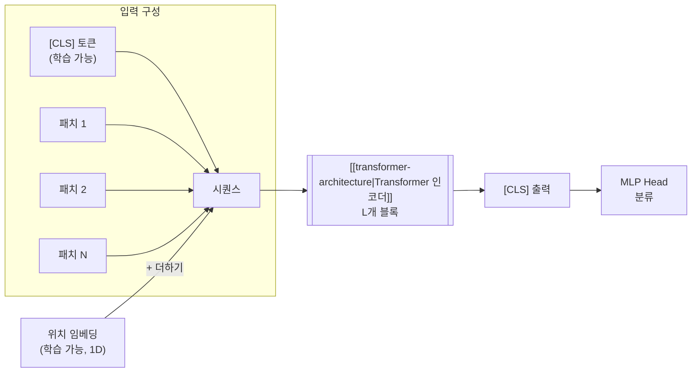

# Vision Transformer (ViT)

## 개요

Vision Transformer(ViT)는 Dosovitskiy et al.(2021)이 "An Image is Worth 16x16 Words"에서 제안한 아키텍처로, 이미지를 고정 크기 패치로 분할하여 [[transformer-architecture|Transformer]] 인코더에 직접 입력하는 방식이다. [[cnn|CNN]]의 합성곱 연산 없이 순수 [[self-attention-mechanism|셀프 어텐션]]만으로 이미지를 처리할 수 있음을 입증했다. JFT-300M 규모의 대용량 데이터셋에서 사전 학습 시 ImageNet에서 88.55% top-1 정확도를 달성하며 CNN 기반 모델(EfficientNet, BiT-L)과 동등하거나 우수한 성능을 보였다. ViT의 패치 토큰화 전략은 이후 [[diffusion-transformer|DiT]], DeiT, Swin Transformer 등 비전 분야 전반으로 확산되었다.

## 핵심 동기

[[cnn|CNN]]은 이미지 인식의 사실상 표준이었다. 그러나 NLP에서 [[transformer-architecture|Transformer]]가 보여준 스케일링 효율성과 범용성은 "비전에서도 Transformer만으로 충분한가?"라는 질문을 자연스럽게 이끌었다. CNN의 귀납적 편향(inductive bias)인 지역성(locality)과 이동 불변성(translation equivariance)이 소규모 데이터에서는 유리하지만, 대규모 데이터에서는 Transformer가 이 편향 없이도 동등한 패턴을 데이터에서 직접 학습할 수 있다는 것이 ViT의 핵심 가설이었다.

## 아키텍처 구조

### 패치 임베딩 (Patch Embedding)

ViT의 첫 단계는 2D 이미지를 1D 토큰 시퀀스로 변환하는 것이다:

```
입력 이미지: H x W x C (예: 224 x 224 x 3)
패치 크기: P x P (예: 16 x 16)
패치 수: N = (H x W) / P^2 = (224 x 224) / (16 x 16) = 196개
각 패치: P^2 x C = 16 x 16 x 3 = 768 차원 벡터
선형 투영: 768 --> D차원 (모델 히든 차원)
```

이미지를 겹치지 않는 P x P 패치 격자로 분할하고, 각 패치를 평탄화(flatten)한 뒤 학습 가능한 선형 투영(linear projection)으로 D차원 임베딩 공간에 매핑한다. 이 과정은 NLP에서 단어를 토큰 임베딩으로 변환하는 것에 대응된다.

### 특수 토큰과 위치 임베딩



- **[CLS] 토큰**: 시퀀스 맨 앞에 학습 가능한 특수 토큰을 추가한다. Transformer 인코더를 거친 후 이 토큰의 출력 표현이 전체 이미지를 대표하며, 분류 헤드의 입력이 된다. BERT의 [CLS] 토큰과 동일한 역할이다
- **위치 임베딩**: 1D 학습 가능한 위치 임베딩을 패치 임베딩에 더한다. 2D 인식 위치 임베딩도 실험했으나, 1D 임베딩과 성능 차이가 미미했다

### Transformer 인코더

ViT는 표준 Transformer 인코더를 거의 수정 없이 사용한다. 각 블록은:

1. Layer Normalization (Pre-LN 배치)
2. [[multi-head-attention|Multi-Head Self-Attention]] (MSA)
3. [[residual-connection|잔차 연결]]
4. Layer Normalization
5. MLP (2층, GELU 활성함수)
6. [[residual-connection|잔차 연결]]

이 구조는 NLP Transformer와 사실상 동일하며, 비전 특화 수정이 최소화된 것이 ViT의 설계 철학이다.

## 모델 변형

| 모델 | 레이어 수 | 히든 차원 | 헤드 수 | 파라미터 |
|------|----------|----------|--------|---------|
| ViT-Base | 12 | 768 | 12 | 86M |
| ViT-Large | 24 | 1024 | 16 | 307M |
| ViT-Huge | 32 | 1280 | 16 | 632M |

## 데이터 규모와 성능

ViT의 가장 중요한 발견은 **사전 학습 데이터 규모와 성능의 관계**다:

| 사전 학습 데이터 | ViT-L 성능 (ImageNet top-1) | ResNet-152x4 (BiT) |
|-----------------|---------------------------|---------------------|
| ImageNet-1K (1.3M) | 76.5% | 87.5% |
| ImageNet-21K (14M) | 85.2% | 87.5% |
| JFT-300M (300M) | **87.8%** | 87.5% |

- **소규모 데이터**: CNN의 귀납적 편향이 유리. ViT는 ImageNet-1K만으로 학습하면 CNN에 크게 뒤진다
- **중규모 데이터**: 격차가 좁혀지기 시작
- **대규모 데이터**: ViT가 CNN을 따라잡거나 능가. 데이터에서 직접 공간 관계를 학습

이 결과는 "충분한 데이터가 있으면 귀납적 편향이 불필요하다"는 스케일링 가설을 강하게 지지한다.

## 후속 발전

### DeiT (Data-efficient Image Transformers, 2021)

ImageNet-1K만으로도 ViT를 효과적으로 학습시키는 방법을 제시했다. 강력한 데이터 증강, 정규화, 그리고 CNN 교사 모델로부터의 지식 증류(distillation)를 결합하여, 대규모 외부 데이터 없이도 경쟁력 있는 성능을 달성했다.

### Swin Transformer (2021)

ViT의 O(N^2) 어텐션 비용 문제를 해결하기 위해 이동 윈도우(shifted window) 기반의 계층적 구조를 도입했다. 윈도우 내에서만 어텐션을 계산하고 윈도우를 이동시켜 정보를 교환하는 방식으로, 선형 연산 복잡도를 달성하면서도 높은 성능을 유지한다.

### MAE (Masked Autoencoders, 2022)

이미지 패치의 75%를 마스킹하고 나머지에서 복원하는 자기지도 학습 방식으로, NLP의 BERT 사전 학습 전략을 비전에 성공적으로 적용했다.

### DiT로의 확장

[[diffusion-transformer|DiT]]는 ViT의 패치 토큰화를 잠재 공간(latent space)에 적용하여, [[diffusion-models|확산 모델]]의 노이즈 예측 네트워크로 Transformer를 사용한다. ViT가 비전 분류에서 시작한 "패치 = 토큰" 패러다임이 생성 모델로까지 확장된 사례다.

## CNN과의 비교

| 속성 | [[cnn|CNN]] | ViT |
|------|-----------|-----|
| 귀납적 편향 | 강함 (지역성, 이동 불변성) | 약함 (위치 임베딩만) |
| 소규모 데이터 성능 | 우수 | 열등 (편향 부족) |
| 대규모 데이터 성능 | 포화 경향 | 지속적 향상 |
| 수용 영역 | 지역적 (층을 쌓아 확장) | 첫 층부터 전역(global) |
| 연산 복잡도 | O(K^2 x C^2) per pixel | O(N^2 x D) per token |
| 해상도 유연성 | 네이티브 지원 | 위치 임베딩 보간 필요 |

## 참고 자료

- Dosovitskiy, A. et al. (2021). [An Image is Worth 16x16 Words: Transformers for Image Recognition at Scale](https://arxiv.org/abs/2010.11929). ICLR 2021
- [How the Vision Transformer (ViT) works in 10 minutes](https://theaisummer.com/vision-transformer/). AI Summer
- [Vision Transformer - Wikipedia](https://en.wikipedia.org/wiki/Vision_transformer)
