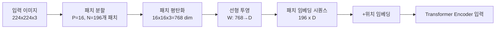
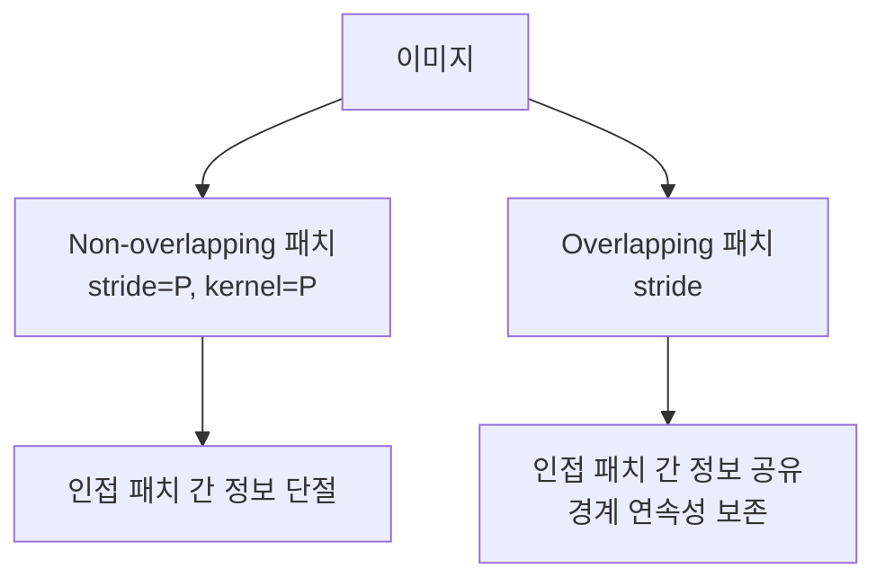
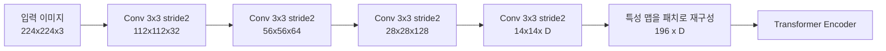
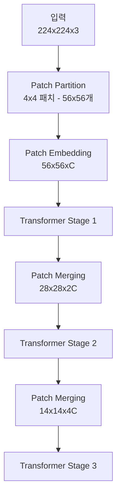

# ViT 패치 임베딩 설계 심화

## 개요

[[vision-transformer]](ViT)의 패치 임베딩(patch embedding)은 2D 이미지를 Transformer가 처리할 수 있는 1D 토큰 시퀀스로 변환하는 첫 번째 단계다. 이 변환 방식은 단순해 보이지만, 실제로는 모델의 성능, 학습 안정성, 계산 효율에 큰 영향을 미친다. 원본 ViT의 단순한 비겹침(non-overlapping) 패치 분할 이후, 다양한 개선된 설계가 등장했다.

[[cnn]] 구조에서 쌓아온 신호 처리 지식이 ViT 패치 임베딩 설계에 어떻게 녹아들었는지를 이해하는 것이 이 문서의 핵심이다.

## 기본 패치 임베딩 (원본 ViT)

원본 ViT는 이미지를 겹치지 않는(non-overlapping) 고정 크기 패치로 분할하고, 각 패치를 평탄화(flatten)한 뒤 선형 투영(linear projection)으로 임베딩 벡터를 생성한다.

$$\mathbf{x}_{patch} \in \mathbb{R}^{H \times W \times C} \rightarrow \mathbf{z}_0 \in \mathbb{R}^{N \times D}$$

- $N = \frac{H \times W}{P^2}$: 패치 수 ($P$는 패치 크기, 보통 16 또는 32)
- $D$: 임베딩 차원

**구현 기법:** 이 선형 투영은 `nn.Conv2d(in_channels=3, out_channels=D, kernel_size=P, stride=P)`와 수학적으로 동일하다. 실제 구현에서는 대부분 Conv2d를 사용한다.

## 설계 변형들

### 1. 겹치는 패치 (Overlapping Patches)

비겹침 패치는 패치 경계에서 연속성이 끊기는 문제가 있다. CNN은 항상 슬라이딩 윈도우 방식으로 겹치는 수용 야를 가지는 것과 대조된다. 겹치는 패치는 stride < kernel_size인 Conv2d로 구현한다.

**장점:** 특히 작은 객체, 엣지, 텍스처 등 공간적 연속성이 중요한 태스크에서 유리
**단점:** 패치 수 증가로 시퀀스 길이 및 계산 비용 증가

### 2. Conv Stem (합성곱 줄기)

Conv Stem은 선형 투영 대신 여러 층의 [[cnn]] 레이어로 이미지를 먼저 처리한 후, 결과 특성 맵을 패치로 분할하는 방식이다.

**왜 유용한가:**

1. **학습 안정성**: 직접 픽셀 입력보다 CNN 처리 후 특성 입력이 학습이 훨씬 안정적. 원본 ViT는 대규모 데이터 없이는 학습이 불안정했는데, Conv Stem이 이를 크게 개선
2. **지역 특성 사전 처리**: Transformer의 글로벌 어텐션이 처리하기 전에 엣지, 코너, 색상 경계 등 저수준 특성을 CNN이 먼저 추출
3. **분산 감소**: 입력 공간의 급격한 변동을 완충

**대표 채택 모델:** ViT-B 기반 DeiT 계열, ConvNeXt의 Patchify Stem, Swin Transformer의 Patch Merging 설계

### 3. 계층적 패치 임베딩 (Hierarchical)

Swin Transformer 등에서 채택한 방식으로, 초기에는 세밀한 패치(4x4)로 시작하여 깊어질수록 패치를 병합(merge)하여 해상도를 줄이는 구조다.

**장점:** CNN과 유사한 계층적 표현 학습, FPN(Feature Pyramid Network)와의 연결이 자연스러워 탐지/분할 태스크에 적합

### 4. 다중 스케일 패치 (Multi-Scale Patching)

서로 다른 크기의 패치를 동시에 처리하여 다양한 스케일의 특성을 캡처한다.

- **작은 패치(8x8)**: 세밀한 지역 특성 캡처
- **큰 패치(32x32)**: 글로벌 구조 캡처

이 두 토큰 스트림을 크로스 어텐션으로 연결하거나 단순 합산하는 변형들이 연구되었다.

## 패치 임베딩 설계 선택 가이드

| 시나리오 | 권장 설계 |
|---------|-----------|
| 분류 (ImageNet 규모 데이터) | 비겹침 선형 패치 임베딩 |
| 분류 (소규모 데이터) | Conv Stem + 비겹침 패치 |
| 객체 탐지 / 분할 | 계층적 패치 (Swin 스타일) |
| 고해상도 입력 (의료, 위성) | 겹치는 패치 또는 NaFlex 스타일 동적 |
| 모바일 / 엣지 배포 | 경량 Conv Stem (depth-wise conv 활용) |

## 위치 임베딩과의 관계

패치 임베딩 설계는 위치 임베딩(position embedding) 선택과 연동된다:

- **비겹침 고정 크기**: 1D 절대 위치 임베딩 또는 2D 삼각 함수 위치 임베딩
- **동적 해상도(NaFlex 등)**: 보간 기반 위치 임베딩 또는 RoPE(Rotary Position Embedding)

## 관련 문서

- [[vision-transformer]] - 패치 임베딩을 사용하는 원본 ViT 아키텍처
- [[cnn]] - Conv Stem의 기반이 되는 합성곱 신경망 원리
- [[siglip2-multilingual]] - NaFlex 동적 해상도 패치 처리 응용
- [[efficientformer-v2]] - 하이브리드 Conv+Attention 구조에서의 패치 설계
- [[vit-distillation-techniques]] - 경량 ViT 학습을 위한 증류 기법
