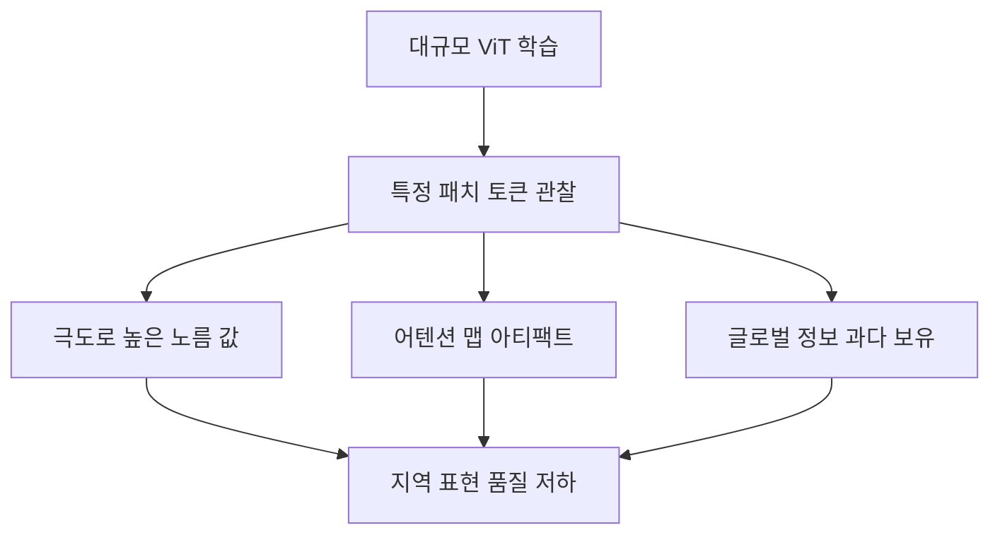
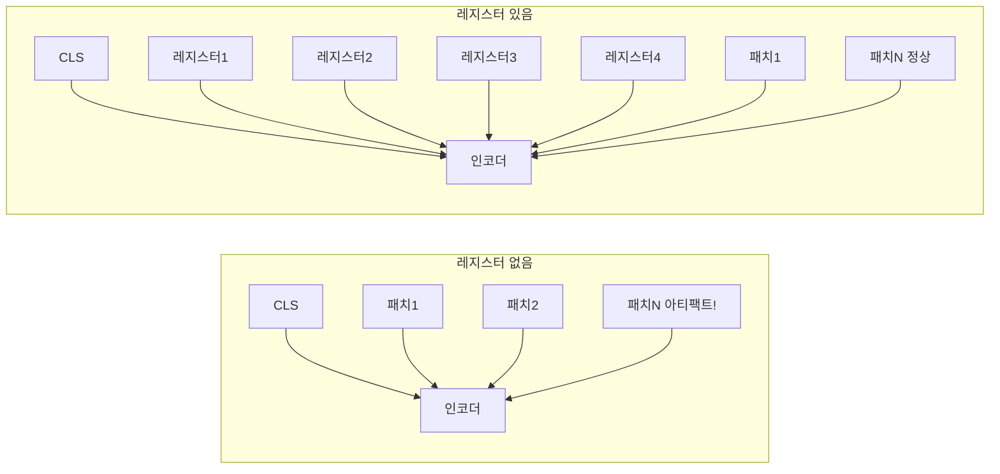
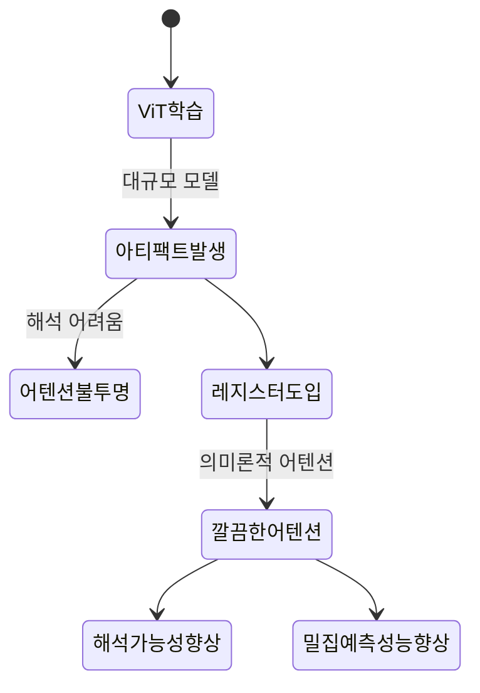

# ViT 레지스터 토큰 - 아티팩트 억제

## 개요

레지스터 토큰(register tokens)은 Meta AI가 2023년 [[dinov2]] 연구에서 발견한 ViT 아티팩트 문제를 해결하기 위해 제안한 기법이다. 대규모 ViT 모델에서 어텐션 맵에 나타나는 불규칙한 고노름(high-norm) 패치 문제를 **추가적인 "레지스터" 토큰**으로 흡수해 해결한다. 단순한 기법이지만 시각적 특징 품질과 어텐션 해석 가능성을 크게 향상시킨다.

## 발견된 문제: 아티팩트 토큰

[[vision-transformer-vit]] 기반 모델, 특히 DINOv2 같은 대규모 자기지도 학습 모델에서 특정 현상이 관찰되었다:

### 아티팩트의 특성

1. **고노름 패치**: 일부 패치 토큰이 비정상적으로 큰 노름 값을 가짐
2. **정보 과부하**: 이 토큰들이 이미지의 글로벌 정보를 과도하게 저장
3. **어텐션 집중**: 다른 토큰들이 이 "이상한" 토큰에 과도하게 어텐션
4. **지역성 손실**: 결과적으로 어텐션 맵이 의미론적 지역성을 잃음

이 현상은 이미지의 배경처럼 **의미론적으로 중요하지 않은 영역**에서 주로 발생한다. 해당 패치들이 "로컬 정보가 없으니 글로벌 정보를 저장하자"는 방식으로 동작하는 것으로 해석된다.

## 해결책: 레지스터 토큰

레지스터 토큰은 **학습 가능한 추가 토큰**으로, CLS 토큰처럼 이미지 패치와 함께 트랜스포머 인코더에 입력된다. 이 토큰들은 이미지의 특정 영역과 대응하지 않으며, 글로벌 정보를 저장하기 위한 "버퍼" 역할을 한다.

### 동작 원리

- 글로벌 정보를 저장해야 하는 토큰들이 패치 토큰 대신 레지스터 토큰에 정보를 집어넣음
- 패치 토큰은 해당 지역의 로컬 정보에 집중할 수 있게 됨
- 최종 출력에서 레지스터 토큰은 버리고, 패치 토큰과 CLS 토큰만 사용

## 효과

| 지표 | 레지스터 없음 | 레지스터 있음 |
|------|-------------|-------------|
| 어텐션 맵 품질 | 아티팩트 포함 | 깔끔한 의미론적 어텐션 |
| 고노름 패치 수 | 많음 | 거의 없음 |
| 밀집 예측 태스크 | 성능 저하 | 개선 |
| 분류 성능 | 기준 | 유사 또는 소폭 향상 |

어텐션 맵이 개선되면 세그멘테이션, 깊이 추정 등 픽셀 단위 밀집 예측 태스크에서 직접적인 성능 향상으로 이어진다.

## [[dinov2]]에서의 적용

[[dinov2]]는 레지스터 토큰을 도입한 첫 대규모 공개 모델이다. DINOv2 + 레지스터(DINOv2-reg)는 다음을 개선했다:

- 픽셀 단위 특징 품질 향상
- 어텐션 맵의 의미론적 정확도 향상
- 밀집 예측 태스크(세그멘테이션, 깊이 추정)에서 성능 향상

레지스터 토큰의 최적 수는 보통 4-8개이며, 더 많이 추가해도 성능이 포화된다.

## 해석 가능성에의 함의

레지스터 토큰은 단순히 성능 수치를 높이는 것 이상으로, ViT 어텐션 맵의 **해석 가능성(interpretability)**을 복원한다는 점에서 중요하다. 어텐션 맵이 다시 의미론적 구조를 반영하게 되어 모델 행동을 디버깅하고 이해하기 쉬워진다.

## 관련 문서

- [[vision-transformer-vit]] - ViT 기본 아키텍처
- [[dinov2]] - 레지스터 토큰을 처음 도입한 모델
- [[masked-image-modeling-survey]] - ViT 사전학습 방법 비교
- [[hierarchical-vit-design]] - ViT 설계 패턴 비교
