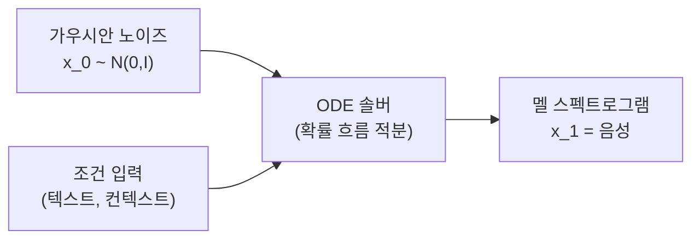
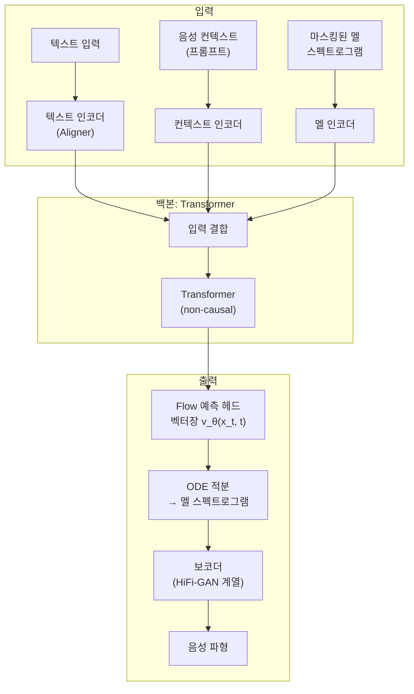

# Voicebox - 비자기회귀 TTS와 Flow Matching

## 개요

Voicebox(2023, Meta AI)는 **[[flow-matching]] 기반 비자기회귀(non-autoregressive) 음성 합성** 모델이다. 기존 TTS 모델들이 텍스트 → 음성 순서를 순차적으로 생성하는 자기회귀(autoregressive) 방식을 택하는 데 비해, Voicebox는 마스킹된 음성 구간을 독립적으로 예측하여 고품질 음성을 빠르게 생성한다.

단일 모델로 음성 합성(TTS), 음성 인페인팅(in-painting), 잡음 제거, 음성 변환 등 다양한 태스크를 처리하는 **범용 음성 생성 모델**이라는 점이 핵심 차별점이다.

## 핵심 기술: Flow Matching

[[flow-matching]]은 확산 모델(diffusion model)의 대안으로 등장한 생성 모델 프레임워크다. 랜덤 노이즈에서 데이터로 향하는 **확률적 흐름(probability flow)**을 학습한다.

### Voicebox에서의 Flow Matching

확산 모델이 수백~수천 스텝의 역방향 확산(denoising)을 수행하는 것과 달리, Flow Matching은 **직선에 가까운 경로(straight-path OFT)**를 학습하여 적은 함수 평가(NFE, Number of Function Evaluations)로 샘플을 생성한다. Voicebox는 약 10-20 NFE로 고품질 음성을 생성한다.

## 아키텍처 구조

### 마스킹 기반 학습

Voicebox의 학습 전략은 BERT의 마스킹 언어 모델(MLM)에 음성을 적용한 것과 유사하다:

1. 음성 멜 스펙트로그램의 일부 구간을 마스킹
2. 나머지 구간(컨텍스트)과 텍스트 정렬 정보를 조건으로 마스킹 구간 재구성
3. 이 과정을 flow matching objective로 학습

이 방식 덕분에 추론 시 마스킹 위치를 자유롭게 지정할 수 있어 **인페인팅, 편집, 노이즈 제거** 등에 자연스럽게 적용된다.

## 비자기회귀 방식의 이점

| 특성 | 자기회귀(AR) TTS | Voicebox (Non-AR) |
|------|----------------|-------------------|
| 생성 순서 | 프레임 순차 생성 | 전체 동시 생성 |
| 지연(latency) | 길이에 비례 | 길이와 무관 |
| 병렬화 | 불가 (각 스텝이 이전에 의존) | 가능 |
| 컨텍스트 활용 | 단방향 (과거만) | 양방향 (전체) |
| 수정·편집 | 어려움 | 마스킹으로 자연스럽게 지원 |

비자기회귀 특성은 실시간 스트리밍보다는 **배치 처리, 후처리 편집, 긴 발화 생성** 시나리오에 적합하다.

## 지원 태스크

Voicebox 단일 모델이 처리하는 태스크 목록:

- **TTS(Text-to-Speech)**: 텍스트 + 화자 참조 음성 → 해당 화자의 음성
- **제로샷 음성 복제(zero-shot voice cloning)**: 수 초의 화자 샘플만으로 화자 스타일 복제
- **음성 인페인팅**: 음성의 특정 구간을 자연스럽게 대체
- **잡음 제거**: 마스킹된 구간에 깨끗한 음성 생성
- **다국어 TTS**: 영어, 프랑스어, 독일어, 스페인어, 포르투갈어, 폴란드어

## 평가 및 성능

음성 합성 품질 평가는 [[speech-synthesis-evaluation]]에서 정의한 지표들을 사용한다:

- **WER(Word Error Rate)**: Voicebox가 생성한 음성을 ASR([[whisper]] 계열)로 전사 후 원본 텍스트와 비교
- **SIM(Speaker Similarity)**: 생성 음성과 참조 화자 음성의 임베딩 코사인 유사도
- **UTMOS**: MOS(Mean Opinion Score)의 자동 추정 지표

[[voxcpm2]] 등 후속/경쟁 모델과 비교 시 Voicebox는 자연스러움(naturalness)과 화자 유사도에서 경쟁력 있는 성능을 보이며, 생성 속도에서 특히 우위를 가진다.

## 한계와 윤리적 고려

- 화자 복제 능력이 높아 **딥페이크 음성** 악용 가능성 존재
- Meta AI는 이 이유로 모델 가중치를 공개하지 않음
- 운율(prosody) 제어가 명시적이지 않아 세밀한 표현력 조정이 어려움
- 비자기회귀 특성상 장문 발화에서 일관성 유지에 추가 처리 필요

## 관련 문서

- [[flow-matching]] - Voicebox의 핵심 생성 프레임워크
- [[voxcpm2]] - 경쟁/후속 비자기회귀 TTS 모델
- [[speech-synthesis-evaluation]] - 음성 합성 품질 평가 지표
