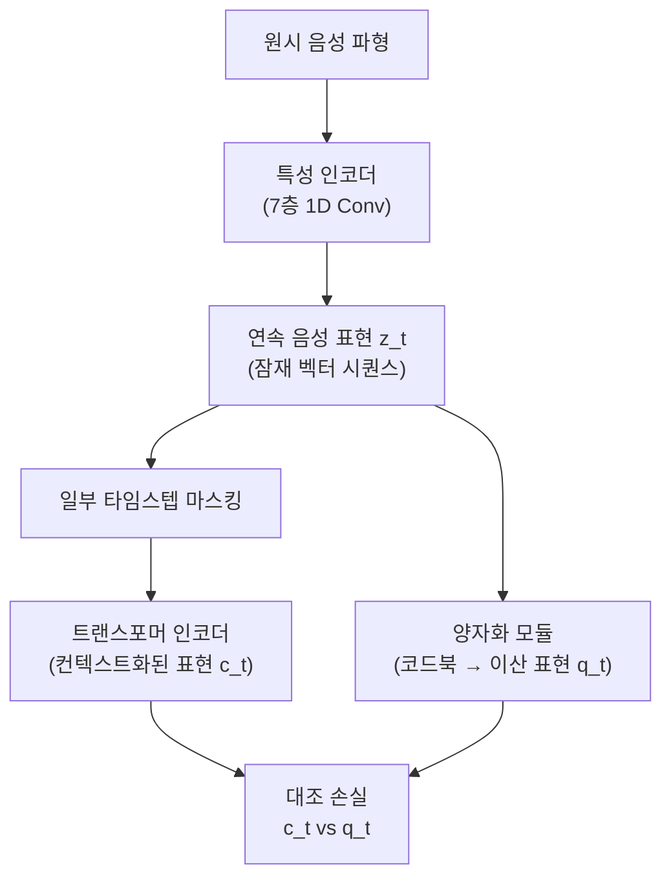

# Wav2Vec 2.0 - 자기지도 음성 표현 학습

## 배경과 문제 의식

자동 음성 인식(ASR, Automatic Speech Recognition)은 전통적으로 대규모 전사(transcription) 데이터, 즉 음성-텍스트 쌍이 필수적이었다. 그런데 대부분의 언어에서 이런 레이블된 데이터는 극히 부족하다. 전 세계 7,000여 개 언어 중 충분한 ASR 학습 데이터가 있는 언어는 수십 개에 불과하다.

Facebook AI Research(현 Meta AI)의 Baevski et al.(2020)은 이 문제를 해결하기 위해 **Wav2Vec 2.0**을 발표했다. 핵심 아이디어는 방대한 레이블 없는(unlabeled) 음성 데이터로 자기지도 사전학습한 후, 소량의 레이블 데이터로 파인튜닝하는 방식이다.

결과는 놀라웠다. **단 10분의 레이블 데이터**만으로 전통적인 LibriSpeech 벤치마크에서 경쟁력 있는 ASR 성능을 달성했다. 100시간 레이블 데이터로는 당시 SOTA를 달성했다.

## 아키텍처 구조



세 가지 주요 구성 요소가 있다.

### 1. 특성 인코더 (Feature Encoder)

7개의 1D 합성곱 레이어로 구성되며, 16kHz 원시 음성 파형을 입력받아 20ms 간격의 연속 잠재 표현 $z_t$를 생성한다. 이 표현은 약 50개/초의 비율로 음성을 표현한다.

### 2. 양자화 모듈 (Quantization Module)

연속 표현 $z_t$를 유한한 코드북에서 이산 표현 $q_t$로 변환한다. 이 과정이 **음성의 이산 단위 학습**을 가능하게 한다.

구체적으로 Gumbel-Softmax를 사용하여 미분 가능한 이산화를 구현한다. $G$개의 코드북(code group)에서 각각 $V$개의 코드 벡터(code vector)를 선택하고 이를 연결(concatenate)한다.

$$q_t = [e_{g_1}, e_{g_2}, ..., e_{g_G}]$$

이 코드들이 바로 음성의 기본 단위(음소와 유사한 역할)를 학습한다.

### 3. 컨텍스트 네트워크 (Context Network)

[[transformer-architecture|트랜스포머]] 인코더로 구성된다. 마스킹된 특성 시퀀스를 입력받아 전체 시퀀스의 컨텍스트를 반영한 표현 $c_t$를 출력한다.

## 학습 목표: 대조 손실

학습 목표는 마스킹된 타임스텝의 올바른 양자화 표현을 **대조 학습(contrastive learning)**으로 맞추는 것이다.

$$\mathcal{L}_m = -\log \frac{\exp(\text{sim}(c_t, q_t)/\kappa)}{\sum_{\tilde{q} \in Q_t} \exp(\text{sim}(c_t, \tilde{q})/\kappa)}$$

- $c_t$: 트랜스포머가 출력한 컨텍스트 표현
- $q_t$: 해당 타임스텝의 실제 양자화 표현 (정답)
- $\tilde{q}$: K개의 무작위 선택된 음성 단위 (오답, 네거티브 샘플)
- $\text{sim}$: 코사인 유사도
- $\kappa$: 온도 파라미터

BERT의 [[masked-autoencoder-mae|마스킹 언어 모델링(MLM)]]이 텍스트 토큰을 예측하는 것처럼, Wav2Vec 2.0은 **마스킹된 음성 구간의 이산 표현**을 대조 학습으로 예측한다.

### 다양성 손실 (Diversity Loss)

모든 코드 벡터가 균등하게 사용되도록 코드북 활용률을 높이는 추가 손실이다.

$$\mathcal{L}_d = \frac{1}{GV} \sum_{g=1}^{G} -H(\bar{p}_g)$$

엔트로피를 최대화하여 일부 코드만 집중 사용되는 붕괴를 방지한다.

## 마스킹 전략

텍스트 모델의 랜덤 마스킹과 달리, 음성은 시간 연속성이 있다. Wav2Vec 2.0은 **연속 구간 마스킹**을 사용한다.

- 무작위로 시작 타임스텝 선택
- 각 시작점에서 길이 M(기본 10 타임스텝, 약 200ms)만큼 연속으로 마스킹
- 전체 타임스텝의 약 49%가 마스킹됨

## 성능 및 벤치마크

### LibriSpeech 벤치마크 (영어)

| 학습 조건 | 모델 | 단어 오류율(WER) test-clean |
|-----------|------|--------------------------|
| 960시간 레이블 | 기존 SOTA | 1.9% |
| 100시간 레이블 | Wav2Vec 2.0 Large | 1.9% |
| 10시간 레이블 | Wav2Vec 2.0 Large | 3.2% |
| **10분 레이블** | **Wav2Vec 2.0 Large** | **5.7%** |

**10분 레이블만으로 경쟁력 있는 ASR 성능**을 보인 결과는 음성 AI 분야에 큰 충격을 주었다.

### 저자원 언어 (BABEL 벤치마크)

| 설정 | WER |
|------|-----|
| 기존 최고 성능 | 15.6% |
| Wav2Vec 2.0 (1시간 레이블) | 11.3% |

## 후속 연구와 영향

Wav2Vec 2.0은 음성 AI의 자기지도 학습 시대를 열었다.

**직접 파생 모델들**:
- **XLSR (Cross-lingual Speech Representations)**: 53개 언어 동시 사전학습. 다국어 ASR의 표준
- **Wav2Vec-U**: 레이블 없이 음성-텍스트 정렬만으로 음성 인식 (완전 비지도)
- **MMS (Massively Multilingual Speech)**: 1,100+ 언어 지원, Meta AI 2023

**Wav2Vec 2.0에 영향받은 연구**:
- [[hubert-speech-representation|HuBERT]]: k-means 의사 레이블로 더 안정적인 학습
- [[wavlm-speech-processing|WavLM]]: 다중 태스크로 통합 음성 처리

## 파인튜닝 방법

사전학습된 Wav2Vec 2.0에 CTC(Connectionist Temporal Classification) 헤드를 붙여 ASR 태스크로 파인튜닝한다.

```python
# HuggingFace transformers 기반 파인튜닝 예시
from transformers import Wav2Vec2ForCTC, Wav2Vec2Processor

model = Wav2Vec2ForCTC.from_pretrained("facebook/wav2vec2-large-960h")
processor = Wav2Vec2Processor.from_pretrained("facebook/wav2vec2-large-960h")
```

- **특성 인코더 고정**: 파인튜닝 시 특성 인코더 파라미터를 동결하고 트랜스포머만 업데이트하는 것이 일반적
- **낮은 학습률**: 사전학습 모델의 표현을 보존하기 위해 1e-4 이하 사용

## 실무 적용 관점

**저자원 언어 ASR 구축**: 충분한 레이블 데이터 없이도 강력한 ASR을 만들 수 있어, 소수 언어 음성 인식 시스템 개발에 널리 활용된다.

**음성 데이터 증가가 레이블보다 쉬운 환경**: 콜센터 음성 로그 등 대량의 미전사(untranscribed) 음성이 있는 기업 환경에 적합하다.

**XLSR을 통한 언어 전이**: 영어 등 자원이 풍부한 언어에서 학습한 후 다른 언어로 전이하면 효율적이다.

**계산 비용 주의**: Large 모델 사전학습에는 수백 GPU 시간이 필요하다. 실제로는 HuggingFace Hub에서 공개된 사전학습 체크포인트를 파인튜닝하는 방식을 권장한다.

## 관련 문서

- [[self-supervised-learning]] - Wav2Vec 2.0이 적용한 자기지도 학습 패러다임
- [[contrastive-learning]] - 대조 손실의 이론적 배경
- [[hubert-speech-representation]] - Wav2Vec 2.0의 직접 후계 모델
- [[wavlm-speech-processing]] - 통합 음성 처리로 확장한 후속 연구
- [[transformer-architecture]] - 컨텍스트 네트워크의 기반
- [[masked-autoencoder-mae]] - 음성 마스킹과 비전 마스킹의 유사성
- [[whisper]] - 대규모 지도학습 방식의 음성 인식 모델 (대조)
