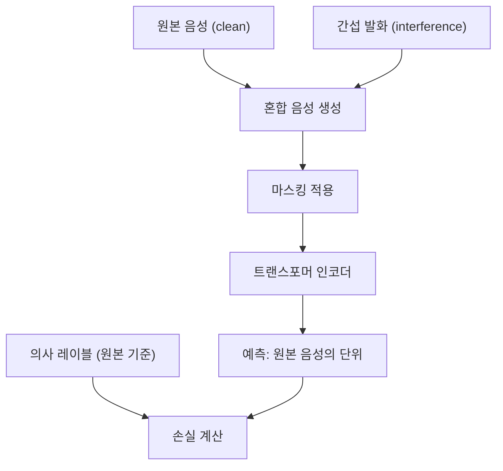
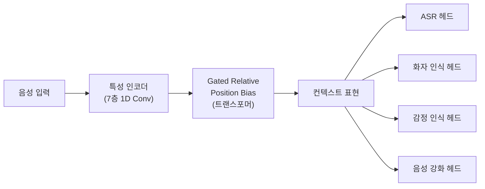
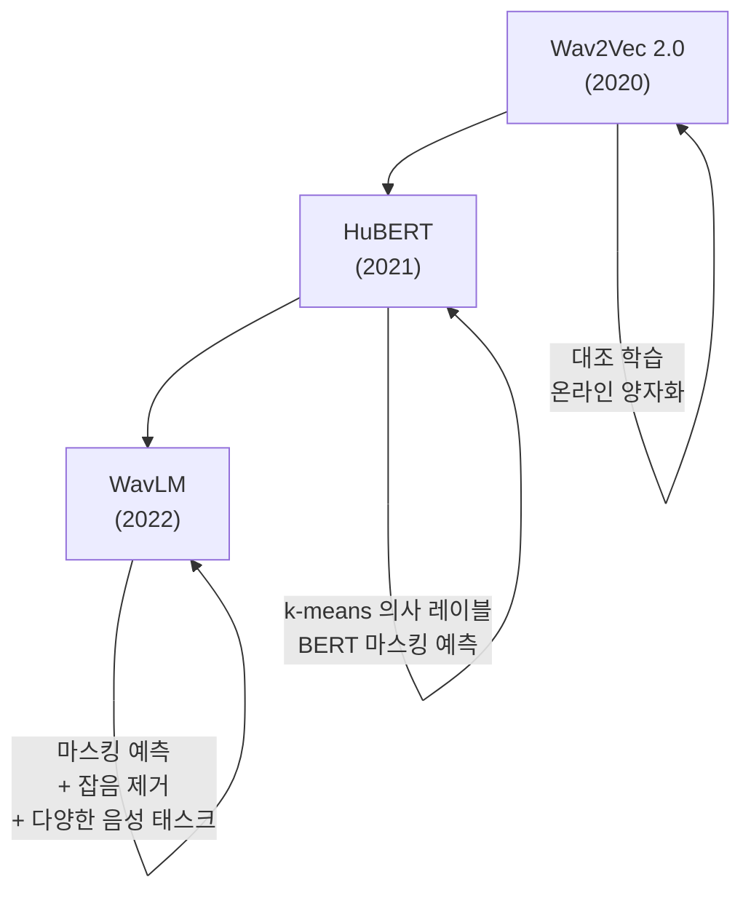

# WavLM - 통합 음성 처리를 위한 마스킹 음성 예측

## 배경과 문제 의식

[[wav2vec-2-speech|Wav2Vec 2.0]]과 [[hubert-speech-representation|HuBERT]]는 자기지도 음성 사전학습의 가능성을 입증했지만, 두 모델 모두 주로 **음성 인식(ASR)** 성능 향상에 초점을 맞췄다. 실제 음성 AI 시스템에서는 ASR 외에도 다음과 같은 다양한 태스크가 요구된다.

- **화자 인식(Speaker Recognition)**: 누가 말했는가
- **화자 분리(Speaker Diarization)**: 여러 화자를 구분하기
- **감정 인식(Emotion Recognition)**: 어떤 감정으로 말했는가
- **음성 강화(Speech Enhancement)**: 잡음 환경에서 음성 복원
- **음성 분리(Speech Separation)**: 여러 화자 목소리 분리
- **키워드 인식(Keyword Spotting)**: 특정 단어 탐지

기존 모델들은 이런 태스크들에서 성능이 들쑥날쑥했다. Microsoft Research의 Chen et al.(2022)은 **"하나의 사전학습 모델로 모든 음성 태스크를 잘 처리할 수 있는가?"**라는 질문에 답하기 위해 **WavLM**을 제안했다.

## 핵심 혁신: 마스킹 음성 예측 + 잡음 제거

WavLM의 핵심 차별점은 HuBERT의 **마스킹 음성 예측(Masked Speech Prediction)**에 **마스킹 음성 잡음 제거(Masked Speech Denoising)**를 결합한 것이다.

### 마스킹 음성 예측 (HuBERT 방식 계승)

HuBERT와 동일하게 오프라인 k-means 의사 레이블을 사용하여 마스킹된 구간의 음성 단위를 예측한다.

### 마스킹 음성 잡음 제거 (WavLM 혁신)

원본 음성에 다른 발화를 **간섭음(interference)**으로 추가하여 혼합 음성을 만든다. 모델은 이 혼합 음성에서 마스킹 예측을 수행하도록 학습한다.



이 잡음 제거 학습은 모델이 **화자 내용(content)**과 **비내용 특성(화자 ID, 잡음 등)**을 분리하는 능력을 기르도록 강제한다. 결과적으로 화자 관련 태스크(화자 인식, 분리 등)와 음성 내용 태스크(ASR) 모두에서 유리한 표현을 학습한다.

## 아키텍처 구조



WavLM은 특성 인코더로 7층 1D CNN을 사용하고, 컨텍스트 네트워크로 트랜스포머를 사용한다는 점에서 Wav2Vec 2.0/HuBERT와 동일하다.

**차별점**: WavLM은 트랜스포머에 **게이팅된 상대 위치 편향(Gated Relative Position Bias)**을 도입한다. 이는 음성 신호의 지역(local) 패턴과 전역(global) 패턴을 동시에 효과적으로 모델링한다.

### 게이팅된 상대 위치 편향

어텐션 점수를 계산할 때 내용 기반 어텐션과 위치 기반 어텐션을 게이팅으로 조합한다.

$$\text{Attention}(Q, K, V) = \text{softmax}\left(\frac{QK^T}{\sqrt{d}} + \lambda \cdot B\right) V$$

$B$는 상대 위치 편향 행렬이며, $\lambda$는 학습 가능한 게이팅 파라미터다.

## 모델 크기 변형

| 변형 | 트랜스포머 레이어 | 히든 차원 | 파라미터 수 |
|------|----------------|----------|-------------|
| WavLM-Base | 12 | 768 | 94M |
| WavLM-Base+ | 12 | 768 | 94M (더 많은 데이터) |
| WavLM-Large | 24 | 1024 | 317M |

**Base+**는 Base와 동일한 아키텍처지만, LibriLight 960시간 외에 추가 데이터(VoxPopuli, GigaSpeech 등)로 학습한 버전이다.

## 성능: SUPERB 벤치마크

SUPERB 벤치마크는 10개 음성 태스크를 포괄적으로 평가한다. WavLM은 발표 당시 거의 모든 태스크에서 SOTA를 달성했다.

| 태스크 | 평가지표 | HuBERT-Large | WavLM-Large |
|--------|---------|-------------|-------------|
| ASR (음성 인식) | WER↓ | 3.62 | 3.41 |
| 화자 인식 (SV) | EER↓ | 0.90 | 0.35 |
| 화자 확인 (SID) | ACC↑ | 90.33 | 95.21 |
| 감정 인식 (ER) | ACC↑ | 64.92 | 65.59 |
| 키워드 탐지 (KS) | ACC↑ | 98.60 | 98.73 |
| 음소 인식 (PR) | PER↓ | 4.20 | 4.01 |
| 의도 분류 (IC) | ACC↑ | 98.76 | 98.63 |

특히 화자 관련 태스크(SV, SID)에서 WavLM의 우위가 두드러진다. 잡음 제거 학습이 화자 특성 표현에 크게 기여함을 보여준다.

## Wav2Vec 2.0 / HuBERT / WavLM 비교



| 측면 | Wav2Vec 2.0 | HuBERT | WavLM |
|------|-------------|--------|-------|
| 학습 목표 | 대조 손실 | 마스킹 예측 | 마스킹 예측 + 잡음 제거 |
| 주요 강점 | 저자원 ASR | ASR + 범용 | 범용 (화자, 감정, ASR 통합) |
| 위치 편향 | 절대/상대 | 절대/상대 | 게이팅된 상대 위치 편향 |
| 다중 태스크 | 제한적 | 중간 | 강함 |

## 음성 언어 모델과의 통합

WavLM의 표현은 음성 언어 모델(speech LM) 연구에서도 핵심 재료로 활용된다.

- **SpeechLM**: WavLM 표현을 언어 모델과 통합한 멀티모달 음성 모델
- **AudioLM**: [[audiolm-framework|AudioLM]]에서 WavLM 의미 토큰을 고수준 표현으로 활용
- **VALL-E**: 음성 합성에서 화자 특성 추출을 위해 WavLM 활용

## 실무 적용 관점

**단일 모델로 다양한 음성 태스크**: 애플리케이션이 ASR뿐 아니라 화자 인식, 감정 분석 등 여러 음성 태스크를 필요로 한다면 WavLM이 최적 선택이다.

**화자 관련 태스크에 특히 강함**: 화자 검증(speaker verification), 화자 인식(speaker identification), 화자 분리(speaker diarization) 등에서 HuBERT보다 일관되게 우수하다.

**레이어별 특화 활용**:
- 하위 레이어: 음향 특성 (잡음 환경 음성 처리)
- 중간 레이어: 음소 정보 (ASR)
- 상위 레이어: 화자/감정 정보

**파인튜닝 접근**:
```python
from transformers import WavLMForCTC, AutoProcessor

# ASR 파인튜닝용 (CTC 헤드)
model = WavLMForCTC.from_pretrained("microsoft/wavlm-large")

# 화자 인식 파인튜닝 (분류 헤드)
from transformers import WavLMForSequenceClassification
model = WavLMForSequenceClassification.from_pretrained("microsoft/wavlm-large")
```

**계산 비용**: WavLM-Large는 317M 파라미터로, 실시간 추론에는 최적화가 필요하다. 엣지 기기나 저지연 환경에서는 WavLM-Base(94M) 사용을 권장한다.

## 한계점

- 사전학습에 많은 레이블 없는 음성 데이터가 필요하다 (960시간+)
- 파인튜닝 없이는 특정 태스크에 직접 적용하기 어렵다
- 실시간 스트리밍 ASR에는 추가 최적화가 필요하다
- **2023-2024년 이후 whisper 등 대규모 지도 학습 모델이 ASR에서 경쟁력을 높이면서**, WavLM의 상대적 우위는 화자/감정 등 비ASR 태스크에 집중된다

## 관련 문서

- [[wav2vec-2-speech]] - WavLM의 선행 연구
- [[hubert-speech-representation]] - WavLM이 계승한 마스킹 예측 방식
- [[self-supervised-learning]] - 자기지도 학습 일반 개념
- [[whisper]] - 대규모 지도 학습 방식의 음성 인식
- [[audiolm-framework]] - WavLM 표현을 활용한 음성 언어 모델
- [[encodec-audio-tokenizer]] - WavLM과 함께 사용되는 오디오 코덱
- [[soundstream-neural-codec]] - 신경 오디오 코덱의 또 다른 접근법
- [[transformer-architecture]] - WavLM 컨텍스트 인코더의 기반
