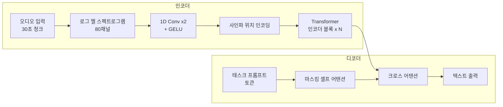

# Whisper - OpenAI 범용 음성 인식

## 개요

**Whisper**는 2022년 OpenAI가 공개한 범용 음성 인식(ASR, Automatic Speech Recognition) 모델이다. 680,000시간에 달하는 대규모 웹 오디오 데이터로 학습된 인코더-디코더 Transformer로, 별도 파인튜닝 없이도 97개 언어에서 강건한 전사(transcription) 성능을 보인다.

Whisper의 차별점은 단순 음성-텍스트 변환을 넘어 **단일 모델이 여러 음성 처리 작업을 수행**하는 멀티태스크 설계에 있다.

## 아키텍처

- **인코더**: 오디오를 로그 멜 스펙트로그램으로 변환 후 1D 합성곱 2개를 거쳐 Transformer 인코더에 입력
- **디코더**: 태스크 프롬프트 토큰으로 작업 유형을 지정하고 크로스 어텐션으로 인코더 출력 참조
- **30초 단위** 청크로 오디오를 처리 (더 긴 오디오는 슬라이딩 윈도우)

## 멀티태스크 설계

디코더 입력부에 삽입되는 **특수 토큰**으로 수행할 작업을 지정한다:

| 토큰 | 역할 |
|------|------|
| `<\|language\|>` | 언어 식별 (97개 언어) |
| `<\|transcribe\|>` | 음성 -> 텍스트 전사 |
| `<\|translate\|>` | 음성 -> 영어 번역 |
| `<\|timestamps\|>` | 타임스탬프 포함 전사 |
| `<\|notimestamps\|>` | 타임스탬프 없는 전사 |

이 설계 덕분에 하나의 모델이 STT, 번역, 언어 감지, 발화 구간 감지를 모두 처리한다.

## 모델 계열

| 모델 | 파라미터 | VRAM | 상대 속도 | 용도 |
|------|---------|------|----------|------|
| tiny | 39M | 1 GB | ~32x | 초경량 |
| base | 74M | 1 GB | ~16x | 경량 |
| small | 244M | 2 GB | ~6x | 균형 |
| medium | 769M | 5 GB | ~2x | 고품질 |
| large-v2 | 1.5B | 10 GB | 1x | 최고 품질 |
| large-v3 | 1.5B | 10 GB | 1x | v2 개선판 |

large-v3는 v2 대비 오류율 약 10-20% 감소, 특히 저자원 언어에서 향상.

## 학습 데이터

680K 시간의 웹 크롤링 오디오로 학습:
- 96% 영어 이외 언어 포함
- 약 117K 시간은 번역 태스크 (비영어 -> 영어)
- 특별한 데이터 정제 없이 노이즈 환경 그대로 학습 -> 강건성 확보
- 전통적 ASR 학습 데이터 대비 훨씬 저품질이지만 규모로 극복

## 제로샷 강건성

Whisper의 핵심 가치는 **제로샷(zero-shot) 강건성**이다. 특정 도메인/환경에 맞게 파인튜닝하지 않아도:
- 다양한 억양과 방언 처리
- 배경 소음 환경에서도 작동
- 전문 용어와 비표준 발음 인식

단, 특정 도메인(의료, 법률)에서 최고 성능을 원하면 파인튜닝이 유리하다.

## 효율화 변형

### distil-whisper
HuggingFace가 공개한 지식 증류(knowledge distillation) 버전:
- large-v2 대비 **6배 빠른 추론**, 49% 파라미터 감소
- WER(단어 오류율) 거의 동등 유지
- distil-large-v2, distil-medium.en, distil-small.en 제공

### 로컬 배포 생태계

| 구현체 | 특징 |
|--------|------|
| whisper.cpp | C++ 구현, Apple Silicon Metal 가속, CPU 추론 최적화 |
| faster-whisper | CTranslate2 기반, GPU 메모리 효율 4배 개선 |
| WhisperX | 강제 정렬으로 단어 수준 타임스탬프 |
| whisper-jax | JAX 구현, TPU 최적화 |

## 한계와 주의사항

1. **환각(hallucination)**: 침묵 구간에서 없는 말을 생성하는 현상 발생
2. **30초 제한**: 청크 단위 처리로 문장 경계에서 오류 발생 가능
3. **실시간 처리 미지원**: 배치 처리 설계 (스트리밍은 서드파티 구현)
4. **특정 언어 성능 편차**: 저자원 언어는 영어 대비 WER 높음
5. **화자 분리 불가**: 여러 화자 구분 기능 없음 (WhisperX 등으로 보완)

## 관련 문서
- [[speaker-diarization]] -- 화자 분리 (Speaker Diarization)

- [[transformer-architecture]] - Transformer 인코더-디코더 기반 구조
- [[distillation]] - 지식 증류 기법
- [[asr-evaluation-metrics]] - WER, CER 등 ASR 평가 지표
- [[speech-processing]] - 오디오 전처리 및 멜 스펙트로그램
