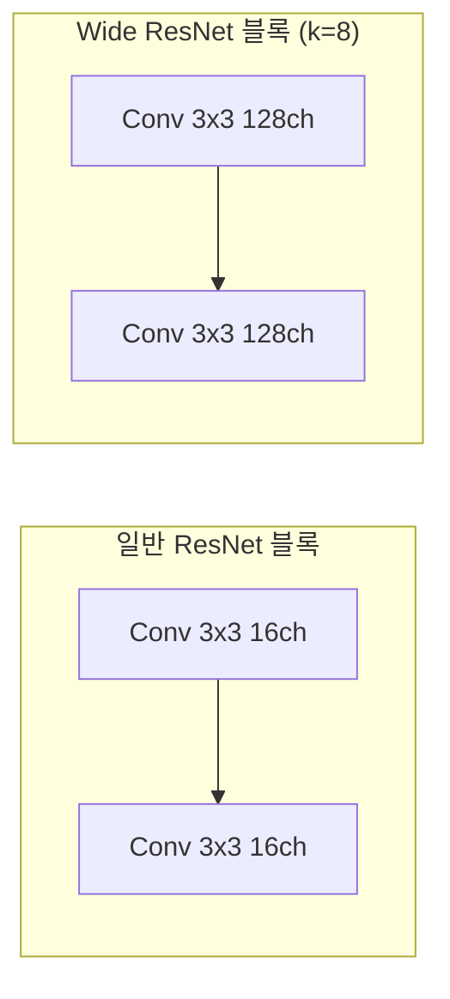
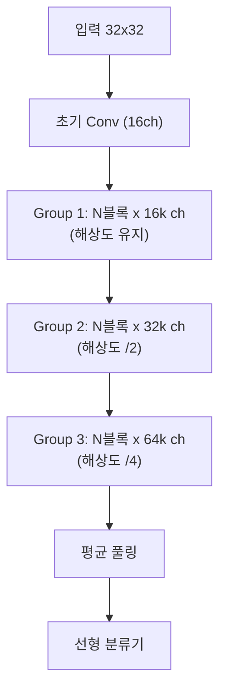

# Wide ResNet - 깊이보다 너비로 성능 향상

## 배경과 문제 의식

2015년 ResNet 이후 컴퓨터 비전 커뮤니티는 더 깊은 네트워크가 더 좋다는 믿음 아래 100층, 1000층, 심지어 1202층까지 ResNet을 깊게 쌓았다. 그러나 **깊이(depth)**를 계속 늘리는 전략은 여러 문제를 만들었다.

- 학습 속도가 느려진다. 레이어가 많아질수록 한 번의 순전파/역전파가 더 오래 걸린다
- 그래디언트가 레이어 수에 비례하여 희석된다. 잔차 연결이 있어도 1000층에서는 효율적인 학습이 어렵다
- 파라미터가 늘어나지만 그중 상당수가 실질적으로 기여하지 않는다 (gradient monopolization 현상)

Zagoruyko & Komodakis(2016)는 이 패러다임에 이의를 제기했다. "깊이 대신 너비(width)를 늘리면 어떨까?" 그들의 실험 결과는 놀라웠다. **16층의 Wide ResNet이 1000층의 기존 ResNet보다 더 빠르고 더 좋은 성능**을 보였다.

## 아키텍처 구조

Wide ResNet은 기존 ResNet의 기본 블록(basic block) 또는 전처리 블록(pre-activation block)을 사용하되, **채널 너비를 곱인수 $k$로 확장**한다.

### 너비 곱인수 (Widening Factor)

기존 ResNet 기본 블록의 채널 수가 $[16, 32, 64]$라면, WRN-$d$-$k$는 이를 $[16k, 32k, 64k]$로 확장한다.

- **WRN-28-10**: 28층, 너비 10배. 가장 많이 쓰이는 기본 설정
- **WRN-40-2**: 40층, 너비 2배
- **WRN-16-8**: 16층, 너비 8배



### 전체 구조

WRN은 보통 세 개의 그룹(group)으로 구성되며, 각 그룹은 동일 해상도의 잔차 블록들을 포함한다.



여기서 $N$은 각 그룹의 블록 수이며, 전체 층수 $d = 6N + 4$로 계산된다.

### Dropout 통합

Wide ResNet의 또 다른 특징은 **잔차 블록 내에 Dropout**을 통합한다는 점이다. 너비가 넓어지면 과적합 위험이 증가하는데, 두 Conv 사이에 Dropout을 삽입하여 이를 방지한다.

```
Conv → BN → ReLU → Dropout(p) → Conv → BN → ReLU
```

## 깊이 vs 너비 트레이드오프

핵심 실험 결과를 정리하면 다음과 같다.

| 모델 | 깊이 | 너비($k$) | 파라미터 | CIFAR-10 오류율 | 학습 시간 |
|------|------|-----------|----------|----------------|-----------|
| ResNet-110 | 110 | 1 | 1.7M | 6.43% | 기준 |
| ResNet-1001 | 1001 | 1 | 10.2M | 4.62% | 5.6x |
| WRN-28-10 | 28 | 10 | 36.5M | 4.00% | 1x |
| WRN-40-10 | 40 | 10 | 55.8M | 3.80% | 1.4x |

**WRN-28-10은 ResNet-1001보다 36배 빠른 학습**으로 더 낮은 오류율을 달성했다. 파라미터 수는 더 많지만, GPU 병렬화에 훨씬 유리한 구조다.

## 왜 너비가 효과적인가

### GPU 병렬화 효율

깊은 모델은 본질적으로 순차적(sequential)이다. 층이 많으면 파이프라인 병렬화의 여지가 좁고, 텐서당 연산량이 적어 GPU 활용률이 낮아진다. 반면 넓은 모델은 각 연산(conv)의 텐서 크기가 커서 GPU 행렬 연산이 더 효율적으로 동작한다.

### Gradient Monopolization 방지

매우 깊은 ResNet에서는 역전파 그래디언트가 특정 경로에 집중되는 현상이 발생한다. 너비를 늘리면 그래디언트가 분산되어 각 레이어가 더 균등하게 학습에 기여한다.

### 표현력 vs 깊이

이론적으로 충분한 너비의 2층 신경망은 임의의 함수를 근사할 수 있다([[universal-approximation-theorem]] 참조). 실용적으로도 적당한 깊이에서 너비를 충분히 늘리면 매우 깊은 좁은 모델과 유사한 표현력을 얻는다.

## 실무 적용 관점

**CIFAR 계열 벤치마크**: WRN-28-10이 오랫동안 표준 베이스라인으로 사용됐다.

**강화학습 환경 모델**: 연산이 비교적 단순한 게임/로봇 환경의 상태 인코더로 Wide ResNet 변형이 자주 사용된다.

**데이터 증강 연구**: CutMix, MixUp, RandAugment 등의 논문에서 WRN-28-10이 표준 실험 모델로 사용된다.

**지식 증류 연구**: 교사 모델로 WRN-28-10, 학생 모델로 작은 ResNet을 쓰는 설정이 많다.

**메모리 주의**: WRN-28-10은 36.5M 파라미터로, 배치 크기와 입력 해상도가 크면 메모리 사용량이 상당하다.

## RegNet/EfficientNet과의 비교

Wide ResNet의 너비 확장 아이디어는 이후 여러 방향으로 발전했다.

- **[[regnet-design-spaces|RegNet]]**: 너비를 선형적으로 증가시키는 설계 원칙을 정량적으로 도출
- **[[mobilenet-efficientnet|EfficientNet]]**: 너비·깊이·해상도를 동시에 복합 스케일링
- **[[bit-big-transfer|BiT]]**: 너비를 3~4배 확장한 ResNet을 대규모 사전학습에 활용

## 관련 문서

- [[resnet-skip-connections]] - Wide ResNet의 기반 아키텍처
- [[highway-networks]] - ResNet/WRN의 선행 아키텍처
- [[regnet-design-spaces]] - 너비/깊이 최적 비율의 정량적 탐색
- [[bit-big-transfer]] - 너비 확장 ResNet의 대규모 사전학습 활용
- [[mobilenet-efficientnet]] - 너비·깊이·해상도 복합 스케일링
- [[nfnet-normalizer-free]] - 배치 정규화 없는 고성능 CNN 연구
