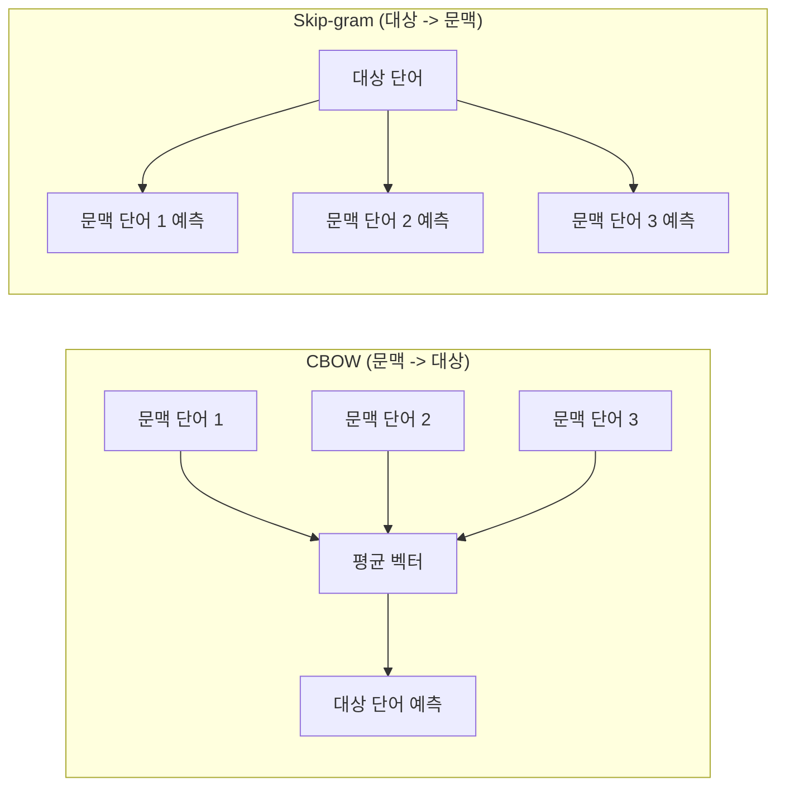
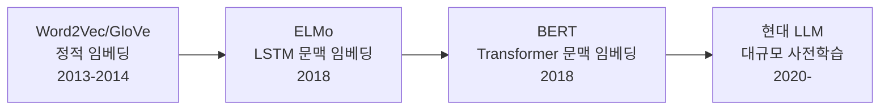

# Word2Vec과 사전학습 임베딩

## 개요

Word2Vec (Mikolov et al., 2013)은 대규모 코퍼스에서 단어의 분산 표현(distributed representation)을 학습하는 알고리즘이다. "비슷한 문맥에서 나타나는 단어는 비슷한 의미를 가진다"는 **분포 가설(distributional hypothesis)**에 기반하며, 얕은 2층 신경망으로 단어를 밀집 벡터 공간에 매핑한다. GloVe와 FastText는 Word2Vec의 한계를 보완한 후속 알고리즘이다. 이들은 모두 **정적 임베딩** -- 동일 단어에 대해 항상 같은 벡터를 반환한다 -- 이며, [[contextual-embeddings|문맥적 임베딩(ELMo, BERT)]]으로 가는 징검다리 역할을 했다.

## Word2Vec 아키텍처



### CBOW (Continuous Bag of Words)

주변 문맥 단어들로부터 **중심 단어를 예측**하는 모델이다.

- 입력: 윈도우 내 문맥 단어들의 원-핫 벡터
- 과정: 문맥 단어 벡터의 평균을 계산 -> 출력 레이어에서 대상 단어 확률 예측
- **장점**: 학습이 빠르고, 빈출 단어의 벡터 품질이 우수
- **단점**: 희귀 단어 표현이 상대적으로 약함

### Skip-gram

중심 단어로부터 **주변 문맥 단어들을 예측**하는 모델이다. CBOW의 정확히 반대 방향이다.

- 입력: 대상 단어의 원-핫 벡터
- 과정: 대상 단어 벡터에서 각 문맥 단어의 확률 예측
- **장점**: 희귀 단어와 소규모 데이터셋에서 더 우수한 표현 학습
- **단점**: CBOW보다 학습이 느림

### 학습 효율화

전체 어휘에 대한 softmax는 연산 비용이 높아 두 가지 근사 기법이 사용된다:
- **Negative Sampling**: 전체 어휘 대신 소수의 부정 샘플만으로 학습
- **Hierarchical Softmax**: 이진 트리 구조로 softmax를 O(log V)로 축소

## 벡터 산술과 의미적 관계

Word2Vec이 주목받은 핵심 발견은 벡터 공간에서 **의미적 관계가 산술 연산으로 표현**된다는 것이다:

```
vec("king") - vec("man") + vec("woman") ~= vec("queen")
vec("Paris") - vec("France") + vec("Italy") ~= vec("Rome")
```

이 현상은 벡터 공간의 선형 부분 구조(linear substructure)로 설명되며, 유추(analogy) 문제를 벡터 연산으로 풀 수 있음을 보여준다.

## GloVe (Global Vectors)

Pennington et al. (2014, Stanford)이 제안한 알고리즘으로, Word2Vec의 **로컬 문맥 한계**를 보완한다.

**핵심 차이:**
- Word2Vec은 슬라이딩 윈도우의 로컬 문맥만 활용
- GloVe는 전체 코퍼스의 **동시출현 행렬(co-occurrence matrix)**을 구축한 뒤 행렬 분해
- 로컬 + 글로벌 통계를 모두 포착

**목적 함수:** 두 단어 벡터의 내적이 해당 단어 쌍의 로그 동시출현 횟수에 비례하도록 학습한다. 빈출 쌍에 가중치를 부여하되, 극단적으로 빈번한 쌍(예: "the" + "is")의 영향을 상한선으로 제한한다.

## FastText

Bojanowski et al. (2017, Facebook)이 제안한 모델로, **서브워드 정보**를 활용한다.

**핵심 차이:**
- 각 단어를 문자 n-gram의 집합으로 표현 (예: "where" -> "<wh", "whe", "her", "ere", "re>")
- 단어 벡터 = 해당 단어의 모든 문자 n-gram 벡터의 합
- **미등록어(OOV)에도 벡터 생성 가능** -- 구성 n-gram에서 합성
- 형태소가 풍부한 언어(한국어, 터키어 등)에서 특히 효과적

## 사전학습 임베딩의 활용

사전학습 임베딩은 초기 NLP 딥러닝에서 **전이 학습(transfer learning)**의 첫 번째 형태였다.

**활용 패턴:**
1. 대규모 코퍼스에서 Word2Vec/GloVe 학습 (또는 공개된 사전학습 벡터 다운로드)
2. 타겟 모델의 [[embedding-layers|임베딩 레이어]]를 사전학습 벡터로 초기화
3. 미세조정 또는 동결(freeze)하여 하위 태스크 학습

**공개된 사전학습 벡터:**
- Google Word2Vec: 1000억 단어 코퍼스, 300차원, 300만 단어
- GloVe: Wikipedia + Gigaword, 50/100/200/300차원
- FastText: 157개 언어, 300차원

## 정적 임베딩의 한계와 극복

정적 임베딩의 근본적 한계는 **다의어(polysemy) 처리 불능**이다. "bank"가 은행이든 강둑이든 동일한 벡터를 반환한다. 이 한계를 극복한 것이 [[contextual-embeddings|문맥적 임베딩]]으로, ELMo가 양방향 LSTM을 통해 문맥 의존적 벡터를 생성했고, BERT가 Transformer로 이를 완성했다.



## 관련 문서

- [[embedding-layers]] -- 임베딩 레이어의 일반 구조와 동작
- [[contextual-embeddings]] -- 정적 임베딩의 한계를 극복한 문맥 의존적 표현
- [[tokenization-bpe-sentencepiece]] -- 임베딩의 입력 단위를 결정하는 토크나이저

## 참고 자료

- [Word2Vec, GloVe, and FastText, Explained (Towards Data Science)](https://towardsdatascience.com/word2vec-glove-and-fasttext-explained-215a5cd4c06f/)
- [Word2Vec - Wikipedia](https://en.wikipedia.org/wiki/Word2vec)
- [Comparison Between CBOW and Skip-Gram Models (GeeksforGeeks)](https://www.geeksforgeeks.org/nlp/word-embeddings-in-nlp-comparison-between-cbow-and-skip-gram-models/)
