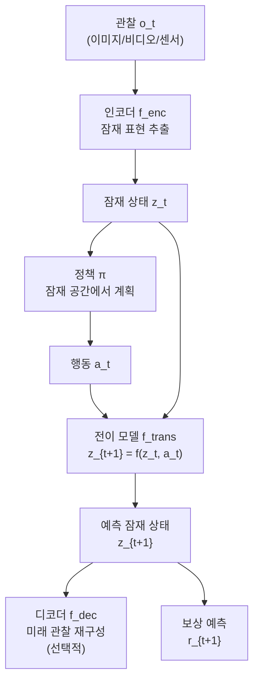
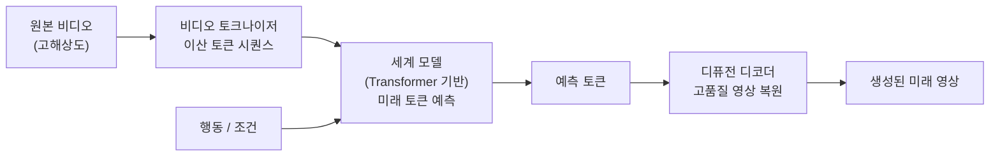
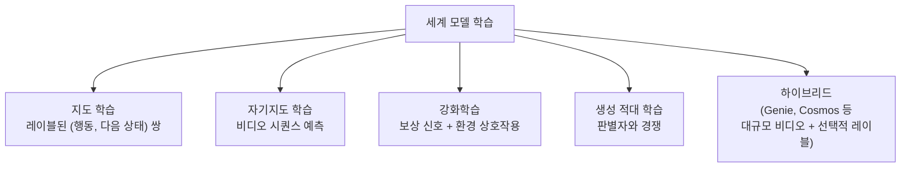

# 세계 모델 아키텍처 (World Model Architectures)

## 개요

세계 모델(World Model)은 **환경의 내부 표현(internal model)**을 학습하여 미래 상태를 예측하고, 그 예측 안에서 계획과 행동을 시뮬레이션하는 신경망이다. 강화학습에서 Dyna(Sutton, 1991)가 선구적 아이디어를 제시했으나, 최근에는 Genie 3, Cosmos, LeCun의 AMI(Advanced Machine Intelligence) 프레임워크로 대규모 멀티모달 세계 모델이 구현되고 있다.

## 세계 모델의 핵심 구성 요소

세계 모델은 세 가지 함수를 학습한다.

1. **인코더**: 고차원 관찰 → 압축된 잠재 표현
2. **전이 모델**: 현재 잠재 상태 + 행동 → 다음 잠재 상태 예측
3. **디코더(선택)**: 잠재 상태 → 관찰 재구성 (픽셀 공간 복원)

## Genie 3 (Google DeepMind, 2025)

Genie 3는 비디오-to-인터랙티브 세계 변환 모델이다. 단일 이미지 또는 텍스트 프롬프트로부터 인터랙티브하게 조종 가능한 3D 세계를 생성한다.

### 핵심 기여

- **Foundation World Model**: 대규모 비디오 데이터로 사전학습된 범용 세계 모델
- **액션-컨디셔닝**: 잠재 행동(latent action)을 비지도 학습으로 추출해 컨트롤 가능성 부여
- **3D 일관성**: 공간적으로 일관된 씬(scene)을 시간에 걸쳐 유지

아키텍처는 [[jepa-architecture]] (JEPA: Joint Embedding Predictive Architecture)와 유사하게 픽셀 재구성 없이 잠재 공간에서 예측을 수행해 계산 효율을 높인다.

## Cosmos (NVIDIA, 2025)

Cosmos는 물리 기반 시뮬레이션을 위한 세계 모델 플랫폼이다. 로보틱스와 자율주행을 주요 타깃으로 한다.

### 주요 특징

- **물리적 일관성**: 중력, 충돌, 유체 역학 등 물리 법칙을 암묵적으로 학습
- **토크나이저 + 디퓨전 디코더**: 비디오 관찰을 이산 토큰으로 압축, [[diffusion-models]] 기반 디코더로 고품질 복원
- **다중 해상도 처리**: 저해상도 계획 + 고해상도 렌더링 분리

## LeCun의 AMI 프레임워크

Yann LeCun이 2022년 제안한 AMI(Advanced Machine Intelligence)는 인간 수준 지능을 위한 세계 모델 중심 아키텍처 청사진이다. 현재의 오토레그레시브 LLM이 세계 모델 없이 예측을 수행하는 데 한계가 있다고 비판하며 다음을 제안한다.

### AMI의 7개 모듈

| 모듈 | 기능 |
|------|------|
| 지각 (Perception) | 멀티모달 입력 → 잠재 표현 |
| 세계 모델 (World Model) | 미래 상태 예측 |
| 비용 함수 (Cost Module) | 에너지 기반 목표 평가 |
| 단기 기억 (Short-term Memory) | 에피소드 상태 유지 |
| 계층적 계획 (Hierarchical Planner) | 추상-구체 계획 |
| 행위자 (Actor) | 계획 → 실제 행동 |
| 설정 가능 목표 (Configurator) | 태스크 컨텍스트 주입 |

AMI에서 세계 모델은 **에너지 기반 모델(Energy-Based Model)**로 구현하는 것을 제안한다. 에너지가 낮은 상태(일관성 있는 미래)를 선호하도록 학습한다.

## [[jepa-architecture]]와의 관계

[[jepa-architecture]](JEPA: Joint Embedding Predictive Architecture)는 LeCun 그룹이 세계 모델을 위해 제안한 구체적 아키텍처다.

- 픽셀 공간에서 예측하지 않고 **잠재 표현 공간에서 예측**
- I-JEPA(이미지), V-JEPA(비디오)로 구체화
- Genie 3와 개념적으로 유사한 잠재 공간 예측 원칙

## [[diffusion-models]]의 역할

세계 모델에서 [[diffusion-models]]는 주로 **디코더** 역할을 한다.

- 잠재 상태 → 픽셀 재구성 시 디퓨전으로 고품질 생성
- 전이 모델 자체를 디퓨전으로 구현하는 연구도 존재 (확률적 전이)
- Cosmos에서는 비디오 토큰을 디퓨전 디코더로 고해상도 복원

## 학습 방식 비교

## 실무 적용

- **로보틱스**: 실제 로봇 실험 없이 시뮬레이션에서 정책 사전학습 (Sim-to-Real 갭 감소)
- **자율주행**: 희귀 시나리오(사고, 악천후) 합성 데이터 생성
- **게임 AI**: AlphaZero처럼 모델 내에서 MCTS(Monte Carlo Tree Search)
- **과학 시뮬레이션**: 물리/화학 반응 예측

## 현재 한계

- **복합성 스케일**: 현실 세계의 물리적 복잡성을 완전히 학습하기 어려움
- **장기 오류 누적**: 다단계 예측 시 오류가 누적되어 정확도 저하
- **계산 비용**: 고품질 비디오 생성 세계 모델은 추론 비용이 높음

## 관련 문서

- [[jepa-architecture]] - LeCun의 잠재 공간 예측 아키텍처
- [[diffusion-models]] - 세계 모델 디코더로 활용되는 생성 모델
- [[latent-space-reasoning]] - 잠재 공간에서의 추론과 계획
- [[vision-transformer]] - 세계 모델 인코더로 활용되는 비전 백본
