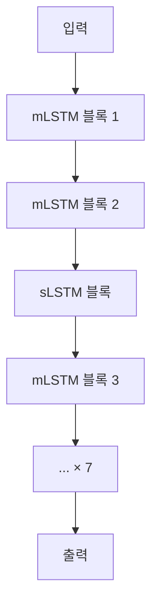

# xLSTM (Extended Long Short-Term Memory)

xLSTM은 LSTM의 원저자 Sepp Hochreiter 팀(JKU Linz)이 2024년 발표한 LSTM의 현대적 확장이다. 기존 LSTM의 두 핵심 한계인 **지수 게이팅 불안정성**과 **스칼라 메모리 용량 제약**을 각각 해결하는 sLSTM과 mLSTM을 제안하고, 이를 조합해 대형 언어 모델 스케일에서 Transformer와 경쟁한다. LSTM이 30년 만에 부활했다는 상징적 의미도 있다.

## 기존 LSTM의 한계

1. **Softmax 어텐션 부재**: 콘텐츠 기반 어드레싱 어려움
2. **스칼라 메모리**: $c_t \in \mathbb{R}^d$ — 저장 용량 한계
3. **시그모이드 게이팅**: 지수 스케일 정보를 다루기 어려움
4. **병렬화 불가**: 순차 재귀 구조

## sLSTM: 스칼라 메모리 + 지수 게이팅

**sLSTM**은 기존 LSTM의 메모리 셀은 유지하되 두 가지 핵심 변경을 적용한다:

### 지수 게이팅 (Exponential Gating)
입력 게이트 $i$와 망각 게이트 $f$를 지수 함수로 변환한다:

$$\tilde{i}_t = \exp(i_t), \quad \tilde{f}_t = \exp(f_t)$$

분모 정규화(normalizer state $n_t$)로 수치 안정성을 유지한다.

### 멀티 헤드 메모리
출력 헤드를 여러 개로 나눠 다양한 정보를 병렬로 기억한다.

## mLSTM: 행렬 메모리 + 공분산 업데이트

**mLSTM**은 메모리를 $\mathbb{R}^d$에서 **$\mathbb{R}^{d \times d}$ 행렬**로 확장한다. 이는 선형 어텐션의 KV 상태 행렬과 동일한 구조다.

```mermaid
flowchart LR
    subgraph sLSTM "sLSTM (스칼라 메모리)"
        XT1["x_t"] --> GATES1["i, f, o, z 게이트\n지수 활성화"]
        GATES1 --> CT1["c_t ∈ R^d\n스칼라 셀 상태"]
        CT1 --> HT1["h_t"]
    end
    subgraph mLSTM "mLSTM (행렬 메모리)"
        XT2["x_t"] --> QKV["q, k, v\n투영"]
        QKV --> CT2["C_t ∈ R^(d×d)\n행렬 메모리\n공분산 업데이트"]
        CT2 --> HT2["h_t = C_t q / n_t"]
    end
```

**mLSTM 업데이트 규칙**:
$$C_t = f_t C_{t-1} + i_t v_t k_t^T$$

이는 선형 어텐션의 키-값 상태 업데이트 $S_t = S_{t-1} + v_t k_t^T$와 망각 게이트만 다른 구조다.

## xLSTM 블록 혼합

xLSTM[7:1]은 7개의 mLSTM 블록과 1개의 sLSTM 블록을 교대로 쌓는 설계다. 비율은 태스크/스케일에 따라 조정 가능하다.



## Transformer/SSM과의 스케일링 비교

원 논문에서 1.3B~7B 파라미터 범위로 비교 실험을 수행했다.

| 모델 | 1.3B 파라미터 | 주요 특징 |
|------|------------|---------|
| GPT-3 계열 | 기준 | Transformer |
| Mamba | 약간 낮음 | 선택적 SSM |
| xLSTM[7:1] | 경쟁적/유사 | 행렬 메모리 LSTM |

xLSTM은 특히 **길이 일반화(length generalization)**와 **희귀 토큰 복사** 태스크에서 강점을 보였다.

## LSTM 부활의 의미

xLSTM은 단순히 오래된 모델을 되살린 것이 아니다:
- 선형 어텐션, SSM, LSTM이 수학적으로 동일한 프레임워크로 수렴함을 보여줌
- 30년간 축적된 LSTM 연구 인프라(이론적 이해, 학습 기법)를 현대 LLM에 활용 가능
- 다양한 아키텍처 패밀리가 경쟁적으로 발전하는 포스트-Transformer 시대의 시작

## 관련 문서
- [[state-space-models-general|SSM 일반]]
- [[mamba-3|Mamba-3]]
- [[rwkv|RWKV]]
- [[linear-attention|선형 어텐션]]
- [[titans-miras|Titans / MIRAS]]
