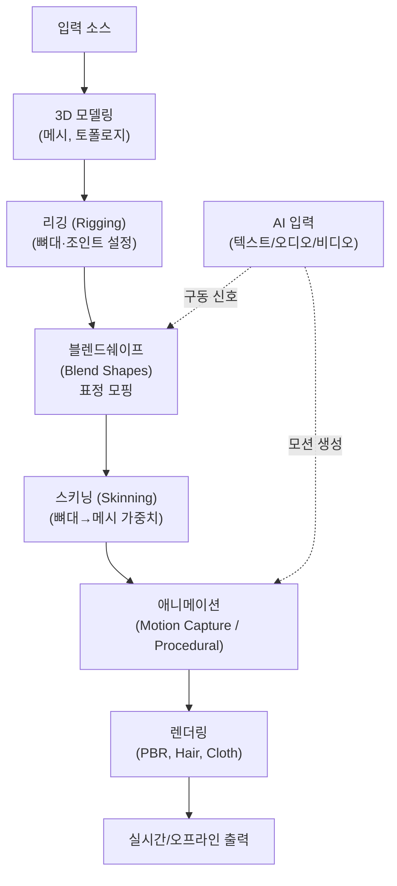
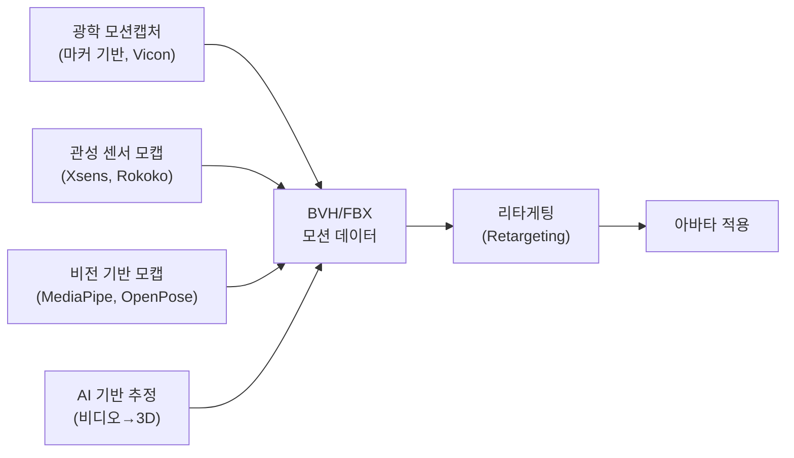
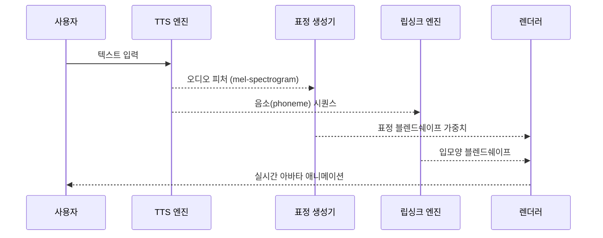
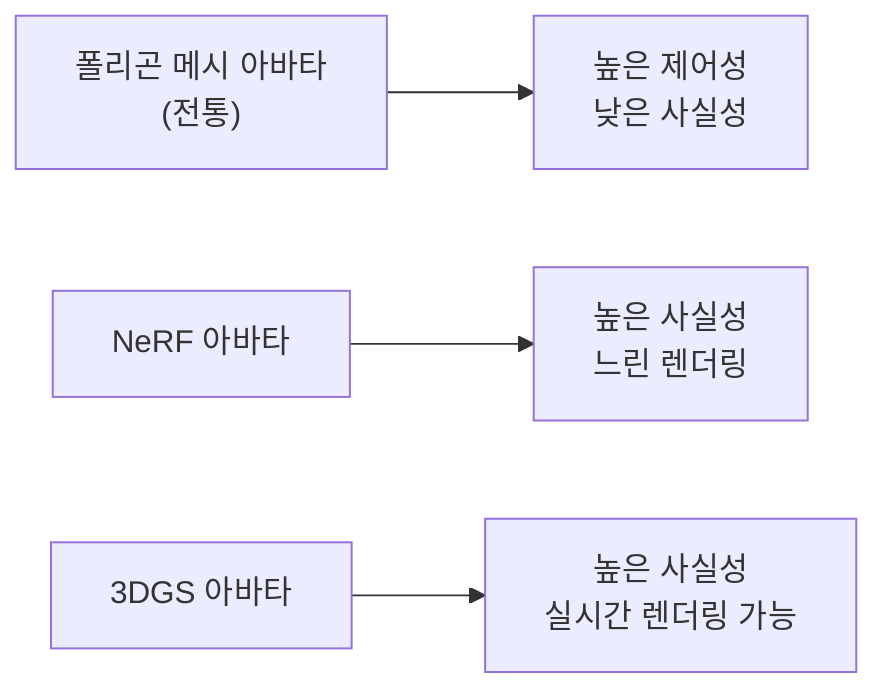

# 3D 아바타 (3D Avatar)

3D 아바타(3D Avatar)는 실제 인물이나 가상의 캐릭터를 3차원 디지털 공간에서 표현하는 컴퓨터 그래픽 표현물이다. 게임, XR(확장 현실), 가상 인플루언서, 영화 VFX, 디지털 인간(digital human), 그리고 AI 기반 실시간 상호작용 에이전트에 이르기까지 폭넓게 활용된다. AI 기술의 발전으로 모션 캡처 없이도 텍스트·음성·영상에서 자동으로 3D 아바타를 구동하는 파이프라인이 빠르게 성숙하고 있다. [[ai-sign-language]], [[gaussian-splatting]], [[neural-rendering]] 과 깊이 연결된다.

## 왜 중요한가

- **디지털 인간 시대**: 고품질 3D 아바타는 가상 인플루언서, AI 아나운서, 교육용 튜터 등 다양한 상업 영역으로 확장 중
- **XR 기반 소통**: 메타버스, VR 회의, AR 내비게이션 등에서 사용자의 디지털 페르소나로 기능
- **AI 통합**: LLM + TTS + 3D 아바타 = 실시간 대화형 디지털 인간 파이프라인
- **수화/접근성**: [[ai-sign-language]] 에서 3D 아바타는 수화 동작을 시각화하는 표준 방법

## 3D 아바타 파이프라인



이 다이어그램은 3D 아바타 제작과 구동의 전체 파이프라인이다. AI는 블렌드쉐이프(표정)와 애니메이션(모션) 두 단계에 개입해 자동 구동을 가능하게 한다.

## 핵심 기술 요소

### 1. 3D 모델 구조

#### 토폴로지 (Topology)

아바타 메시의 폴리곤 배치 방식. 인체 모델에서 특히 중요한 부위:
- **얼굴**: 감정 표현을 위한 조밀한 엣지 루프(edge loop) 필요
- **관절**: 자연스러운 변형을 위해 관절 주변 폴리곤 밀도 증가
- **퍼포먼스 LOD**: Level of Detail 적용해 거리에 따라 폴리곤 수 조절

#### 텍스처 맵

| 맵 종류 | 역할 | 특이사항 |
|--------|------|---------|
| Albedo/Diffuse | 기본 색상 | sRGB 색 공간 |
| Normal Map | 표면 법선 방향 (미세 요철) | 탄젠트 공간 기준 |
| Roughness | 표면 거칠기 | 0(거울)~1(완전 매트) |
| Metallic | 금속성 | 0~1 |
| SSS (Subsurface Scattering) | 피부 아래 빛 산란 | 사실적 피부 필수 |
| Displacement | 실제 기하 변형 | 테셀레이션 필요 |

### 2. 리깅과 스키닝

**리깅(Rigging)**: 3D 메시에 뼈대(skeleton/armature) 구조를 설정하는 작업.
- 인체 표준 본 계층: 루트(hips) → 척추 → 가슴 → 목 → 머리 / 어깨 → 팔 → 손가락
- 페이셜 리그: 눈, 입, 코 주변 수십~수백 개의 조인트

**스키닝(Skinning)**: 각 버텍스(정점)가 어떤 뼈대에 얼마나 영향을 받는지 정의하는 가중치.
- Linear Blend Skinning (LBS): 전통적, 관절 굴곡 시 "사탕 비틀림(candy-wrapper)" 아티팩트
- Dual Quaternion Skinning (DQS): 부피 보존 개선
- Neural Skinning: 학습 기반 피부 변형 (SMPL, SMPL-X 등)

### 3. 블렌드쉐이프 (Blend Shapes / Morph Targets)

블렌드쉐이프는 표정과 입 모양 변화를 표현하는 핵심 기술이다. 기본 메시에서 각 표정별 변형 메시를 정의하고, 이 변형들을 선형 보간(interpolation)해 임의의 표정을 만든다.

$$V_\text{final} = V_\text{neutral} + \sum_i w_i \cdot (V_i - V_\text{neutral})$$

여기서 $w_i$는 각 블렌드쉐이프의 가중치(0~1), $V_i$는 해당 표정의 버텍스 위치다.

**FACS (Facial Action Coding System)**: 인간 표정을 44개의 Action Unit(AU)으로 분류하는 표준 체계. ARKit의 52개 블렌드쉐이프도 FACS 기반이다.

**ARKit 페이셜 블렌드쉐이프 (Apple, 52개):**

| 영역 | 예시 블렌드쉐이프 |
|------|----------------|
| 눈 | eyeBlinkLeft/Right, eyeWideLeft/Right |
| 눈썹 | browDownLeft/Right, browOuterUpLeft/Right |
| 코 | noseSneerLeft/Right |
| 입 | jawOpen, mouthSmileLeft/Right, mouthFunnel |
| 뺨 | cheekPuff, cheekSquintLeft/Right |

### 4. 모션 캡처 (Motion Capture)



**리타게팅(Retargeting)**: 서로 다른 골격 구조를 가진 캐릭터 간에 모션 데이터를 전달하는 과정. A-포즈 또는 T-포즈를 기준으로 비율을 보정한다.

## 주요 플랫폼 및 도구

### ARKit (Apple)

iOS 기기의 TrueDepth 카메라(Face ID 센서)를 사용해 실시간으로 52개 블렌드쉐이프 값을 추출한다.

- **ARFaceAnchor**: 3D 얼굴 추적 앵커 객체. blendShapes 딕셔너리로 각 AU 값 제공
- **ARBodyAnchor**: 전신 3D 포즈 추정 (iPhone 12+ 후면 카메라)
- **활용**: 메모지(Memoji), 페이스타임 이펙트, VTuber 소프트웨어

```swift
// ARKit 블렌드쉐이프 추출 예 (Swift)
func renderer(_ renderer: SCNSceneRenderer, didUpdate node: SCNNode, for anchor: ARAnchor) {
    guard let faceAnchor = anchor as? ARFaceAnchor else { return }
    let blendShapes = faceAnchor.blendShapes
    let jawOpen = blendShapes[.jawOpen]?.floatValue ?? 0
    let smileLeft = blendShapes[.mouthSmileLeft]?.floatValue ?? 0
    // 블렌드쉐이프 값으로 아바타 구동
}
```

### MetaHuman Creator (Unreal Engine)

Epic Games의 클라우드 기반 고품질 디지털 인간 제작 도구.

- 사실적인 피부, 머리카락, 눈 렌더링 사전 구성
- 52개 ARKit 호환 블렌드쉐이프 내장
- **MetaHuman Animator**: 비디오에서 페이셜 퍼포먼스를 자동 전사(2023)
- Unreal Engine 5의 Nanite, Lumen과 통합해 실시간 포토리얼 렌더링

### Ready Player Me

웹 기반 아바타 생성 플랫폼으로 게임, VR, 메타버스 애플리케이션 통합에 특화.

- 셀카 사진 한 장으로 아바타 생성
- GLB/VRM 포맷 내보내기
- Unity, Unreal, Three.js SDK 제공
- 수천 개 앱에서 동일 아바타 사용 가능 ("어디서나 통하는 아바타")

### VRM (Virtual Reality Model)

일본에서 시작된 VTuber/아바타를 위한 3D 표준 포맷 (GLTF 기반).

- 저작권 정보, 아바타 사용 조건 메타데이터 내장
- UniVRM (Unity), three-vrm (Three.js) 등 생태계 활성화
- VRoid Studio로 쉽게 제작 가능

## AI 기반 아바타 구동 파이프라인

### 텍스트/음성 → 3D 표정 애니메이션



### 주요 AI 구동 기술

**Audio2Face (NVIDIA)**: 오디오에서 실시간으로 페이셜 애니메이션 생성. 딥러닝 모델이 음성 파형을 입력으로 블렌드쉐이프 가중치를 예측.

**SadTalker / DiffTalk**: 정지 이미지와 오디오로 립싱크 + 두부 동작을 가진 말하는 영상 합성.

**MotionDiffuse / MDM**: 텍스트 설명에서 전신 모션 시퀀스 생성. "달리는 사람" 텍스트 → 3D 모션 데이터.

### 뉴럴 렌더링과의 통합

[[neural-rendering]] 과 [[gaussian-splatting]] 은 기존 폴리곤 메시 기반 아바타의 대안을 제시한다:

- **NeRF 기반 아바타**: 동영상에서 신경 복사 필드(neural radiance field)로 아바타 재구성. 렌더링 품질이 높지만 느림
- **3DGS(3D Gaussian Splatting) 아바타**: [[gaussian-splatting]] 기반. NeRF 대비 실시간 렌더링 가능. 최신 연구에서 애니메이션 가능한 가우시안 아바타 구현



## 수화와의 연결

[[ai-sign-language]] 분야에서 3D 아바타는 수화 제스처를 시각화하는 핵심 매체다:

- 청각 장애인을 위한 텍스트→수화 자동 번역의 출력 채널
- 표정(NMM: Non-Manual Markers)도 블렌드쉐이프로 제어 필요
- 사실적인 아바타 대신 단순화된 아바타가 수화 가독성에 더 유리할 수 있음

## 성능 및 품질 지표

| 지표 | 실시간 기준 | 영화 VFX 기준 |
|------|-----------|-------------|
| 폴리곤 수 | 20K-100K | 수백만 |
| 텍스처 해상도 | 2K-4K | 8K-16K |
| 프레임레이트 | 30-90 fps | 오프라인 |
| 블렌드쉐이프 수 | 52 (ARKit) ~ 300+ | 1000+ |
| 렌더링 파이프라인 | PBR 실시간 | Path Tracing |

## 관련 개념 링크

- [[ai-sign-language]]: 수화 인식/생성에서 3D 아바타 활용
- [[gaussian-splatting]]: NeRF 이후 3D 아바타 렌더링의 새 패러다임
- [[neural-rendering]]: 뉴럴 기반 포토리얼 아바타 렌더링

## 관련 문서

- [[ai-sign-language]]: 3D 아바타를 수화 출력 채널로 활용하는 방법
- [[gaussian-splatting]]: 3D Gaussian Splatting 기반 실시간 아바타
- [[neural-rendering]]: NeRF/뉴럴 렌더링 기반 아바타 재구성
- [[cogvideox-architecture]]: 비디오 생성 모델과 아바타 애니메이션
