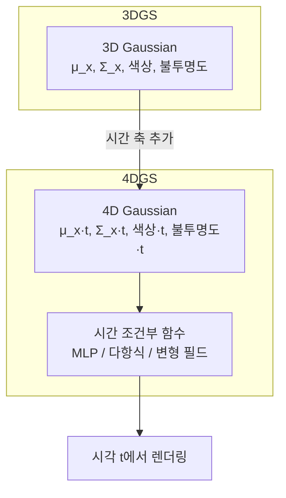

# 4D Gaussian Splatting

4D Gaussian Splatting은 [[3d-gaussian-splatting]](3DGS)의 공간 3차원 표현에 시간 축(t)을 추가해, 움직이는 장면(dynamic scene)을 실시간으로 렌더링할 수 있게 확장한 기법이다. 정적 장면만 처리하는 3DGS의 한계를 극복하여 비디오 재구성, 동적 객체 편집, 4D 콘텐츠 생성 등에 적용된다.

## 3DGS의 시간 확장 동기

[[3d-gaussian-splatting]]은 정적 장면에서 탁월한 렌더링 품질과 실시간 성능을 보여준다. 그러나 실세계는 동적이며, 움직임이 있는 장면을 복원하려면 각 프레임마다 별도의 3DGS를 학습하거나 시간 정보를 모델에 통합해야 한다.

동적 장면 표현의 핵심 과제:
- **대응점 추적**: 같은 물리적 점이 시간에 따라 이동
- **비강체 변형**: 천, 유체, 얼굴 근육 등 복잡한 변형
- **효율적 저장**: 모든 프레임을 독립 표현하면 N배 메모리 소모

## 4D Gaussian의 구조

3D Gaussian $G(x; \mu, \Sigma)$를 4D로 확장하면:

$$
G(x, t; \mu_{xt}, \Sigma_{xt}) = \exp\left(-\frac{1}{2} [x-\mu_x(t)]^T \Sigma_x(t)^{-1} [x-\mu_x(t)]\right)
$$

각 Gaussian은 시간 $t$에 의존하는 중심 위치 $\mu(t)$와 공분산 $\Sigma(t)$를 가진다.

## 주요 접근 방식

### 1. 변형 기반 (Deformation-based)

단일 정규 공간(canonical space)에 정적 3DGS를 두고, 각 시각 t에서의 변형 필드를 MLP로 학습한다.

- **4D Gaussian Splatting** (Wu et al., 2023): 최초 제안. 다항식 기반 시간 의존 변형
- **Deformable 3D Gaussians** (Yang et al., 2023): 변형 MLP가 위치·회전·스케일 모두 예측

장점: 정규 공간이 공유되어 파라미터 효율적  
단점: 큰 변형이나 위상 변화에 취약

### 2. 명시적 4D 표현

시공간 Gaussian을 직접 표현. Gaussian의 평균과 공분산이 시간 차원을 포함한 4D 행렬.

- **4D-GS** (Duan et al., 2024): 4D 공분산 분해로 공간-시간 상관관계 모델링
- 렌더링 시 t를 슬라이싱하여 3D Gaussian으로 변환 후 기존 래스터라이저 사용

### 3. 하이브리드 방식

시공간 격자(voxel grid)와 Gaussian을 결합.

- **HexPlane + 3DGS**: 6개의 2D 특징 평면(xy, xz, yz, xt, yt, zt)으로 시공간 특징 인수분해
- 빠른 학습, 효율적 메모리 사용

## [[nerf-neural-radiance-fields|NeRF]] 기반 동적 표현과 비교

[[nerf-neural-radiance-fields|NeRF]]의 동적 확장(D-NeRF, HyperNeRF 등)과 비교:

| 항목 | 4D Gaussian Splatting | Dynamic NeRF |
|------|----------------------|--------------|
| 렌더링 속도 | 실시간 (30+ FPS) | 느림 (수 초/프레임) |
| 학습 시간 | 수십 분 | 수 시간 |
| 비강체 변형 | 제한적 | 상대적으로 유연 |
| 위상 변화 | 어려움 | HyperNeRF로 부분 대응 |
| 편집 가능성 | 개별 Gaussian 직접 조작 | 어려움 |

## 동적 장면 학습의 과제

### 1. 모노큘러 동영상 학습

다시점 카메라가 없고 단일 카메라 영상만 있는 경우, 깊이 추정과 광류(optical flow)를 감독 신호로 활용한다.

### 2. 장기 동역학

수십 초 이상의 긴 동영상에서 Gaussian이 떠돌아다니는(drift) 문제. 위치 정규화 손실과 강성 정규화(as-rigid-as-possible, ARAP)로 완화.

### 3. 외관 변화

빛의 변화, 반사, 그림자는 위치 변형만으로 모델링 불가. 시간 의존 구면 조화(SH) 계수로 부분 대응.

## 응용 분야

- **스포츠 방송**: 다시점 카메라 → 자유 시점 재생 (volumetric video)
- **영화 VFX**: 실사 동적 장면을 3D 자산으로 변환
- **AR/VR**: 동적 hologram 생성
- **의료**: 심장·폐 등 기관의 4D 운동 분석
- **자율주행**: 동적 장면의 4D 시뮬레이션

## 현재 한계

- 복잡한 비강체 변형(유체, 천)은 여전히 어려움
- 훈련에 동기화된 다시점 영상 필요 (단일 카메라 학습은 품질 저하)
- 새로운 운동 패턴 외삽(extrapolation) 불가

## 관련 문서

- [[3d-gaussian-splatting]] - 정적 장면 표현의 기반 기법
- [[nerf-neural-radiance-fields|NeRF]] - 볼류메트릭 렌더링 패러다임 및 D-NeRF 등 동적 확장
- [[splat-scene-representation]] - Gaussian 기반 장면 표현의 확장 및 편집
