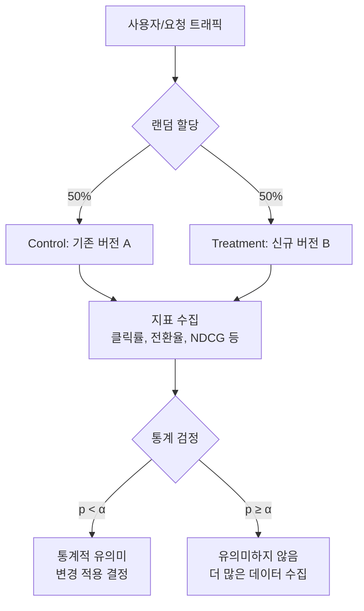
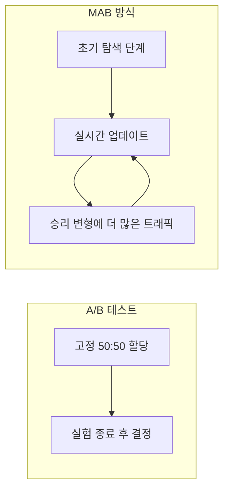
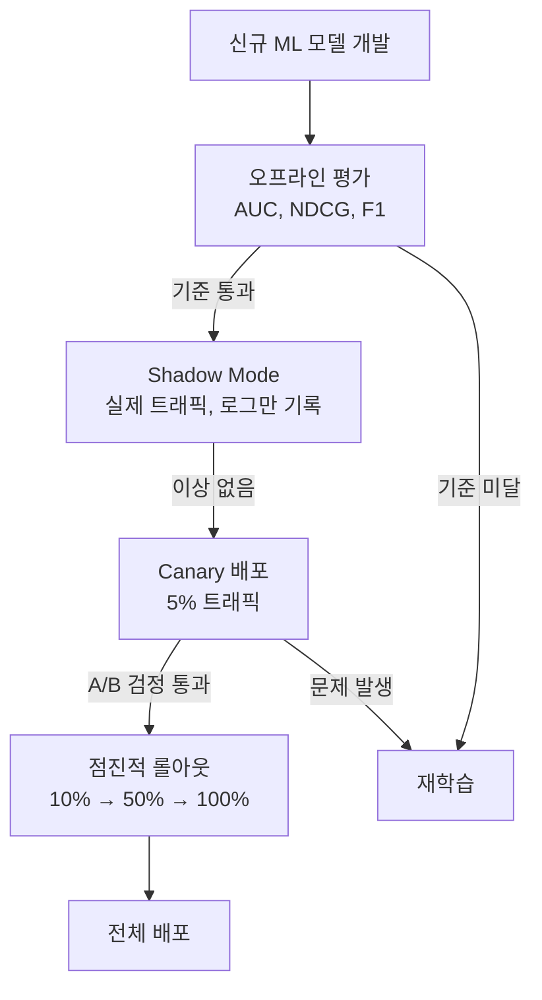

# A/B 테스팅 (A/B Testing)

A/B 테스팅은 두 개 이상의 변형(variant)을 동시에 실험하여 어느 쪽이 특정 지표를 더 잘 달성하는지 통계적으로 결정하는 방법론이다. 웹서비스 UI 최적화에서 출발했지만 현재는 ML 모델 배포 평가, 추천 시스템 검증, LLM 응답 품질 측정까지 폭넓게 사용된다.

## 왜 중요한가

직관이나 소수 관찰만으로는 변경 효과를 신뢰하기 어렵다. A/B 테스팅은 다음을 보장한다:

- **인과성 확보**: 랜덤 할당으로 교란 변수를 통제해 "이 변경이 지표를 바꿨다"는 인과 추론이 가능하다.
- **정량적 신뢰 수준**: p-value, 신뢰구간(CI)으로 우연에 의한 효과를 구분한다.
- **비용 최소화**: 소수 사용자에게 먼저 실험하고 전체 배포 전 위험을 평가한다.



위 흐름은 전통적인 A/B 테스트의 생명주기를 보여준다. 트래픽이 무작위로 두 그룹에 분배되고, 충분한 데이터가 모이면 통계 검정으로 결론을 낸다.

---

## 핵심 개념

### 귀무가설과 대립가설

- **귀무가설 $H_0$**: 두 버전 간 지표 차이가 없다 ($\mu_A = \mu_B$).
- **대립가설 $H_1$**: 두 버전 간 차이가 있다 ($\mu_A \ne \mu_B$), 또는 단방향($\mu_B > \mu_A$).

### p-value와 유의수준 ($\alpha$)

- **p-value**: 귀무가설이 참일 때 관찰된 효과만큼 극단적인 결과가 우연히 나올 확률.
- **유의수준 $\alpha$**: 보통 0.05(5%). p-value < $\alpha$이면 귀무가설 기각.
- **제1종 오류(False Positive)**: $H_0$이 참인데 기각. 확률 = $\alpha$.
- **제2종 오류(False Negative)**: $H_1$이 참인데 기각하지 못함. 확률 = $\beta$.
- **검정력(Statistical Power)**: $1 - \beta$. 보통 0.8(80%) 이상을 목표로 한다.

### 효과 크기 (Effect Size)

절대 차이만으로는 실용적 의미를 판단하기 어렵다. Cohen's d나 상대적 향상률(relative lift)을 함께 보고한다:

$$d = \frac{\mu_B - \mu_A}{\sigma_{pooled}}, \quad \text{Lift} = \frac{\mu_B - \mu_A}{\mu_A} \times 100\%$$

---

## 최소 표본 크기 산출

실험을 시작하기 전에 필요한 표본 크기(sample size)를 계산해야 한다. 이를 사전에 계산하지 않으면 실험이 끝날 때까지 계속 p-value를 들여다보는 **p-hacking** 위험이 생긴다.

$$n = \frac{2 \sigma^2 (z_{\alpha/2} + z_\beta)^2}{\delta^2}$$

- $\sigma^2$: 지표의 분산
- $\delta$: 탐지하고자 하는 최소 효과 크기(MDE, Minimum Detectable Effect)
- $z_{\alpha/2}$: 유의수준에 대응하는 z-값 (0.05 → 1.96)
- $z_\beta$: 검정력에 대응하는 z-값 (0.8 → 0.84)

```python
from scipy import stats
import numpy as np

def min_sample_size(
    baseline_rate: float,
    mde: float,        # Minimum Detectable Effect (상대적)
    alpha: float = 0.05,
    power: float = 0.80
) -> int:
    """이진 지표(클릭률 등)에 대한 최소 표본 크기 산출."""
    p1 = baseline_rate
    p2 = baseline_rate * (1 + mde)
    pooled = (p1 + p2) / 2

    z_alpha = stats.norm.ppf(1 - alpha / 2)  # 양측 검정
    z_beta = stats.norm.ppf(power)

    n = (2 * pooled * (1 - pooled) * (z_alpha + z_beta) ** 2) / (p2 - p1) ** 2
    return int(np.ceil(n))

# 예시: 기준 클릭률 5%, 10% 상대 향상 탐지
n = min_sample_size(baseline_rate=0.05, mde=0.10)
print(f"그룹당 최소 {n:,}개 샘플 필요")  # 약 14,700개
```

---

## 검정 방법 선택

| 지표 유형 | 권장 검정 | 비고 |
|-----------|-----------|------|
| 이진 (클릭/미클릭) | z-test (비율 검정) | 표본 크면 정규 근사 |
| 연속 (구매 금액, 체류 시간) | t-test (Welch's) | 등분산 가정 없는 버전 |
| 랭킹/점수 분포 | Mann-Whitney U | 비모수, 정규성 불필요 |
| 여러 지표 동시 | MANOVA 또는 Bonferroni | 다중 비교 보정 필수 |
| 순차적 모니터링 | Sequential Probability Ratio Test (SPRT) | 조기 종료 허용 |

```python
from scipy.stats import ttest_ind, mannwhitneyu, chi2_contingency

def ab_test_binary(control_success, control_total, treat_success, treat_total):
    """이진 지표 A/B 검정."""
    table = [[control_success, control_total - control_success],
             [treat_success, treat_total - treat_success]]
    chi2, p_value, _, _ = chi2_contingency(table)
    
    cr_control = control_success / control_total
    cr_treat = treat_success / treat_total
    lift = (cr_treat - cr_control) / cr_control * 100
    
    return {
        "control_cr": f"{cr_control:.4f}",
        "treat_cr":   f"{cr_treat:.4f}",
        "lift":        f"{lift:+.2f}%",
        "p_value":     f"{p_value:.4f}",
        "significant": p_value < 0.05
    }
```

---

## 다중 비교 문제와 보정 (Multiple Comparisons Correction)

하나의 실험에서 지표를 여러 개 동시에 검정하거나, 여러 버전을 동시에 테스트하면 **우연히 유의미하게 나올 확률**이 급증한다.

- 20개 지표를 $\alpha = 0.05$로 독립 검정하면, 적어도 하나가 거짓 유의미할 확률 = $1 - 0.95^{20} \approx 64\%$.

### 주요 보정 방법

| 방법 | 수식 | 특성 |
|------|------|------|
| **Bonferroni** | $\alpha' = \alpha / m$ | 가장 보수적. FWER 통제 |
| **Holm-Bonferroni** | 단계별 조정 | Bonferroni보다 검정력 높음 |
| **Benjamini-Hochberg (BH)** | FDR 통제 | 탐색적 분석에 적합 |
| **Sidak** | $\alpha' = 1 - (1 - \alpha)^{1/m}$ | 독립 가정 시 정확 |

```python
from statsmodels.stats.multitest import multipletests

p_values = [0.04, 0.03, 0.08, 0.001, 0.06]

# Benjamini-Hochberg FDR 보정 (추천 시스템 지표 다수 검정에 적합)
reject, p_adjusted, _, _ = multipletests(p_values, alpha=0.05, method='fdr_bh')

for i, (orig, adj, rej) in enumerate(zip(p_values, p_adjusted, reject)):
    print(f"지표 {i+1}: p={orig:.3f} → 보정후={adj:.3f} {'[유의]' if rej else ''}")
```

---

## A/A 테스트 - 실험 타당성 검증

실험 인프라를 신뢰하기 위해 동일 버전을 두 그룹에 배포하는 **A/A 테스트**를 먼저 수행한다.

- 기대: p-value가 균일 분포(uniform distribution) 형태 - 즉 5%의 경우만 p < 0.05.
- 실패 징후: p-value가 과도하게 작거나, 한쪽 방향으로 치우침 → 할당 편향, 로그 유실 등 시스템 오류.

---

## MAB (Multi-Armed Bandit) - A/B 테스팅의 대안

전통 A/B 테스팅은 실험 기간 동안 열등한 변형에도 동일 비중으로 트래픽을 보내는 **탐색 비용(exploration cost)**이 발생한다. MAB (Multi-Armed Bandit)는 실시간으로 결과를 반영해 유망한 변형에 더 많은 트래픽을 동적으로 할당한다.



### MAB 주요 전략

| 전략 | 설명 | 장단점 |
|------|------|--------|
| **Epsilon-Greedy** | 확률 $\epsilon$으로 탐색, $1-\epsilon$으로 활용 | 단순, 하지만 탐색이 균일하지 않음 |
| **UCB1 (Upper Confidence Bound)** | 불확실성이 높은 팔을 우선 선택 | 이론적 보장 있음, 비정상성에 약함 |
| **Thompson Sampling** | 베타 분포 사후 확률로 샘플링 | 베이즈 방식, 실용성 높고 빠른 수렴 |
| **LinUCB / LinTS** | 문맥(context) 정보를 선형 모델로 통합 | 컨텍스추얼 MAB, 개인화 추천에 적합 |

```python
import numpy as np

class ThompsonSamplingMAB:
    """Beta-Bernoulli Thompson Sampling 구현."""
    
    def __init__(self, n_arms: int):
        self.alpha = np.ones(n_arms)  # 성공 횟수 + 1 (사전분포)
        self.beta  = np.ones(n_arms)  # 실패 횟수 + 1
    
    def select_arm(self) -> int:
        samples = np.random.beta(self.alpha, self.beta)
        return int(np.argmax(samples))
    
    def update(self, arm: int, reward: float) -> None:
        """reward: 1(성공) 또는 0(실패)."""
        self.alpha[arm] += reward
        self.beta[arm]  += 1 - reward

mab = ThompsonSamplingMAB(n_arms=3)
arm = mab.select_arm()
mab.update(arm, reward=1)
```

### A/B 테스트 vs MAB 비교

| 기준 | A/B 테스트 | MAB |
|------|-----------|-----|
| 목적 | 통계적 인과 추론 | 누적 보상 최대화 |
| 트래픽 할당 | 고정 (50:50) | 동적 |
| 탐색 비용 | 높음 | 낮음 |
| 해석 가능성 | 높음 (p-value, CI) | 낮음 |
| 적합 상황 | 주요 제품 변경 결정 | 광고 배너, 추천 슬롯 등 |

---

## ML 모델 배포에서의 A/B 테스팅

### 온라인 평가 vs 오프라인 평가

오프라인 지표(AUC, NDCG 등)와 온라인 지표(클릭률, 매출)는 항상 일치하지 않는다. 모델이 오프라인에서 더 좋아도 온라인 A/B에서 역전되는 경우가 흔하다.



### 추천 시스템 실험 특이사항

- **노출 편향(Exposure Bias)**: 사용자는 노출된 아이템만 클릭할 수 있다. 노출 로그를 반드시 보존해야 한다.
- **캐리오버 효과(Carryover Effect)**: 이전 실험이 사용자 행동 패턴을 바꾸면 다음 실험을 오염시킨다. 쿨다운 기간이 필요하다.
- **네트워크 효과(Network Effect)**: 소셜 플랫폼에서 한 사용자에 대한 처치가 다른 사용자(친구)에게도 영향을 미칠 수 있다. 클러스터 랜덤화(cluster randomization)를 사용한다.
- **단위 문제(Unit of Randomization)**: 사용자 수준 vs 세션 수준 vs 요청 수준 중 실험 목적에 맞게 선택해야 한다.

```python
# CUPED (Controlled-experiment Using Pre-Experiment Data)
# 사전 실험 데이터로 분산을 줄여 필요 표본 수를 낮춤
import numpy as np
from sklearn.linear_model import LinearRegression

def cuped_variance_reduction(y_post: np.ndarray, y_pre: np.ndarray) -> np.ndarray:
    """CUPED: 사전 측정값으로 분산 축소."""
    theta = np.cov(y_post, y_pre)[0, 1] / np.var(y_pre)
    return y_post - theta * (y_pre - np.mean(y_pre))

# 사전 클릭률을 공변량으로 처리해 지표 분산 약 30-50% 감소 효과
```

---

## LLM 응답 품질 A/B 테스팅

LLM 프롬프트 변경, 모델 교체, 파인튜닝 효과를 온라인에서 측정하는 경우 [[ab-testing-llms]] 페이지에서 자세히 다룬다. 핵심 차이점:

- **지표 정의가 어렵다**: 클릭률처럼 명확한 이진 신호가 없다. 사용자 만족도, 대화 길이, 작업 완료율 등을 복합 지표로 사용한다.
- **Implicit vs Explicit 피드백**: 좋아요 버튼(explicit)보다 대화 계속 여부, 복사 횟수 등 암묵적 신호가 더 풍부하다.
- **LLM-as-Judge**: GPT-4 등 강력한 모델로 응답 품질을 자동 평가해 지표화한다.

---

## 실무 체크리스트

### 실험 시작 전
- [ ] 1차 지표(primary metric)와 가드레일 지표(guardrail metric)를 명확히 정의
- [ ] MDE 설정 후 표본 크기 사전 계산
- [ ] A/A 테스트로 실험 인프라 검증
- [ ] 실험 기간 결정 (최소 1주 이상, 주말 효과 포함)

### 실험 중
- [ ] p-hacking 방지 - 사전 정의된 종료 시점만 검토
- [ ] 분기당 한 번이 아닌 매일 지표 모니터링 (이상값 조기 발견)
- [ ] 트래픽 오염(leakage) 여부 확인

### 실험 종료 후
- [ ] 효과 크기(effect size)와 실용적 유의성 함께 보고
- [ ] 세그먼트별 분석 (신규/기존 사용자, 플랫폼 등)
- [ ] 다중 비교 보정 적용 여부 확인
- [ ] 결과 문서화 및 지식 공유

---

## 한계와 주의사항

- **느린 학습자 편향(Novelty Effect)**: 신규 변형이 일시적으로 더 높은 참여를 유도하는 현상. 시간이 지나면 효과가 사라질 수 있다.
- **장기 효과 미반영**: 단기 지표 최적화가 장기 사용자 만족을 해칠 수 있다.
- **윤리적 고려**: 사용자 경험을 실험적으로 저하시키는 설계는 지양해야 한다.
- **작은 효과 크기**: 통계적으로 유의미해도 실무적으로 무의미할 수 있다. 비용-편익 분석을 병행하라.

---

## 관련 문서

- [[ab-testing-llms]] - LLM 응답 품질 특화 A/B 테스팅 전략
- [[ai-content-recommendation]] - 추천 시스템에서 실험 설계 사례
- [[ai-personalization-engines]] - 개인화 시스템에서 컨텍스추얼 MAB 활용
- [[recommendation-systems-dl]] - 딥러닝 추천 시스템 지표와 평가 방법론
