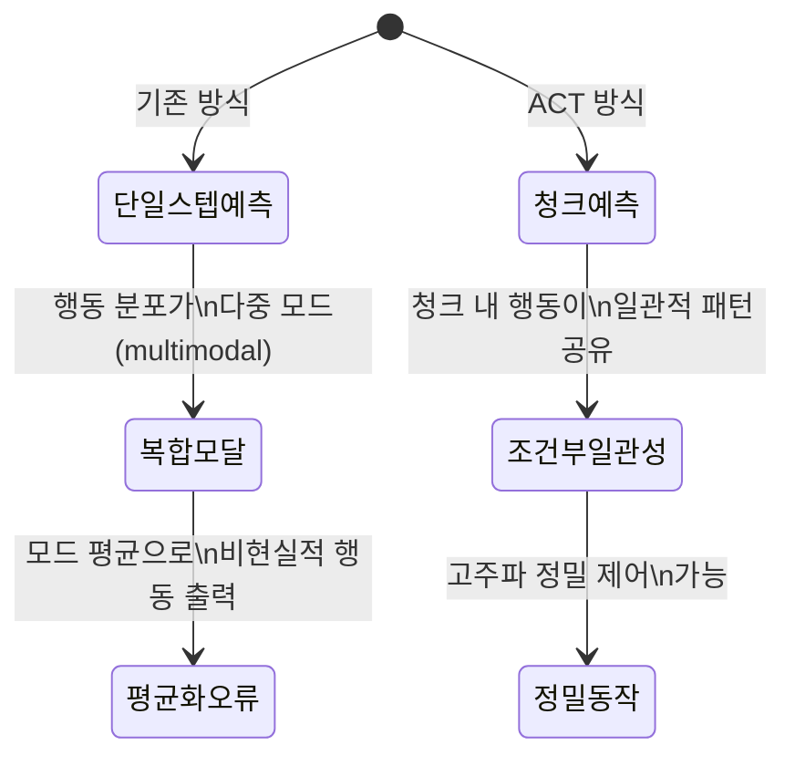
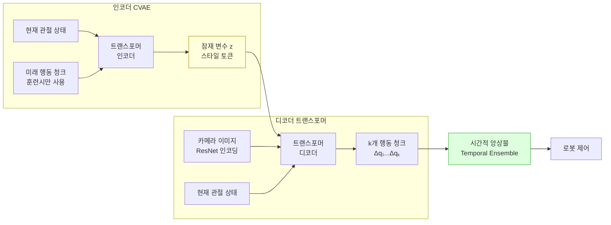

# ACT - 행동 청킹 트랜스포머 (Action Chunking Transformer)

## 개요

ACT(Action Chunking Transformer)는 Tony Zhao 등이 2023년 "Learning Fine-Grained Bimanual Manipulation with Low-Cost Hardware" 논문에서 제안한 모방 학습(imitation learning) 알고리즘이다. 핵심 아이디어는 로봇 행동을 매 스텝 단독으로 예측하지 않고, 여러 스텝의 행동 시퀀스를 **청크(chunk)** 단위로 묶어 한 번에 예측하는 것이다.

ALOHA 하드웨어와 함께 발표되어 저비용 양팔 로봇으로 정교한 조작을 가능하게 하는 기술 스택의 핵심을 담당한다.

## 왜 청킹인가

로봇 조작 데이터를 텔레옵(teleoperation)으로 수집하면 인간 시연자의 행동에 **다중 모달(multimodal)** 특성이 나타난다. 즉, 동일한 상황에서도 여러 가지 유효한 행동 경로가 존재한다. 매 스텝 조건부로 행동을 예측하면 이 모드들의 평균을 출력하게 되어 비물리적인 행동이 발생한다.

청크 예측은 이 문제를 완화한다. 청크 내에서는 행동들이 맥락적으로 일관되므로, 특정 청크를 선택한 이후의 스텝들은 단일 모달 분포를 보이는 경향이 있다.

## 아키텍처

ACT는 CVAE(Conditional Variational Autoencoder) 구조를 사용한다. 훈련 시 인코더가 미래 행동 청크로부터 스타일 잠재 변수 $z$를 학습하고, 추론 시에는 $z$를 평균(0)으로 고정해 디코더만 사용한다.

## 시간적 앙상블 (Temporal Ensemble)

ACT는 청크를 실행하는 중에도 계속 새로운 청크를 예측하며, 여러 청크 예측의 중첩 부분을 지수 가중 평균으로 합산한다.

$$a_t = \frac{\sum_{i} w_i \cdot \hat{a}_t^{(i)}}{\sum_i w_i}, \quad w_i = e^{-m \cdot \delta_i}$$

- $\hat{a}_t^{(i)}$: $i$번째 청크 예측에서의 시각 $t$의 행동
- $\delta_i$: 예측 이후 경과 스텝 수
- $m$: 감쇠 계수 (최근 예측에 더 높은 가중치)

이 방법은 실행 중 새 관측을 반영한 예측과 진행 중인 청크를 부드럽게 혼합해, 반응성과 안정성을 동시에 확보한다.

## [[diffusion-policy]]와 비교

| 측면 | ACT | Diffusion Policy |
|------|-----|------------------|
| 행동 표현 | 연속 회귀 (CVAE 잠재) | 노이즈 제거 반복 |
| 다중 모달 처리 | CVAE 잠재 공간 | 확산 과정 자체 |
| 추론 속도 | 빠름 (단일 패스) | 느림 (반복 디노이징) |
| 청킹 | 핵심 개념 | 선택적 적용 가능 |
| 구현 복잡도 | 중간 | 높음 |

## [[vla-models]]와의 관계

ACT는 이미지 관측을 입력으로 받지만, 언어 명령을 직접 처리하지는 않는다. VLA 모델과 달리 순수 모방 학습 기반이다. 그러나 ACT의 청크 예측 방식은 VLA 모델의 행동 헤드로 채택되기도 한다. [[lerobot-framework]]는 ACT를 핵심 알고리즘 중 하나로 구현해 제공한다.

## 실무 적용 포인트

- **청크 길이 선택**: 태스크의 시간적 스케일에 맞게 설정. 빠른 태스크는 짧게(10-20), 긴 조작은 길게(50-100)
- **카메라 구성**: 1차 뷰 + 손목 카메라 조합이 정확도를 크게 향상시킴
- **데이터 품질**: 적은 고품질 시연(50-200개)이 많은 저품질 시연보다 낫다
- **훈련 안정성**: CVAE 학습에서 KL 발산 항의 가중치(β) 조정이 중요

## 관련 문서

- [[diffusion-policy]] - 다중 모달 행동 분포를 다루는 대안적 접근
- [[vla-models]] - 언어 명령까지 통합한 확장 방향
- [[robot-teleoperation-data]] - ACT 학습에 필요한 시연 데이터 수집
- [[lerobot-framework]] - ACT 구현을 포함하는 오픈소스 프레임워크
