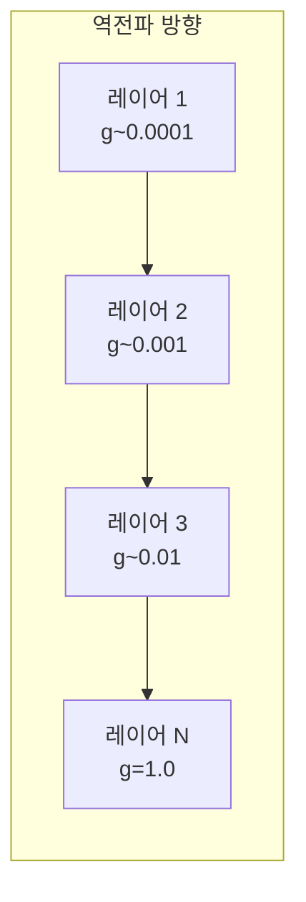
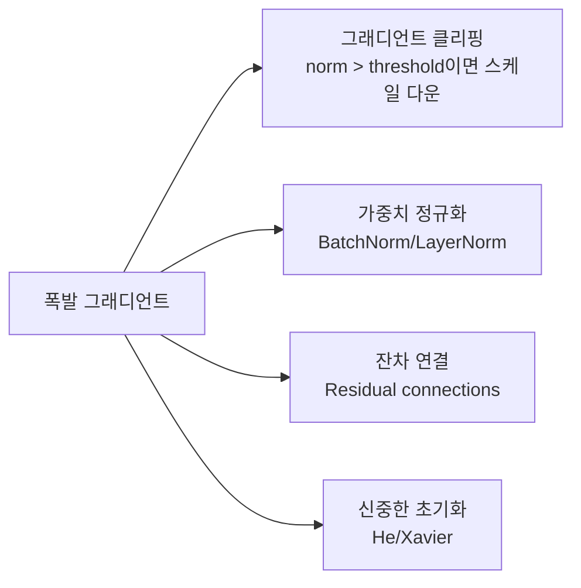
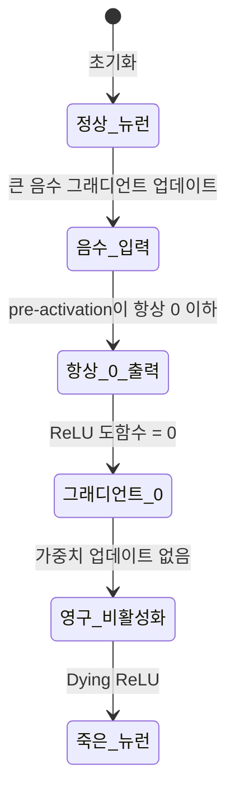
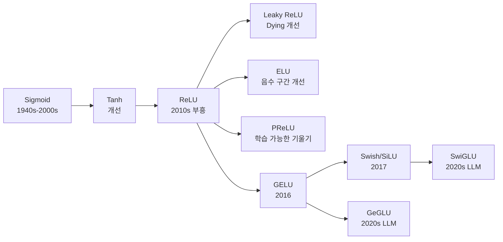

# 활성화 함수 이론

## 개요

활성화 함수(activation function)는 신경망에서 비선형성을 도입하는 핵심 요소다. 활성화 함수 없이는 아무리 깊은 네트워크도 단순한 선형 변환에 불과하다. 그러나 함수의 선택은 단순한 비선형성 도입을 넘어, **그래디언트 흐름, 훈련 안정성, 표현력, 연산 효율**에 광범위한 영향을 미친다.

이 페이지는 활성화 함수의 이론적 배경, 주요 실패 패턴(소멸/폭발 그래디언트, Dying ReLU), 그리고 현대 LLM에서 사용되는 발전된 활성화 함수들을 분석한다.

## 소멸 그래디언트 문제 (Vanishing Gradient)

소멸 그래디언트는 역전파(backpropagation) 과정에서 그래디언트가 깊은 레이어로 갈수록 지수적으로 작아지는 현상이다.

### 수학적 원인

역전파에서 l번째 레이어의 그래디언트:

$$\frac{\partial \mathcal{L}}{\partial W_l} = \frac{\partial \mathcal{L}}{\partial h_N} \cdot \prod_{k=l+1}^{N} \frac{\partial h_k}{\partial h_{k-1}}$$

각 항 $\frac{\partial h_k}{\partial h_{k-1}} = W_k^T \cdot \text{diag}(\sigma'(z_k))$에서 $\sigma'$는 활성화 함수의 도함수다.

**시그모이드의 문제**: $\sigma(x) = \frac{1}{1+e^{-x}}$의 최대 도함수는 0.25다. 100레이어를 통과하면 $0.25^{100} \approx 10^{-60}$으로 사실상 0이 된다.

| 활성화 함수 | 도함수 최댓값 | 100레이어 후 그래디언트 |
|------------|-------------|----------------------|
| Sigmoid | 0.25 | $\approx 10^{-60}$ |
| Tanh | 1.0 | $\leq 1^{100} = 1$ |
| ReLU | 1.0 (양수 구간) | 1 (소멸 없음) |
| GELU | ~1.0 (근사) | 양호 |

## 폭발 그래디언트 문제 (Exploding Gradient)

소멸의 반대 현상이다. 가중치가 크거나 활성화 함수 도함수가 1보다 클 때 발생한다. 그래디언트가 폭발적으로 커져 학습이 불안정해진다.

### 해결 방법

**그래디언트 클리핑** 공식:

$$g' = g \cdot \frac{\min(\text{threshold}, \|g\|_2)}{\|g\|_2}$$

LLM 훈련에서 그래디언트 노름이 갑자기 치솟는 이벤트를 "gradient spike"라 하며, 클리핑으로 제어한다.

## Dying ReLU 문제

ReLU(Rectified Linear Unit)는 소멸 그래디언트를 크게 개선했지만 새로운 문제를 낳았다.

$$\text{ReLU}(x) = \max(0, x)$$

### Dying ReLU의 이론적 분석

뉴런이 죽는 조건은 해당 뉴런의 pre-activation $z = Wx + b$가 모든 훈련 샘플에 대해 음수가 될 때다. 이 상태에서:

1. $\text{ReLU}(z) = 0$ → 그래디언트 = 0
2. 그래디언트 = 0 → 가중치 업데이트 없음
3. 업데이트 없음 → 영구적으로 죽은 상태 유지

**트리거 조건**:
- 높은 학습률 (큰 가중치 업데이트로 bias가 큰 음수가 됨)
- 배치 정규화 없이 음수 치우침이 있는 데이터
- 과도하게 작은 초기화로 모든 입력이 음수

## 주요 활성화 함수 계보

## GELU: Gaussian Error Linear Unit

$$\text{GELU}(x) = x \cdot \Phi(x) = x \cdot \frac{1}{2}\left[1 + \text{erf}\left(\frac{x}{\sqrt{2}}\right)\right]$$

여기서 $\Phi(x)$는 표준 정규분포의 CDF다. 직관적으로는 "입력이 클수록 통과시키고, 작을수록 확률적으로 차단"하는 부드러운 게이팅이다.

**실제 근사 공식** (BERT에서 사용):

$$\text{GELU}(x) \approx 0.5x\left(1 + \tanh\left[\sqrt{\frac{2}{\pi}}\left(x + 0.044715x^3\right)\right]\right)$$

**왜 GELU가 ReLU보다 나은가**:
- 부드러운 곡선으로 기울기가 급격하게 0이 되지 않음
- 음수 입력에도 미세한 기울기 존재
- 실험적으로 BERT, GPT 등에서 ReLU보다 일관되게 좋은 성능

## SwiGLU와 GeGLU: 게이트 선형 단위

[[glu-variants-swiglu-geglu]]에서 상세히 다루며, 여기서는 이론적 배경을 요약한다.

GLU(Gated Linear Unit) 계열은 두 선형 변환의 element-wise 곱으로 정의된다:

$$\text{SwiGLU}(x, W, V, b, c) = \text{Swish}(xW + b) \odot (xV + c)$$

$$\text{GeGLU}(x, W, V, b, c) = \text{GELU}(xW + b) \odot (xV + c)$$

현대 LLM(LLaMA, PaLM, Mistral 등)에서 FFN 레이어를 SwiGLU로 대체한다. 파라미터는 더 쓰지만(3개 행렬) 같은 파라미터 예산에서 더 나은 성능을 보인다.

## [[activation-functions]]와의 연결

전통적 활성화 함수 개요에서 이론을 쌓고, 이 페이지에서 이론적 분석을 심화한다. 실무 적용 시 체크리스트:

1. **깊은 네트워크**: GELU 또는 SwiGLU 사용. 시그모이드/tanh는 피할 것
2. **Dying ReLU 의심 시**: 뉴런 활성화 통계를 모니터링하고, Leaky ReLU나 ELU로 교체 검토
3. **그래디언트 폭발 의심 시**: 그래디언트 노름을 로깅하고, 클리핑 임계값 조정
4. **LLM FFN 레이어**: SwiGLU 또는 GeGLU가 사실상 표준

## 배치 정규화와의 상호작용

활성화 함수의 선택은 정규화 레이어와 상호작용한다. BatchNorm은 ReLU 이전에 적용하면 Dying ReLU를 크게 완화한다. LayerNorm(트랜스포머 표준)은 시퀀스 차원에서 정규화하므로 활성화 선택에 덜 민감하다.

## 관련 문서

- [[activation-functions]] - 활성화 함수 개요 및 종류
- [[glu-variants-swiglu-geglu]] - SwiGLU/GeGLU 상세
- [[lora-theory-mechanism]] - 파인튜닝 시 활성화 함수 고려사항
