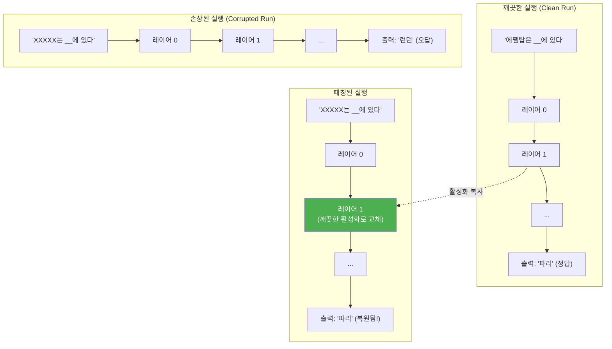
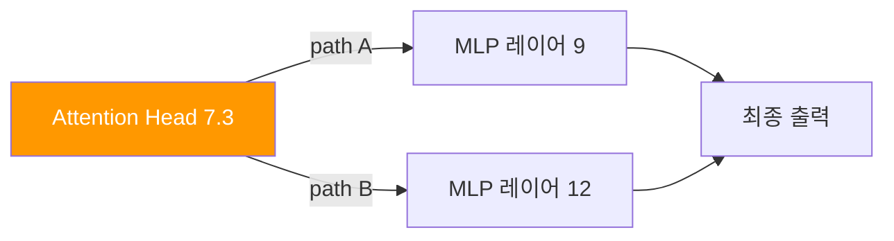
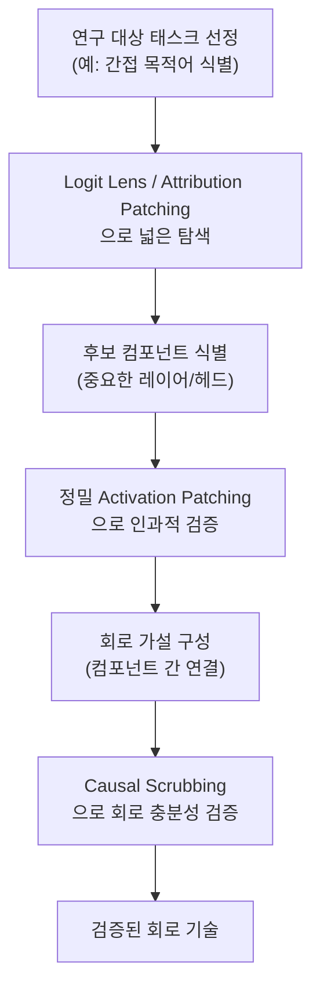

# Activation Patching (활성화 패칭 / 인과 추적)

## 정의

**Activation Patching(활성화 패칭)**은 Meng et al. (2022)이 "Locating and Editing Factual Associations in GPT"에서 체계화한 기법으로, 트랜스포머 내부의 특정 위치(레이어, 토큰 위치)에서 활성화 값을 **다른 실행(run)의 활성화로 교체**하여 해당 위치의 **인과적 영향(causal effect)**을 측정하는 방법이다.

이 기법은 **Causal Tracing(인과 추적)**이라고도 불리며, [[mechanistic-interpretability-2026|기계적 해석가능성]]의 핵심 실험 도구로 자리잡았다. "이 레이어의 이 위치가 최종 출력에 얼마나 기여하는가?"라는 질문에 직접적인 인과적 답을 제공한다.

## 핵심 원리: 깨끗한 실행과 손상된 실행

Activation Patching의 기본 아이디어는 **두 가지 실행(run)**을 비교하는 것이다:

1. **깨끗한 실행(clean run)**: 원래 입력으로 정상적으로 추론한 결과
2. **손상된 실행(corrupted run)**: 입력을 의도적으로 변형(노이즈 추가 또는 다른 입력으로 교체)하여 추론한 결과

그런 다음, 손상된 실행의 특정 위치에서 활성화를 **깨끗한 실행의 활성화로 교체(patch)**하여, 출력이 얼마나 복원되는지를 측정한다.

위 다이어그램은 Activation Patching의 전체 흐름을 보여준다. 손상된 실행의 특정 레이어에 깨끗한 활성화를 주입했을 때 정답이 복원되면, 해당 레이어가 이 사실 정보에 인과적으로 중요하다는 것을 의미한다.

## Meng et al. (2022): 사실 연관의 국소화

### 실험 설계

Meng et al.은 GPT-2와 GPT-J에서 사실적 연관(factual associations)이 저장된 위치를 찾기 위해 Activation Patching을 체계적으로 적용했다.

- **입력**: "에펠탑은 __에 위치해 있다" (정답: 파리)
- **손상 방법**: 주어("에펠탑")에 해당하는 토큰의 임베딩에 가우시안 노이즈를 추가
- **패칭**: 각 레이어 x 각 토큰 위치 조합에서 깨끗한 활성화를 복원
- **측정**: 정답("파리") 확률의 회복 정도

### 핵심 발견

| 발견 | 설명 |
|------|------|
| **MLP가 사실 저장의 핵심** | Attention이 아닌 MLP 레이어에서 패칭했을 때 정답 복원율이 가장 높았다 |
| **중간 레이어에 집중** | 사실 정보는 특정 중간 레이어(GPT-2의 경우 레이어 15-25 근처)에 집중 저장 |
| **주어 토큰 위치가 중요** | "에펠탑"에 해당하는 토큰 위치에서의 패칭이 가장 큰 효과 |
| **ROME으로 연결** | 이 발견을 바탕으로 사실 편집(Rank-One Model Editing) 기법 개발 |

## Activation Patching의 변형

### 1. Path Patching (경로 패칭)

Goldowsky-Dill et al. (2023). 단일 레이어가 아닌 **특정 연산 경로(computational path)**를 따라 패칭한다. 예를 들어, "Attention Head 7.3의 출력이 MLP 9를 거쳐 최종 출력에 미치는 영향"처럼 경로 단위로 인과적 효과를 분리할 수 있다.

이 다이어그램은 Path Patching에서 추적하는 특정 연산 경로를 보여준다. 경로 A만 패칭하면 path A의 고유한 기여를 분리하여 측정할 수 있다.

### 2. Attribution Patching (귀인 패칭)

Neel Nanda et al. (2023). Activation Patching의 **선형 근사(linear approximation)**로, 모든 위치에서 실제 패칭을 수행하는 대신 **그래디언트 기반 근사**로 각 위치의 중요도를 추정한다. 계산 비용이 대폭 절감되어 대규모 모델에서도 탐색이 가능하다.

- **Full Activation Patching**: $O(L \times T)$ 번의 순전파 필요 (L=레이어 수, T=토큰 수)
- **Attribution Patching**: 1번의 순전파 + 1번의 역전파로 모든 위치의 중요도를 근사

정확도는 떨어지지만, 넓은 탐색 공간을 빠르게 스캔하여 "중요한 후보 위치"를 좁히는 데 효과적이다. 이후 후보 위치에 대해 정밀 Activation Patching으로 검증한다.

### 3. Causal Scrubbing

Chan et al. (2022, Redwood Research). Activation Patching을 **가설 검증 프레임워크**로 확장한다. "이 회로가 이 기능을 수행한다"는 가설이 있을 때, 가설에 포함되지 않은 모든 컴포넌트를 무작위 활성화로 교체(scrub)하여, 가설 회로만으로 원래 출력을 재현할 수 있는지 검증한다.

## 회로 발견(Circuit Discovery)에서의 역할

Activation Patching은 [[circuit-tracing|회로 추적]]의 핵심 실험 도구다. 전형적인 회로 발견 워크플로우는 다음과 같다:

이 다이어그램은 회로 발견의 전형적인 파이프라인을 보여준다. Activation Patching은 탐색 단계와 검증 단계 모두에서 사용된다.

## [[logit-lens|Logit Lens]]와의 관계

두 기법은 상보적이다:

| 기법 | 성격 | 질문 | 한계 |
|------|------|------|------|
| Logit Lens | **관찰적** | "이 레이어에서 무엇을 예측하고 있는가?" | 상관관계만 제공, 인과 아님 |
| Activation Patching | **개입적** | "이 레이어가 출력에 얼마나 기여하는가?" | 개별 위치만 테스트, 조합 효과 누락 가능 |

실무에서는 [[logit-lens|Logit Lens]]로 먼저 관찰하여 "흥미로운 레이어"를 식별한 뒤, Activation Patching으로 해당 레이어의 인과적 중요도를 검증하는 순서가 일반적이다.

## 실무 적용 영역

### 1. 모델 편집 (Model Editing)

Activation Patching으로 발견한 "사실 저장 위치"에 직접 개입하여, 모델을 재학습하지 않고 특정 사실을 수정한다. ROME(Rank-One Model Editing), MEMIT(Mass-Editing Memory in a Transformer) 등이 이 접근을 사용한다.

### 2. 안전성 분석

모델이 유해한 출력을 생성하는 내부 경로를 추적한다. 안전 학습(safety training)이 모델 내부의 어떤 부분을 변경했는지, 그리고 그 변경이 "깊이 있는" 것인지 "표면적인" 것인지를 Activation Patching으로 판별할 수 있다.

### 3. 편향 탐지

모델이 특정 인구통계 그룹에 대해 편향된 출력을 생성할 때, 편향의 원인이 되는 내부 위치를 국소화한다. 해당 위치의 활성화를 중립적 값으로 교체하면 편향이 감소하는지 검증할 수 있다.

## 한계

- **조합 폭발**: 모든 레이어 x 토큰 위치 x 컴포넌트 조합을 테스트하는 것은 계산적으로 비실용적 (Attribution Patching이 이를 일부 완화)
- **선형 가정**: 활성화 교체의 효과가 비선형적으로 상호작용할 때, 개별 위치의 패칭 결과를 단순 합산할 수 없다
- **분산 표현**: 정보가 여러 위치에 분산 저장된 경우, 단일 위치 패칭으로는 효과를 포착하기 어렵다
- **스케일 한계**: 수천억 파라미터 모델에서의 체계적인 Activation Patching은 여전히 연산 비용이 높다

## 관련 문서

- [[circuit-tracing]] -- Activation Patching으로 발견한 컴포넌트를 연결하는 회로 추적
- [[mechanistic-interpretability-2026]] -- Activation Patching이 속한 해석가능성 분야의 전체 맥락
- [[logit-lens]] -- Activation Patching과 상보적인 관찰 도구
- [[representation-engineering]] -- 잔차 스트림에 대한 개입을 통한 행동 조향
- [[alignment-faking]] -- Activation Patching으로 탐지 가능한 정렬 위장 패턴
