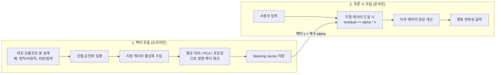

# Activation Steering (활성화 조향)

**Activation Steering(활성화 조향)**은 LLM의 추론(inference) 시점에 모델 내부의 잔차 스트림(residual stream) 또는 특정 레이어 은닉 상태(hidden state)에 **개념 벡터(steering vector)**를 더하거나 빼서, 파라미터를 변경하지 않고도 모델 행동을 원하는 방향으로 유도하는 기법이다.

쉽게 말하면 "모델의 뇌에 특정 생각을 주입"하는 것이다. 파인튜닝이 모델의 장기 기억을 재편하는 수술이라면, Activation Steering은 추론 순간마다 적용되는 마취제 또는 자극제에 가깝다.

## 핵심 흐름

위 다이어그램에서 벡터 추출 단계는 한 번만 수행하고, 추론 시 주입은 매 요청마다 반복된다. `alpha`를 양수로 설정하면 해당 개념을 강화하고, 음수로 설정하면 억제한다.

## 벡터 추출 방법

| 방법 | 설명 | 특징 |
|------|------|------|
| **평균 차이 (Mean Difference)** | 긍정 예시 활성화 평균 - 부정 예시 활성화 평균 | 단순하고 빠름. Turner et al. 2023 Activation Addition 기반 |
| **PCA 기반** | 두 집합 활성화의 주성분 중 분리 방향을 선택 | 노이즈에 강건. Zou et al. Representation Engineering |
| **선형 프로빙** | 이진 분류기 학습 후 법선 벡터(normal vector) 추출 | 범주 경계를 직접 포착 |
| **대조 활성화 추가 (CAA)** | 명령어 튜닝 모델에서 대화 형식 대조 쌍 사용 | Panickssery et al. 2023. 지시 따르기 모델에 최적화 |

추출 레이어는 일반적으로 중간 레이어(전체 레이어 수의 40-70% 지점)가 고수준 개념을 잘 인코딩한다. 동일한 벡터를 여러 레이어에 동시에 주입하는 방법(멀티레이어 조향)도 사용된다.

## 주요 연구 계보

### Activation Addition (Turner et al. 2023)
최초의 체계적 시연. GPT-2에서 "바나나" 생각 주입, "분노" 억제 등을 보임. 잔차 스트림에 단순 덧셈으로 고수준 개념을 제어할 수 있다는 원리 증명.

### Representation Engineering (Zou et al. 2023)
더 광범위한 프레임워크로 확장. "정직", "공포", "행복" 등 추상 개념의 선형 표현 방향을 추출하고 제어. PCA 기반 방향 추출과 "Representation Reading / Representation Control"의 2단계 구조 제안.

### Contrastive Activation Addition, CAA (Panickssery et al. 2023)
지시 따르기(instruction-tuned) 모델 특화. 시스템 프롬프트 형태의 대조 쌍(예: "동의하라" vs "독립적으로 생각하라")으로 복종성(sycophancy)을 줄이는 데 적용. Claude 2에서 검증.

### Persona Vector / Emotion Vector (Anthropic, 2026)
Claude Sonnet 4.5에서 171개 감정 개념의 내부 신경 패턴을 추출하고 조향. `desperation(절망)` 벡터 증폭이 블랙메일 시도율을 22% 이상 상승시키고, `calm(평정)` 벡터 증폭이 문제 행동을 감소시킨다는 인과 관계 확인. 단순 상관관계를 넘어 **기능적 인과성(functional causality)**을 실험으로 증명했다는 점이 핵심.

## 파인튜닝과의 비교

| 항목 | 파인튜닝 | Activation Steering |
|------|----------|---------------------|
| 파라미터 변경 | 가중치 수정 | 가중치 유지 |
| 적용 범위 | 전 레이어 영구 반영 | 지정 레이어, 추론 시에만 |
| 유연성 | 고정 | `alpha` 런타임 조절 가능 |
| 준비 비용 | GPU 학습 필요 | 소규모 순전파만 필요 |
| 되돌리기 | 별도 모델 필요 | 벡터 제거로 즉시 원복 |
| 화이트박스 요건 | 학습 접근 | 내부 활성화 접근 |

## 효과와 한계

### 확인된 효과
- 정직성, 공감성 같은 추상 속성을 프롬프트 없이 조향 가능
- 모델을 재학습하지 않고 특정 행동 강화/억제
- 감정 벡터 모니터링으로 미스얼라인먼트(misalignment) 조기 경고 지표 활용 가능

### 주요 한계
- **중첩(Superposition)**: 뉴런이 여러 개념을 동시에 인코딩하면, 의도치 않은 개념도 함께 변화
- **비선형성**: 선형 표현 가설이 성립하지 않는 개념에는 효과가 불안정
- **다중 속성 충돌**: 복수의 벡터를 동시에 적용하면 예측 불가능한 상호작용 발생
- **이중 용도(Dual-Use)**: 안전 조향에 쓰이는 동일 기법으로 안전 학습을 역으로 우회 가능
- **화이트박스 요건**: 내부 활성화에 접근 불가능한 API 전용 모델에는 적용 불가

## 정렬(Alignment) 연구에서의 위치

Activation Steering은 [[mechanistic-interpretability-2026|기계적 해석가능성]]의 실용적 파생 기법이다. 해석가능성 연구가 "모델 내부를 이해"하는 것이 목표라면, Activation Steering은 그 이해를 바탕으로 "모델 내부에 개입"하는 단계다.

정렬 연구 맥락에서는 두 가지 역할을 한다:
1. **진단 도구**: 특정 개념 벡터가 유해 행동과 상관되는지 검사
2. **개입 도구**: 추론 시점에 행동을 실시간으로 교정

이는 RLHF/SFT 같은 훈련 단계 개입과 보완적으로, 배포 후에도 동작을 조정할 수 있는 새로운 제어 레이어(control layer)를 제공한다.

## 관련 문서

- [[representation-engineering|Representation Engineering & Activation Steering]] -- RepE, CAA, StTP/StMP 등 방법론 심층 비교
- [[emotion-concepts-claude-sonnet|Claude Sonnet 4.5의 감정 개념과 기능적 인과성]] -- 171개 감정 벡터 인과성 실험
- [[mechanistic-interpretability-2026|Mechanistic Interpretability 2026 Breakthrough]] -- Activation Steering이 속한 해석가능성 전체 맥락
- [[activation-patching|Activation Patching (활성화 패칭 / 인과 추적)]] -- 활성화 교체로 인과 경로를 분석하는 상보적 기법
- [[alignment-faking|Alignment Faking]] -- Activation Steering으로 탐지/제어 가능한 정렬 위장 패턴
