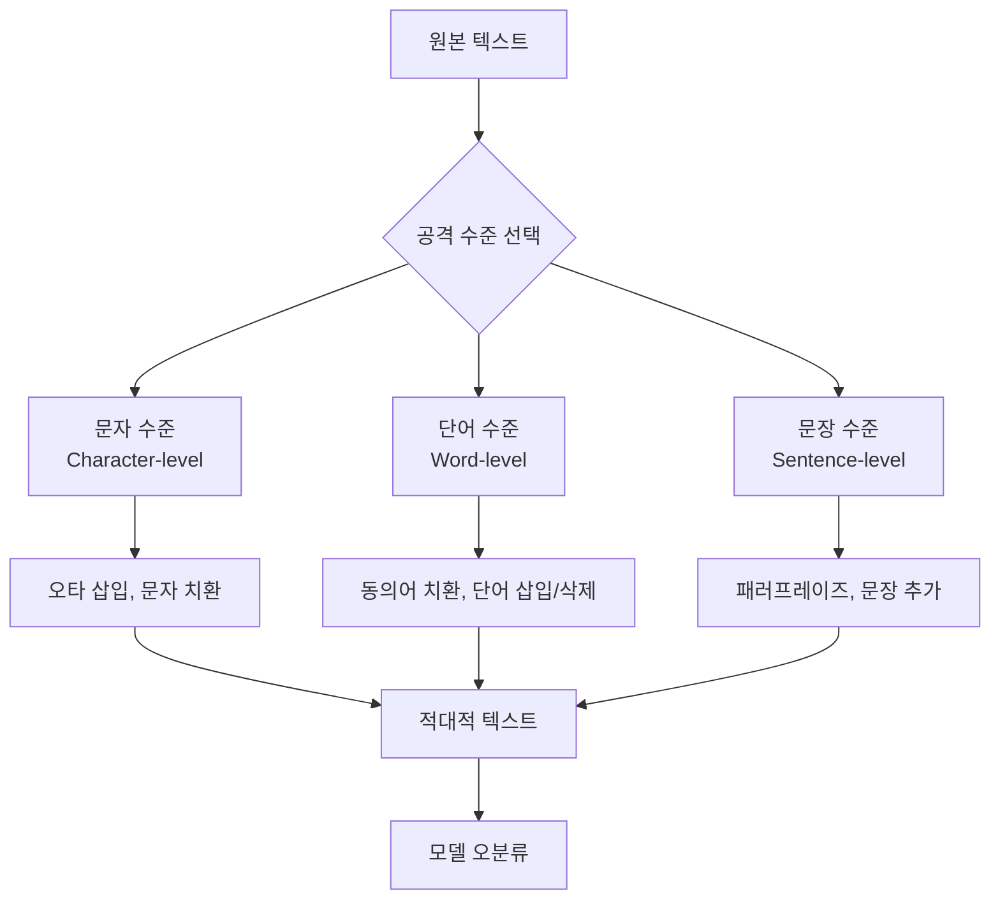

# 적대적 공격 (Adversarial Attacks)

## 개요

적대적 공격(adversarial attack)은 머신러닝 모델을 속이기 위해 입력 데이터에 인간이 인지하기 어려운 미세한 변형을 가하는 기법이다. 공격자는 모델의 예측을 의도적으로 틀리게 만들거나, 특정 잘못된 클래스로 분류되도록 입력을 조작한다.

2013년 Szegedy et al.이 "Intriguing Properties of Neural Networks" 논문에서 처음 공식화한 이후, 적대적 공격은 ML 보안(security) 및 [[robustness]] 연구의 핵심 주제로 자리잡았다. 특히 자율주행, 의료 영상 분석, 얼굴 인식 등 안전이 중요한 응용 분야에서 심각한 위협으로 간주된다.

---

## 공격의 분류

### 지식 수준에 따른 분류

| 분류 | 설명 | 예시 |
|------|------|------|
| 화이트박스(White-box) | 모델 구조, 가중치, 그래디언트 전부 알고 있음 | FGSM, PGD, C&W |
| 블랙박스(Black-box) | 모델 내부 정보 없음. 입출력만 관찰 | 전이 공격, 쿼리 기반 |
| 그레이박스(Gray-box) | 일부 정보만 알고 있음 (구조 O, 가중치 X 등) | 부분 정보 활용 |

### 목표에 따른 분류

- **비표적(Untargeted) 공격**: 어떤 오분류든 상관없이 예측을 틀리게 만드는 것이 목표
- **표적(Targeted) 공격**: 특정 클래스로 오분류시키는 것이 목표 (예: 정지 신호 -> 속도 제한 표지판)

### 시나리오에 따른 분류

- **디지털 공격**: 모델 입력을 직접 픽셀 단위로 조작
- **물리적 공격**: 실제 세계에서 물체에 패턴을 인쇄하거나 스티커 부착 (예: 정지 신호에 스티커를 붙여 인식 방해)
- **추론 시 공격(Evasion)**: 배포된 모델의 예측을 속임
- **학습 시 공격(Poisoning)**: 학습 데이터를 오염시켜 모델 자체를 손상

---

## 주요 공격 기법: 비전(Vision) 도메인

### FGSM (Fast Gradient Sign Method)

Goodfellow et al. (2014, "Explaining and Harnessing Adversarial Examples")이 제안한 단일 스텝 공격이다. 손실 함수의 그래디언트 부호만 사용해 빠르게 적대적 예시를 생성한다.

$$x_{\text{adv}} = x + \epsilon \cdot \text{sign}(\nabla_x J(\theta, x, y))$$

- $x$: 원본 입력
- $\epsilon$: 퍼터베이션(perturbation) 크기
- $J$: 손실 함수
- $y$: 진짜 레이블

단순하고 계산이 빠르지만, 단일 스텝이라 강도가 약하고 [[adversarial-training]]에 쉽게 방어된다.

```python
import torch

def fgsm_attack(model, loss_fn, x, y, epsilon):
    x.requires_grad_(True)
    output = model(x)
    loss = loss_fn(output, y)
    model.zero_grad()
    loss.backward()
    with torch.no_grad():
        x_adv = x + epsilon * x.grad.sign()
        x_adv = torch.clamp(x_adv, 0, 1)
    return x_adv
```

### PGD (Projected Gradient Descent)

Madry et al. (2018, "Towards Deep Learning Models Resistant to Adversarial Attacks")이 제안한 반복적 공격이다. FGSM을 다단계로 반복하고, 각 스텝마다 $\ell_\infty$ 볼 안으로 투영(projection)한다.

$$x^{t+1} = \Pi_{x+S}\left(x^t + \alpha \cdot \text{sign}(\nabla_x J(\theta, x^t, y))\right)$$

- $\alpha$: 단계당 스텝 크기
- $\Pi_{x+S}$: 허용 퍼터베이션 집합 $S$ 로의 투영
- 무작위 초기화(random restart)로 강도를 높임

PGD 공격은 현재 비전 도메인에서 가장 널리 쓰이는 강력한 화이트박스 공격 기준선이다.

```python
def pgd_attack(model, loss_fn, x, y, epsilon, alpha, num_steps):
    x_adv = x.clone().detach() + torch.zeros_like(x).uniform_(-epsilon, epsilon)
    x_adv = torch.clamp(x_adv, 0, 1)

    for _ in range(num_steps):
        x_adv.requires_grad_(True)
        output = model(x_adv)
        loss = loss_fn(output, y)
        model.zero_grad()
        loss.backward()
        with torch.no_grad():
            x_adv = x_adv + alpha * x_adv.grad.sign()
            delta = torch.clamp(x_adv - x, -epsilon, epsilon)
            x_adv = torch.clamp(x + delta, 0, 1).detach()
    return x_adv
```

### C&W 공격 (Carlini & Wagner Attack)

Carlini & Wagner (2017)이 제안한 최적화 기반 공격이다. $\ell_0$, $\ell_2$, $\ell_\infty$ 세 가지 노름(norm)에 대한 버전이 있으며, 특히 $\ell_2$ 버전이 자주 쓰인다.

$$\min_\delta \|\delta\|_2 + c \cdot f(x + \delta)$$

$$\text{s.t.} \quad x + \delta \in [0,1]^n$$

- $f$: 표적 오분류를 달성했을 때 음수가 되는 함수
- $c$: 강도 제어 하이퍼파라미터

C&W 공격은 배포 당시 많은 방어 기법을 우회해 "방어 불가능"처럼 보였으며, 적대적 공격 연구의 방향을 크게 바꿨다.

### AutoAttack

Croce & Hein (2020)이 제안한 앙상블 공격으로, 여러 공격 방법(APGD-CE, APGD-DLR, FAB, Square Attack)을 자동으로 조합한다. 하이퍼파라미터 튜닝 없이 강건 정확도(robust accuracy)를 신뢰성 있게 평가하는 표준 벤치마크로 자리잡았다.

---

## 주요 공격 기법: 텍스트(NLP) 도메인

텍스트는 이산(discrete) 공간이기 때문에 그래디언트를 직접 적용하기 어렵다. 따라서 비전과는 다른 전략이 필요하다.



위 다이어그램은 텍스트 적대적 공격의 세 수준(문자/단어/문장)과 각 수준에서 쓰이는 대표 기법을 보여준다.

### TextAttack 프레임워크

TextAttack은 NLP 적대적 공격을 통합 인터페이스로 제공하는 파이썬 라이브러리다. 네 가지 컴포넌트로 공격을 조합한다:

| 컴포넌트 | 역할 | 예시 |
|----------|------|------|
| 탐색 방법(Search Method) | 후보 생성 전략 | 탐욕적, 빔서치, 유전 알고리즘 |
| 변환(Transformation) | 입력 수정 방식 | 동의어 치환, 오타 삽입 |
| 제약(Constraint) | 유사성/문법 보존 조건 | USE 임베딩 유사도, 문법 검사 |
| 목표(Goal Function) | 공격 성공 조건 | 비표적 분류 오류, 표적 분류 오류 |

```python
from textattack.attack_recipes import TextFoolerJin2019
from textattack import Attacker, AttackArgs
from textattack.models.wrappers import HuggingFaceModelWrapper

model_wrapper = HuggingFaceModelWrapper(model, tokenizer)
attack = TextFoolerJin2019.build(model_wrapper)
attack_args = AttackArgs(num_examples=100)
attacker = Attacker(attack, dataset, attack_args)
results = attacker.attack_dataset()
```

### 대표 텍스트 공격 기법

- **TextFooler (Jin et al., 2019)**: 중요도 기반 단어 치환. TF-IDF 또는 그래디언트로 중요 단어를 찾고, USE 임베딩 유사도가 높은 단어로 교체
- **BERT-Attack (Li et al., 2020)**: BERT의 마스크드 언어 모델(MLM) 능력을 활용해 문맥에 맞는 단어 치환 생성
- **PWWS (Ren et al., 2019)**: WordNet 동의어 + 단어 감도(saliency) 기반 치환
- **CLARE (Li et al., 2021)**: 마스크드 언어 모델로 삽입, 치환, 합성 세 가지 연산을 수행

---

## 평가 지표

| 지표 | 설명 |
|------|------|
| 공격 성공률(Attack Success Rate) | 공격이 오분류를 유발한 비율 |
| 쿼리 수(Query Count) | 블랙박스 공격에서 모델에 보낸 질의 수 |
| 퍼터베이션 크기($\ell_p$ 노름) | 원본과의 변형 크기 |
| 의미 유사도(Semantic Similarity) | 텍스트 공격에서 원본과의 의미 보존 정도 |
| 강건 정확도(Robust Accuracy) | 적대적 예시에서의 정확도 |

---

## 물리적 적대적 공격

디지털 공격이 픽셀을 직접 조작하는 것과 달리, 물리적 공격은 실제 환경에서 카메라로 촬영된 이미지가 모델을 속이도록 물체를 변형한다.

- **적대적 패치(Adversarial Patch)**: 눈에 띄는 패턴을 붙여 분류기를 속임 (Brown et al., 2017)
- **적대적 안경**: 특수 패턴 안경을 쓰면 얼굴 인식을 우회
- **정지 신호 스티커**: 스티커를 붙인 정지 신호를 자율주행 차량이 다른 표지판으로 인식

물리적 공격은 인쇄, 조명 변화, 촬영 각도 등 실제 환경 요인도 고려해야 하므로 디지털 공격보다 어렵지만, 현실 세계 위협으로서 중요성이 크다.

---

## 전이 가능성 (Transferability)

한 모델에서 생성된 적대적 예시가 다른 모델에서도 효과적인 현상을 **전이 가능성(transferability)**이라 한다. 이는 블랙박스 공격의 기반이 된다.

- **아키텍처 간 전이**: ResNet에서 만든 적대적 예시가 VGG에도 통함
- **데이터셋 간 전이**: 제한적이지만 일부 가능
- **전이 강화 기법**: DI-FGSM(다양한 입력 변환), TI-FGSM(변환 불변 공격), MI-FGSM(모멘텀 적용)

전이 가능성은 [[robustness]] 연구에서 모델 앙상블 학습의 근거이기도 하다.

---

## 방어와의 관계

적대적 공격은 방어 기법의 발전을 이끄는 동력이다. 대표적인 방어 기법인 [[adversarial-training]]은 학습 과정에 적대적 예시를 포함시켜 모델 강건성을 높인다.

- **공격 → 방어 사이클**: 새로운 공격이 기존 방어를 깨고, 새 방어가 등장하는 순환 구조
- **적응형 공격(Adaptive Attack)**: 방어 기법을 알고 그에 맞춰 설계된 공격. 방어 평가 시 반드시 적응형 공격으로 검증해야 함
- **확인 가능한 방어(Certified Defense)**: 특정 퍼터베이션 반경 내에서 수학적으로 안전을 보증 (예: Randomized Smoothing)

---

## 실무 관점

**왜 중요한가?**
- 프로덕션 ML 시스템의 보안 감사 필수 항목
- 의료·자율주행·금융 등 고위험 도메인에서 실제 피해 가능
- 모델의 일반화 능력과 결함을 드러내는 진단 도구 역할

**실무 고려사항:**
1. 배포 전 AutoAttack, PGD 공격으로 강건 정확도를 측정하라
2. 텍스트 모델은 TextAttack으로 주요 클래스에 대한 취약 입력을 탐색하라
3. 물리 환경 배포 시 적대적 패치 내성을 별도로 평가하라
4. 강건성과 정확도 트레이드오프([[robustness]] 참조)를 사전에 정의하라
5. 방어 기법 도입 시 반드시 적응형 공격으로 재검증하라

---

## 관련 문서

- [[adversarial-training]] - 적대적 예시를 학습에 포함하는 방어 기법
- [[robustness]] - ML 강건성 전반 (분포 시프트, 불확실성 포함)
- [[ai-agent-security]] - LLM/에이전트 환경에서의 보안 위협
- [[jailbreak-attacks]] - LLM 탈옥 공격 (텍스트 도메인 적대적 공격의 특수 사례)
- [[prompt-injection]] - LLM 프롬프트 조작 공격
