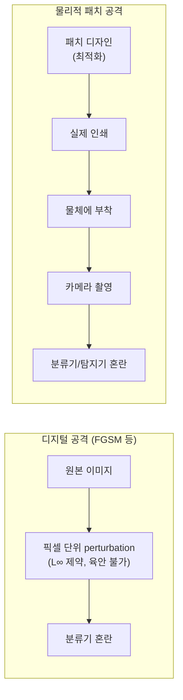
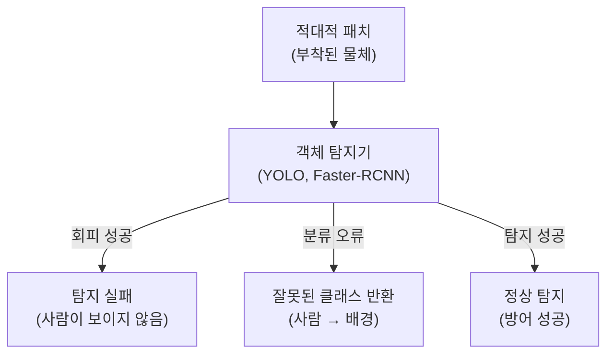

# 물리적 적대적 패치 (Physical Adversarial Patch)

## 개요

물리적 적대적 패치(Physical Adversarial Patch)는 [[adversarial-attacks-robustness]]의 한 분야로, 디지털 픽셀 조작이 아닌 **실제로 인쇄·부착 가능한 패치**를 이용해 딥러닝 모델을 속이는 공격 기법이다. [[fgsm-fast-gradient-sign]] 같은 전통적 적대적 예제가 디지털 공간에서만 유효한 것과 달리, 물리적 패치는 카메라를 통해 촬영된 실제 장면에서도 공격 효과를 유지한다.

2017년 Brown et al.의 "Adversarial Patch" 논문이 이 분야의 출발점으로, 이미지 어디에나 붙일 수 있는 작은 패치가 분류기를 특정 클래스로 오분류하게 만들 수 있음을 처음 증명했다.

## 핵심 개념

### 디지털 공격 vs. 물리적 패치



| 특성 | 디지털 적대적 예제 | 물리적 패치 |
|------|-----------------|------------|
| 위치 | 전체 이미지 | 국소 영역 (패치) |
| 지각 가능성 | 육안 불가 (미세 노이즈) | 명시적으로 보임 |
| 실세계 적용 | 카메라 거치면 효과 소멸 | 카메라 거쳐도 유효 |
| 전이 가능성 | 모델·입력 의존 | 다양한 모델에 전이 |

## 공격 최적화 방법

### 패치 생성 목표 함수

물리적 패치 $\delta$는 다음 최적화 문제를 통해 학습된다:

$$\delta^* = \arg\max_\delta \mathbb{E}_{x, t, l}[\log P(\hat{y} | A(\delta, x, l, t))]$$

- $x$: 원본 이미지
- $t$: 변환(회전, 밝기, 원근 왜곡)
- $l$: 패치 부착 위치
- $A(\cdot)$: 패치를 이미지에 합성하는 함수
- $\hat{y}$: 공격 목표 클래스

### 물리적 변환 시뮬레이션 (Expectation over Transformation)

실제 환경에서 패치는 다양한 조건에 노출된다. 이를 학습에 반영하기 위해 **변환 기댓값(EoT, Expectation over Transformation)** 기법을 사용한다:

```python
# EoT를 통한 패치 최적화 (개념 코드)
for iteration in range(num_steps):
    total_loss = 0
    for _ in range(eot_samples):
        # 임의 변환 샘플링
        transform = sample_transform(
            rotation=(-30, 30),
            scale=(0.8, 1.2),
            brightness=(-0.3, 0.3),
            perspective_distortion=0.1
        )
        # 패치 합성 및 손실 계산
        patched_img = apply_patch(image, patch, transform)
        loss += model_loss(patched_img, target_class)

    # 그래디언트 기반 업데이트
    patch -= lr * patch.grad
    patch = clip(patch, 0, 1)  # 유효 픽셀 범위
```

## 주요 공격 유형

### 분류기 공격

- **목표 공격(Targeted)**: 특정 클래스로 오분류 유도 (예: 정지 신호 → 속도 제한 표지판)
- **비목표 공격(Untargeted)**: 어떤 클래스든 오분류 유도

### 객체 탐지기 공격

[[fgsm-fast-gradient-sign]] 기반 공격과 달리, 탐지기 공격은 더 복잡하다:

- **회피 공격(Evasion)**: 탐지기가 객체를 아예 감지하지 못하게 함
- **생성 공격(Fabrication)**: 없는 객체가 탐지되게 함
- **분류 오류 공격**: 탐지는 되지만 클래스 레이블이 틀리게 함



### 대표 사례

- **STOP 표지판 공격**: 인쇄된 스티커를 붙여 자율주행 인식 시스템 혼란
- **사람 회피**: 특수 인쇄 티셔츠를 입어 보행자 탐지기 회피
- **얼굴 인식 우회**: 안경 프레임에 패치를 적용해 얼굴 인식 시스템 속임

## 방어 기법

### 입력 전처리 기반

- **랜덤 이미지 변환**: 추론 전 랜덤 자르기, 크기 변경으로 패치 효과 감소
- **Median Smoothing / JPEG 압축**: 패치의 고주파 성분 제거
- **디노이징 오토인코더**: 패치 영역을 정상 분포로 복원

### 탐지 기반

- **패치 탐지기**: 이미지에서 적대적 패치 영역을 먼저 감지
- **Local Gradient 이상치 탐지**: 패치는 주변과 그래디언트 불연속이 심함
- **앙상블 검증**: 여러 모델이 일치하지 않으면 공격 의심

### 학습 시 강화

- **패치 증강 학습**: 학습 중 랜덤 패치를 삽입해 강건성 향상
- **인증된 방어(Certified Defense)**: [[adversarial-attacks-robustness]]의 인증 방어를 패치에 확장한 De-randomized Smoothing

## 왜 중요한가

물리적 패치 공격은 자율주행, 보안 카메라, 드론 감지 등 **안전 중요(safety-critical) 실세계 시스템**에 직접적인 위협이다. 디지털 환경에서의 방어가 물리적 공격을 방어하지 못하는 경우가 많아, 실세계 로버스트니스 연구의 핵심 벤치마크가 된다. 또한 패치의 이전 가능성(transferability)이 높아 블랙박스 공격에도 효과적이다.

## 관련 문서

- [[adversarial-attacks-robustness]] - 적대적 공격 전반의 분류와 방어 체계
- [[fgsm-fast-gradient-sign]] - 물리적 패치 최적화의 기반이 되는 그래디언트 공격
- [[data-augmentation-advanced]] - 패치 삽입 증강을 활용한 강건성 학습
