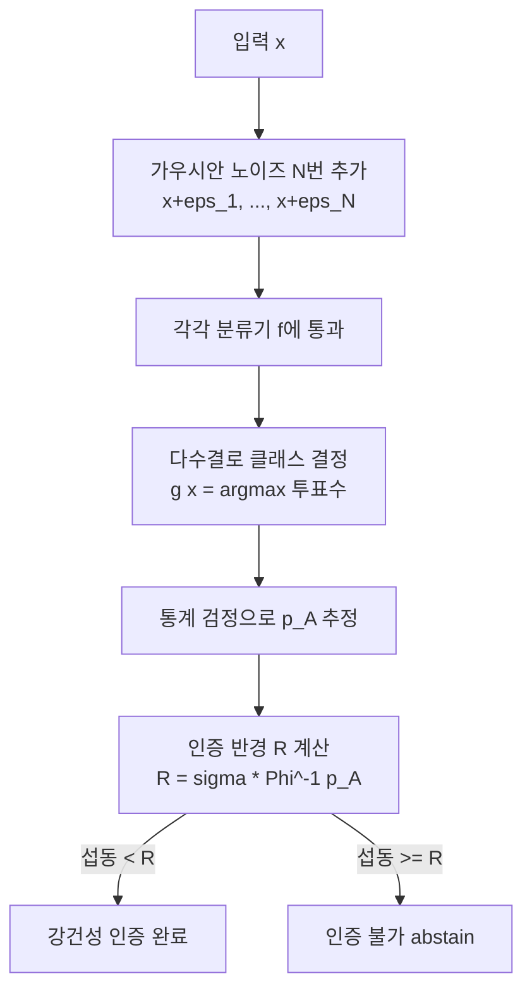
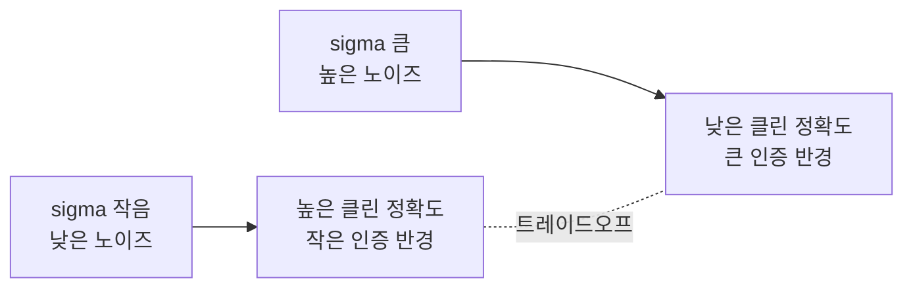

# 인증된 강건성 (Certified Adversarial Robustness)

인증된 강건성(certified robustness)이란 **모델이 특정 크기 이하의 임의의 섭동에 대해 반드시 올바른 예측을 한다는 수학적 보장**을 의미한다. [[adversarial-attacks-robustness]] 분야에서 PGD 같은 실증적 방어(empirical defense)와 구별되는 개념으로, 새로운 공격이 나와도 인증 반경 내의 공격은 원리적으로 성공할 수 없다.

## 실증적 방어 vs. 인증된 강건성

| 구분 | 실증적 방어 | 인증된 강건성 |
|------|------------|--------------|
| 대표 기법 | PGD 적대적 학습 | 무작위 평활화, SMT 검증 |
| 보장 유형 | 알려진 공격에 대해 경험적으로 강함 | 임의 공격에 대한 수학적 보장 |
| 새 공격 취약성 | 있음 | 없음 (보장 범위 내) |
| 계산 비용 | 중간 | 높음 |
| 적용 규모 | 대형 모델 가능 | 소~중형 모델에 현실적 |

## 주요 접근 방식

### 1. 무작위 평활화 (Randomized Smoothing)

Cohen et al. 2019 "Certified Adversarial Robustness via Randomized Smoothing"이 대표 논문이다. 가우시안 노이즈를 입력에 여러 번 추가해 평균 예측으로 "평활화된 분류기(smoothed classifier)"를 만들고, 이 분류기에 대한 인증 반경(certified radius)을 계산한다.

**핵심 아이디어**:
- 원본 분류기 $f$에 가우시안 노이즈 $\mathcal{N}(0, \sigma^2 I)$를 입력에 추가한 확률 분포를 평균내어 평활화 분류기 $g$ 구성
- 클래스 $c_A$가 가장 높은 확률 $p_A$로 반환될 때, $\ell_2$ 반경 $R = \sigma \cdot \Phi^{-1}(p_A)$ 이내의 섭동에 대해 예측이 불변함을 보장
- $\Phi^{-1}$: 표준 정규 분포의 역누적분포함수

### 2. 구간 경계 전파 (Interval Bound Propagation, IBP)

신경망의 각 레이어를 통해 입력의 허용 범위($\ell_\infty$ 박스)를 추적한다. 출력의 상한/하한을 계산해 정답 클래스의 하한이 모든 다른 클래스의 상한보다 높으면 강건성을 인증한다.

- 장점: 빠른 계산, 학습과 인증을 통합 가능 (certified training)
- 단점: 경계가 느슨(loose)해 실제보다 작은 인증 반경 제공

### 3. SMT/LP 기반 정형 검증 (Formal Verification)

Satisfiability Modulo Theories(SMT) 또는 선형 프로그래밍(LP)으로 신경망이 주어진 입력 범위에서 원하는 출력을 보장하는지 검사한다. Reluplex, Planet, MIPVerify 등이 대표 도구.

- 장점: 완전한 수학적 보장 (sound and complete)
- 단점: NP-hard 문제로 소규모 네트워크에만 현실적으로 적용 가능

## [[differential-privacy]] 와의 연결

무작위 평활화는 [[differential-privacy]] 문헌의 기법과 깊이 연결된다. DP에서 가우시안 메커니즘이 민감도를 숨기는 방식과, 무작위 평활화에서 노이즈가 섭동을 흡수하는 방식이 수학적으로 유사하다. 실제로 일부 연구에서는 DP 학습된 모델이 자동으로 인증된 강건성을 부분적으로 획득함을 보였다.

## 인증 반경과 정확도 트레이드오프

인증된 강건성 역시 정확도와 트레이드오프가 존재한다:

- $\sigma$ 증가 → 인증 반경 증가, 클린 정확도 감소
- ImageNet 기준 무작위 평활화: $\ell_2$, $\epsilon=0.5$ 에서 강건 정확도 ~49% (일반 정확도 ~75%)

## 실무 적용 현황

**현실적 적용 가능 영역**:
- 작은 네트워크 + 작은 $\epsilon$: 정형 검증 (의료기기, 항공 소프트웨어)
- 대형 네트워크 + $\ell_2$ 위협 모델: 무작위 평활화
- 중간 규모: IBP 기반 certified training

**한계**:
- 현재 기술로 ImageNet 수준 대형 모델의 $\ell_\infty$ 인증은 계산적으로 비현실적
- 실용적 강건성이 필요한 경우 [[pgd-adversarial-training]] 와 혼합 사용

## 벤치마크

- **CIFAR-10 $\ell_2$, $\epsilon=0.5$**: 무작위 평활화 기준 강건 정확도 ~70% (2023년 최고 성능)
- **ImageNet $\ell_2$, $\epsilon=1.0$**: ~49% 수준
- **ModelVerificationDatabase**: 정형 검증 도구 비교 공개 벤치마크

## 핵심 논문

| 논문 | 기여 |
|------|------|
| Cohen et al. 2019 | 무작위 평활화의 $\ell_2$ 인증 반경 이론 |
| Lecuyer et al. 2018 | PixelDP - DP 기반 최초 인증 |
| Mirman et al. 2018 | IBP 기반 certified training |
| Katz et al. 2017 | Reluplex - ReLU 네트워크 정형 검증 |

## 관련 문서

- [[adversarial-attacks-robustness]] - 적대적 공격 전반과 평가 기준
- [[pgd-adversarial-training]] - 인증 없이 실증적으로 강건한 학습 기법
- [[differential-privacy]] - 유사한 수학적 기반의 프라이버시 보장 기법
- [[fgsm-fast-gradient-sign]] - 기본 적대적 공격 기법
