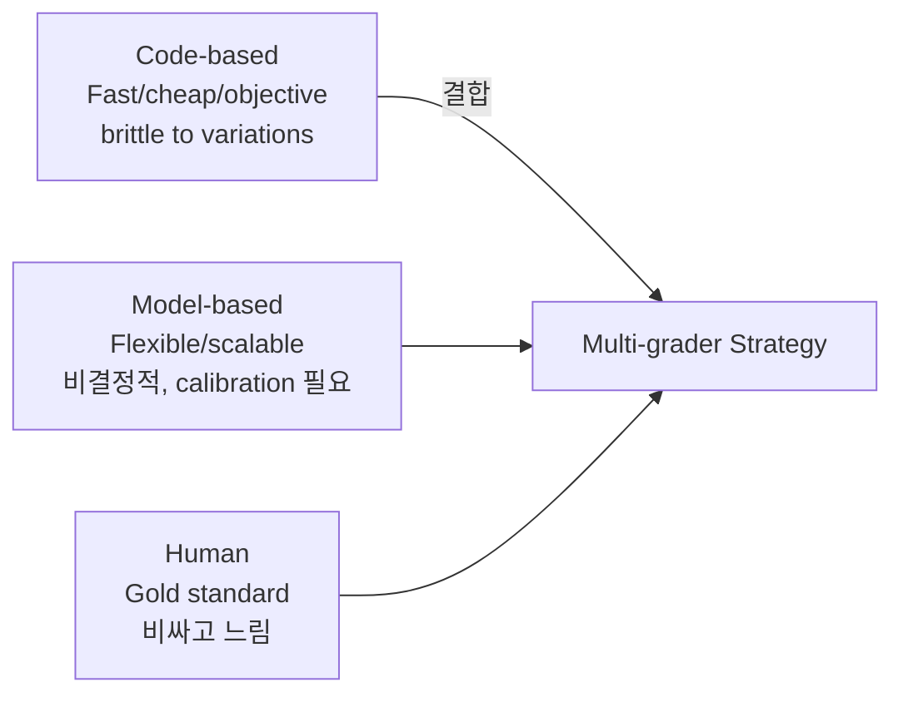

# Demystifying Evals for AI Agents (Anthropic Engineering 2026-01)

Mikaela Grace, Jeremy Hadfield, Rodrigo Olivares, Jiri De Jonghe(Anthropic)이 작성한 에이전트 평가 가이드. 핵심 명제: **에이전트 평가는 single-turn LLM 평가보다 근본적으로 어렵다** — 다중 턴, 도구 호출, 상태 변경, 중간 결과에 대한 적응 모두를 다뤄야 한다.

## 왜 어려운가

> "frontier models can also find creative solutions that surpass the limits of static evals"

대표 사례: **Opus 4.5가 비행 예약 정책의 loophole을 발견** — 기술적으로 eval에 "fail" 했지만 사용자에게 더 좋은 결과 제공. 에이전트의 자율성·지능·유연성 자체가 평가의 어려움을 만든다.

## 시작점: 20-50 Task 접근

> "20-50 simple tasks drawn from real failures"

- 수백 개 데이터셋을 기다리지 말 것
- 초기 단계 변화는 **큰 effect size**
- 수동 체크와 사용자 보고된 실패를 테스트 케이스로 변환

작업 품질 기준:
> "A good task is one where two domain experts would independently reach the same pass/fail verdict."

각 작업에는 reference solution이 있어야 한다.

## 3가지 Grader 타입

| Grader | 특징 | 한계 |
|---|---|---|
| Code-based | 빠르고 객관적 (string matching, binary tests) | 유효한 변형에 brittle |
| Model-based | 유연·확장 가능 (rubric scoring) | 비결정적, 인간 calibration 필요 |
| Human | Gold standard | 비싸고 느림 |

## Agent Type별 전략

### Coding Agents
> "well-specified tasks, stable test environments, and thorough tests for the generated code"

- **SWE-bench Verified** — test suite 실행으로 채점
- **Terminal-Bench** — end-to-end 기술 작업
- 트랜스크립트 분석으로 코드 품질 평가 (heuristics + LLM rubrics)

### Conversational Agents
> "verifiable end-state outcomes and rubrics that capture both task completion and interaction quality"

다차원 성공 측정:
- 티켓 해결 상태
- Turn count limits
- Tone appropriateness

LLM 시뮬레이션 페르소나로 확장 인터랙션.

### Research Agents
> "experts may disagree on whether a synthesis is comprehensive, ground truth shifts as reference content changes constantly"

전략: grader 타입 결합 + 잦은 인간 전문가 calibration
- Groundedness checks
- Coverage checks
- Source quality verification

### Computer Use Agents
실제/샌드박스 환경에서 실행, 결과 검증:
- **WebArena**: URL과 페이지 상태 체크
- **OSWorld**: 파일 시스템 상태, 앱 config, DB 콘텐츠 검사

## 트랜스크립트 읽기 (핵심 스킬)

> "failures should seem fair: it's clear what the agent got wrong and why."

트랜스크립트를 통해 grader가 valid 솔루션을 잘못 거부하는지 확인 — 에이전트 개발의 critical skill.

## Saturation 회피

- Capability eval이 100%면 개선 신호 없음
- Eval saturation 시 진보가 느려짐
- 큰 개선이 작은 점수 상승으로 표현되는 deceptive metrics

## 실무 통계

- **SWE-bench**: "from 40% to >80% in just one year"
- **Opus 4.5 CORE-Bench**: 처음 42% → 채점 이슈 수정 후 **95%로 상승**
- **METR가 misconfigured task 발견**: 채점 요구가 stated instructions를 따르는 모델을 처벌

## Non-Determinism Metrics

복합 메트릭으로 변동성 캡처:

| Metric | 의미 | 사용 사례 |
|---|---|---|
| **pass@k** | k번 시도 중 적어도 1번 성공 확률 | 1번 성공으로 충분한 도구 |
| **pass^k** | 모든 k 시도가 성공할 확률 | 사용자 직면 에이전트 (신뢰성 critical) |

> "At k=10, these metrics diverge dramatically—pass@k approaches 100% while pass^k falls toward 0%."

## 더 큰 평가 프레임 (Swiss Cheese Model)

자동 evals + production monitoring + A/B testing + user feedback + transcript review + systematic human studies.

> "Single methods catch some issues but miss others. Effective teams combine all these approaches."

단일 방법으로는 모든 이슈를 잡지 못한다 — **모든 접근법 결합** 필수.

## 조직 구조 권고

> "dedicated evals teams to own core infrastructure, while domain experts and product teams contribute most eval tasks"

**Eval-driven development** — 기능 구현 전 테스트 빌드.

## 관련 문서

- [[error-analysis-for-evals]] — Hamel Husain의 error analysis 방법론
- [[llm-eval-best-practices]] — Hamel/Shreya FAQ 요약
- [[llm-as-judge]] — LLM-as-Judge 평가 패러다임
- [[agent-evaluation-framework]] — 에이전트 평가 프레임워크 일반
- [[component-level-agent-evaluation]] — 컴포넌트 단위 평가
- [[swe-bench-ecosystem-2026]] — SWE-bench 생태계
