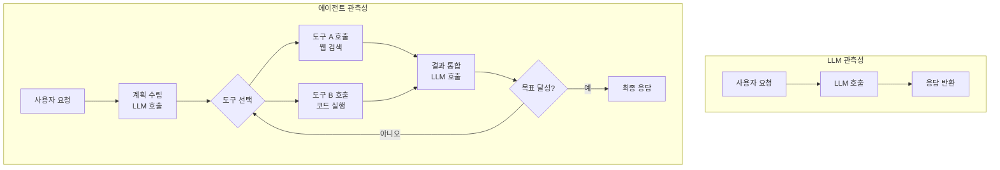
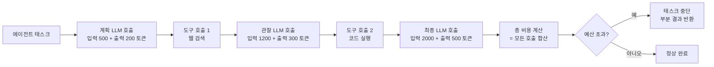
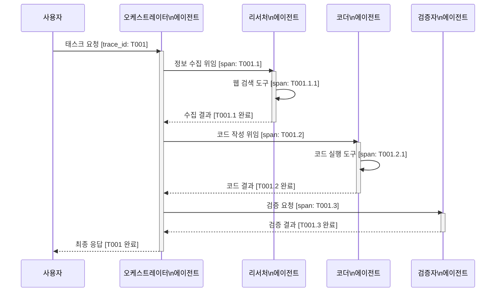
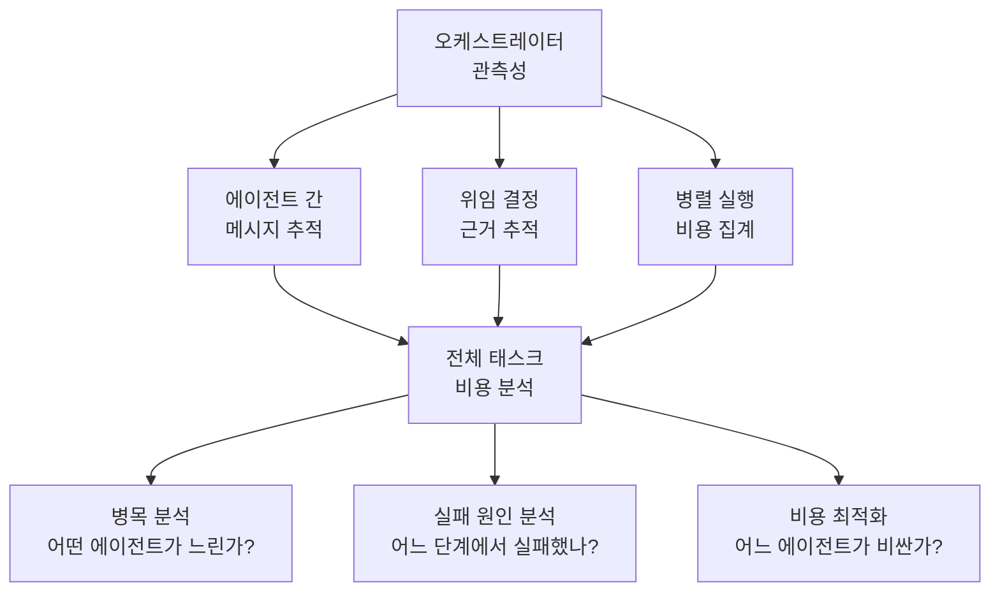

# 에이전트 관측성 (Agent Observability)

에이전트 관측성(Agent Observability)은 LLM 기반 에이전트(agent) 시스템이 어떤 결정을 내리고, 어떤 도구를 호출하며, 어떤 추론 경로를 따라 목표를 달성하는지 추적·이해·진단하는 역량 전체를 가리킨다. [[llm-observability]]가 단일 LLM 호출의 입출력·토큰·비용을 추적한다면, 에이전트 관측성은 **여러 LLM 호출, 도구 호출, 하위 에이전트 위임이 연쇄(chain)되는 복잡한 실행 흐름** 전체를 추적한다.

에이전트 시스템은 비결정적(non-deterministic)이다. 같은 입력이 주어져도 LLM이 다른 추론 경로를 선택할 수 있고, 도구 호출 결과에 따라 후속 행동이 달라진다. 이 복잡성이 관측성을 더 어렵고 더 중요하게 만든다.

## 에이전트 관측성이 LLM 관측성과 다른 이유



에이전트 시스템에서는 단일 사용자 요청이 수십 개의 LLM 호출과 도구 호출로 확장될 수 있다. 관측성 없이는 어느 단계에서 실패했는지, 왜 그런 결정을 내렸는지, 비용이 어디서 발생했는지 알 수 없다.

## 핵심 추적 항목

### 1. 도구 호출 추적 (Tool Invocation Tracing)

에이전트가 어떤 도구를 얼마나 자주, 어떤 파라미터로 호출했는지 추적한다.

```python
import logging
from dataclasses import dataclass, field
from datetime import datetime
from typing import Any

logger = logging.getLogger(__name__)

@dataclass
class ToolCallRecord:
    tool_name: str
    input_params: dict
    output: Any
    latency_ms: float
    success: bool
    error_message: str | None = None
    timestamp: datetime = field(default_factory=datetime.now)
    parent_trace_id: str = ""

    def log(self) -> None:
        status = "성공" if self.success else f"실패({self.error_message})"
        logger.info(
            "도구 호출: tool=%s status=%s latency=%.0fms trace=%s",
            self.tool_name,
            status,
            self.latency_ms,
            self.parent_trace_id,
        )

def trace_tool_call(tool_name: str, trace_id: str):
    """도구 호출 추적 데코레이터."""
    import time
    from functools import wraps

    def decorator(func):
        @wraps(func)
        def wrapper(*args, **kwargs):
            start = time.perf_counter()
            success = True
            error_msg = None
            output = None
            try:
                output = func(*args, **kwargs)
                return output
            except Exception as exc:
                success = False
                error_msg = str(exc)
                raise exc from exc
            finally:
                record = ToolCallRecord(
                    tool_name=tool_name,
                    input_params=kwargs,
                    output=output,
                    latency_ms=(time.perf_counter() - start) * 1000,
                    success=success,
                    error_message=error_msg,
                    parent_trace_id=trace_id,
                )
                record.log()
        return wrapper
    return decorator
```

### 2. 추론 트레이스 (Reasoning Trace)

에이전트의 **생각 과정(chain-of-thought)**과 결정 근거를 추적한다. 특히 Claude의 Extended Thinking 기능이나 o1 시리즈의 내부 추론을 사용하는 에이전트에서 중요하다.

추적 대상:
- 각 LLM 호출의 시스템 프롬프트·사용자 메시지·응답 전체
- 에이전트가 다음 행동을 선택하는 근거 (도구 선택 이유)
- 반복 루프(retry loop)에서의 재시도 이유
- 에이전트가 목표 달성 여부를 판단하는 기준

```python
from dataclasses import dataclass, field
from typing import Literal

@dataclass
class ReasoningStep:
    step_type: Literal["plan", "tool_selection", "observation", "conclusion"]
    content: str
    confidence: float | None = None
    alternatives_considered: list[str] = field(default_factory=list)
    step_index: int = 0

@dataclass
class AgentTrace:
    trace_id: str
    task: str
    steps: list[ReasoningStep] = field(default_factory=list)
    total_llm_calls: int = 0
    total_tool_calls: int = 0
    total_tokens: int = 0
    total_cost_usd: float = 0.0
    success: bool = False
    final_output: str = ""

    def add_step(self, step: ReasoningStep) -> None:
        step.step_index = len(self.steps)
        self.steps.append(step)
        logger.info(
            "추론 단계 %d [%s]: %s...",
            step.step_index,
            step.step_type,
            step.content[:100],
        )
```

### 3. 비용 분석 (Cost Analysis)

에이전트는 루프를 돌면서 비용이 기하급수적으로 증가할 수 있다. 태스크 단위 비용 추적이 필수다.



비용 급증 방지 전략:
- **토큰 예산(token budget)**: 태스크당 최대 사용 가능 토큰 수 설정
- **반복 횟수 상한**: 에이전트 루프의 최대 반복 횟수 제한
- **컨텍스트 압축**: 긴 대화 이력을 요약해 컨텍스트 윈도우 절약
- **도구 결과 캐싱**: 동일한 도구 호출 결과를 캐시해 중복 호출 방지

```python
class BudgetAwareAgent:
    def __init__(self, max_tokens: int = 100_000, max_iterations: int = 20):
        self.max_tokens = max_tokens
        self.max_iterations = max_iterations
        self.used_tokens = 0
        self.iteration_count = 0

    def check_budget(self) -> bool:
        if self.used_tokens >= self.max_tokens:
            logger.warning("토큰 예산 초과: %d/%d", self.used_tokens, self.max_tokens)
            return False
        if self.iteration_count >= self.max_iterations:
            logger.warning("최대 반복 횟수 초과: %d", self.iteration_count)
            return False
        return True
```

### 4. 분산 트레이스 (Distributed Tracing)

멀티에이전트 시스템에서는 여러 에이전트가 서로 다른 서비스에서 실행되며 협력한다. 분산 트레이스는 전체 요청이 여러 에이전트를 거쳐 어떻게 처리됐는지 하나의 일관된 뷰로 보여준다.



W3C TraceContext 표준을 사용하면 `traceparent` 헤더로 trace ID를 전파해 여러 서비스에 걸친 전체 요청 경로를 추적할 수 있다.

```python
# W3C TraceContext: traceparent 헤더 전파 예시
import uuid

def propagate_trace_context(parent_trace_id: str) -> dict:
    """에이전트 간 호출 시 trace context 전파."""
    span_id = uuid.uuid4().hex[:16]
    return {
        "traceparent": f"00-{parent_trace_id}-{span_id}-01",
        "tracestate": "ai-wiki=agent-observability",
    }
```

## 에이전트 실패 패턴과 진단

에이전트 관측성이 감지해야 하는 주요 실패 패턴:

### 루프 탐지

에이전트가 같은 행동을 무한 반복하는 경우.

```python
from collections import Counter

class LoopDetector:
    def __init__(self, threshold: int = 3):
        self.action_history: list[str] = []
        self.threshold = threshold

    def add_action(self, action: str) -> bool:
        """루프 감지. True이면 루프 의심."""
        self.action_history.append(action)
        recent = self.action_history[-10:]
        counts = Counter(recent)
        if counts.most_common(1)[0][1] >= self.threshold:
            logger.warning("루프 감지: action=%s count=%d", action, counts[action])
            return True
        return False
```

### 목표 표류 (Goal Drift)

에이전트가 원래 목표에서 벗어나 관련 없는 작업을 수행하는 경우. 각 단계에서 현재 행동이 최초 목표와 얼마나 관련 있는지 평가한다.

### 환각 도구 호출 (Hallucinated Tool Calls)

존재하지 않는 도구를 호출하거나, 도구 파라미터를 잘못 생성하는 경우. 도구 호출 성공률과 파라미터 유효성 검사 실패율을 추적한다.

### 컨텍스트 손실

긴 에이전트 실행에서 초기 지시사항이나 중요 정보가 컨텍스트 윈도우 밖으로 밀려나는 경우. 컨텍스트 길이와 핵심 정보 포함 여부를 주기적으로 점검한다.

## Claude Code에서의 에이전트 관측성

[[claude-code]]는 파일 시스템, 터미널, 웹 브라우저 등 다양한 도구를 사용하는 복잡한 에이전트다. Claude Code 사용 시 관측성 측면에서 고려할 사항:

- **도구 호출 로그**: Read, Write, Bash, Edit 등 각 도구 호출의 파라미터와 결과
- **비용 추적**: 세션별 토큰 사용량과 비용 집계
- **결정 감사(audit)**: 민감한 작업(파일 삭제, 외부 API 호출)에 대한 결정 근거 기록
- **오류 패턴**: 반복적으로 실패하는 도구 호출 유형 파악

## [[multi-agent-orchestration]]과의 연계

멀티에이전트 오케스트레이션에서 관측성은 더욱 복잡해진다.



각 에이전트가 독립적으로 관측성 데이터를 생성하고, 오케스트레이터가 이를 집계해 전체 태스크 뷰를 구성하는 방식이 권장된다.

## 에이전트 관측성 성숙도 모델

| 단계 | 역량 | 대표 지표 |
|------|------|---------|
| 1단계 (기본) | 로그만 있음 | 에이전트 오류 여부 |
| 2단계 (추적) | 스팬 단위 트레이스 | 도구 호출 성공률, 총 지연 |
| 3단계 (분석) | 비용·성능 대시보드 | 태스크당 비용, 반복 횟수 분포 |
| 4단계 (평가) | 자동 품질 평가 | 목표 달성률, 루프 감지율 |
| 5단계 (최적화) | 피드백 기반 개선 | 비용 20% 절감, 성공률 향상 |

## 관련 문서

- [[claude-code]] - Claude Code 에이전트의 도구 사용 및 관측성
- [[multi-agent-orchestration]] - 멀티에이전트 오케스트레이션 패턴
- [[llm-observability]] - 단일 LLM 호출 수준의 관측성 (에이전트 관측성의 기반)
- [[agent-trajectory-evaluation]] - 에이전트 실행 경로 품질 평가
- [[langsmith]] - LangGraph 에이전트 추적에 특화된 플랫폼
- [[ml-monitoring]] - 배포 후 전체 ML 시스템 모니터링
