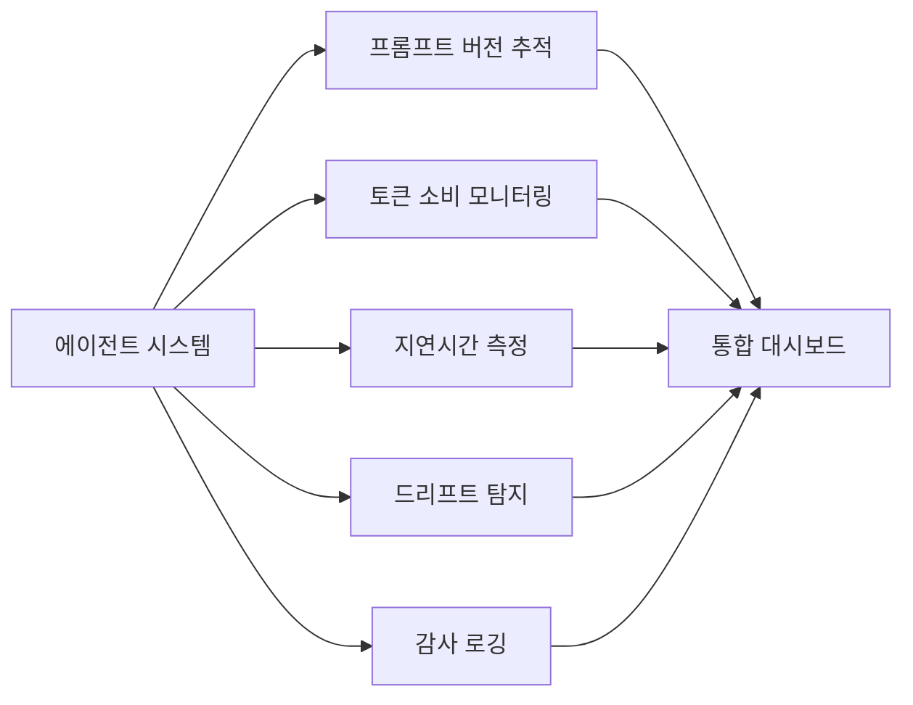

# Agentic AI 프로덕션 배포 패턴

에이전트 AI를 기업 프로덕션 환경에 배포하기 위한 아키텍처 패턴, 거버넌스, 모니터링 전략.

## 개요

Gartner는 2026년 말까지 기업 애플리케이션의 40%가 AI 에이전트를 탑재할 것으로 예측한다. 이에 따라 에이전트를 단순 프로토타입이 아닌 프로덕션급 분산 시스템 컴포넌트로 설계하고 배포하는 패턴이 정립되고 있다. 핵심은 에이전트를 고립된 도구가 아닌 분산 시스템의 구성요소로 취급하는 것이다.

## 핵심 개념

### 모듈식 아키텍처 분리

프로덕션 에이전트 시스템은 다음 계층을 독립적으로 분리하여 각 계층의 개별 반복(iteration)을 가능하게 한다:

- **오케스트레이션 계층**: 에이전트 간 조율 및 작업 분배
- **메모리 관리**: 단기/장기 컨텍스트 관리
- **도구 실행 프레임워크**: 외부 시스템과의 상호작용
- **가드레일/제약 조건**: 행동 범위 제한 및 안전성 보장
- **관측성 파이프라인**: 트레이싱, 메트릭, 로깅

핵심 설계 원칙은 "추론(reasoning), 행동 실행(action execution), 검증(validation) 계층"을 분리하여 취약성을 줄이고 각 계층의 독립적 반복을 가능하게 하는 것이다.

### 3단계 자율성 모델

| 단계 | 자율성 수준 | 설명 |
|------|-------------|------|
| 1단계 | 추천 | AI가 권장 사항을 생성하고 사람이 검토 |
| 2단계 | 감독 하 실행 | 승인 체크포인트가 있는 자동 실행 |
| 3단계 | 제한적 자율 | 정의된 경계 내에서 자율 운영 |

기업은 내부 시스템에서 먼저 배포한 후 고객 대면 시스템으로 확장하는 것이 권장된다. 이는 평판 리스크를 줄이고 통제된 환경에서 성능을 개선할 수 있게 한다.

### 하이브리드 아키텍처

모호성을 처리하는 AI 시스템과 비즈니스 규칙을 강제하는 결정론적 전통 시스템을 결합한다. 완전 자율 접근보다 이 조합이 더 안정적이라는 것이 실무에서 확인되었다.

### 태스크 스코핑 원칙

성공적인 프로덕션 배포는 범용 어시스턴트가 아닌 좁고 측정 가능한 태스크에 집중한다:

- 송장 검증(Invoice Validation)
- 지원 티켓 분류(Support Ticket Triage)
- 영업 자격 심사(Sales Qualification)
- 내부 지식 검색(Internal Knowledge Retrieval)
- 데이터 대조(Data Reconciliation)

좁은 태스크 스코핑은 ROI를 앞당기고, 환각 리스크를 줄이며, 거버넌스를 단순화한다.

## 기술 상세

### 프로덕션 관측성 요구사항

AI를 "인프라로서" 관측하는 관점이 필요하다. "AI 관측성을 일급 시민으로 취급"하지 않으면 시스템이 블랙박스가 된다:

- 프롬프트 버전 관리 및 출력 평가 메트릭
- 토큰 소비량 및 지연시간 모니터링 (비용 및 효율 추적)
- 모델 드리프트 탐지 메커니즘 (시간 경과에 따른 성능 저하 식별)
- 감사 로깅 및 규정 준수 문서화
- 역할 기반 접근 제어 및 에스컬레이션 정책

### 핵심 KPI

- 태스크 성공률 (측정 가능한 비즈니스 영향)
- 출력 품질 평가 점수
- 트랜잭션당 비용 (토큰 소비 기반)
- 시스템 지연시간 및 가용성
- 규정 준수/감사 추적 완전성

### 실패 패턴과 회피 전략

기업들이 공통적으로 범하는 실수:

1. **자율성 과대평가**: 에이전트의 자율 운영 능력을 과신
2. **시스템 설계 기초 생략**: 분산 시스템 설계 원칙 미적용
3. **보안 공격 표면 과소평가**: 프롬프트 인젝션, 비인가 접근 등 공격 표면 미고려

프로덕션에서 빈번하게 발생하는 구체적 장애:

- 에이전트가 엣지 케이스를 잘못 해석
- 도구 호출이 무음 실패(silent failure)
- 외부 API가 검증 없이 변경
- 출력이 사람 검토를 우회
- 타임아웃 및 비정상 출력

권장 완화 전략: 재시도(retry), 서킷 브레이커(circuit breaker), 샌드박싱(sandboxing), 포괄적 로깅.

### 구조화된 실험 프레임워크

가설 수립 -> 통제된 PoC -> 실패 매핑 -> 리스크 평가 -> 점진적 롤아웃 순서의 체계적 접근이 비용이 큰 확장 실패를 방지한다.

### 보안 공격 표면

엔터프라이즈 AI가 도입하는 새로운 보안 위협:

- **프롬프트 인젝션**: 악의적 입력으로 에이전트 행동 조작
- **데이터 유출**: 에이전트 출력을 통한 민감 데이터 노출
- **도구 남용**: 비인가 API에 에이전트가 접근
- **제로 트러스트 아키텍처**: 모든 에이전트 행동을 검증하는 설계 필요

입력 새니타이즈, 컨텍스트 격리, 행동 사전 검증, 역할 기반 접근 제어, 에스컬레이션 정책이 필수 가드레일이다.

### 사람 개입(HITL)의 위치

Human-in-the-loop 메커니즘은 선택사항이 아닌 기초 요구사항이다. 3단계 자율성 모델에서도 에스컬레이션 경로와 긴급 개입 메커니즘은 항상 유지되어야 한다.

### 거버넌스 설계 원칙

"AI 거버넌스는 더 이상 선택이 아닌 인프라다." PoC 단계가 아닌 1일차부터 거버넌스를 설계해야 한다:

- 규정 준수 문서화
- 에스컬레이션 정책 정의
- 감사 로깅 및 추적성
- 프롬프트/모델 버전 관리
- 팀 정렬: 엔지니어링 + 운영 + 리더십의 3자 협업

## 관련 문서

- [[ms-agent-governance-toolkit|Microsoft Agent Governance Toolkit]]
- [[ai-agent-marketplaces]] -- 에이전트 조달·배포 마켓플레이스 생태계
- [[orchestrator-worker-pattern|Orchestrator-Worker Multi-Agent Pattern]]
- [[evolution-of-agentic-patterns|Evolution of Agentic Patterns]]
- [[llm-observability-platforms|LLM Observability Platforms]]
- [[opentelemetry-genai-semconv|OpenTelemetry GenAI Semantic Conventions]]
- [[multi-agent-orchestration|Multi-Agent Orchestration]]
